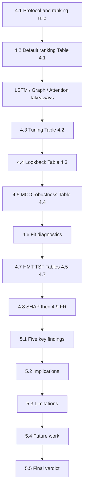

# Chapter 4–5 Panel Presentation Structure

**Assumption:** This is the **results / discussion / future-work block** to present to panel, continuing the existing P1 deck style after methodology (current slides cover lit review → gaps → RQs → scope → data/EDA → metrics → models → expected outcomes). It is **not** a rewrite of Part 1; content is taken from P2 [docs/24202141_p2_report_formatted.pdf](docs/24202141_p2_report_formatted.pdf) Chapters 4–5.

**Suggested new deck sections (after current 06 What I Contribute):**
- **07 Findings & Results** (maps to Ch.4)
- **08 Discussion & Implications** (maps to Ch.5.1–5.3)
- **09 Future Work & Verdict** (maps to Ch.5.4–5.5)

---

## Presentation flow (recommended slide blocks)

### Block A — Experimental setup (Ch.4.1) — ~1–2 slides
- Central question: can hybrid HMT-TSF beat 16 baseline variants for **7-day** Malaysia ridership, and under what conditions?
- Shared protocol: AdamW, Huber, 70/15/15 chronological, headline config **`base_nomco_lb14`**
- Ranking rule: **Combined%** (= demand-normalised MAPE% + MAE% + RMSE%; report formula as in Ch.3.6 / P1 metrics slide). Also report **R², MAE, RMSE**
- Fit rules: validation drift >25% above best checkpoint; train/val gap ratio >3× → overfit

### Block B — Baseline ranking under normal ops (Ch.4.2) — ~3–4 slides
1. **Headline ranking** from Table 4.1 (all 16 variants)
2. **Series takeaways** (keep short; architecture detail already in P1 05c):
   - **LSTM-family:** dominate top 8; BiLSTM 79.04 / TPA-LSTM 78.67 / LSTM 78.13
   - **Graph:** wider dispersion; MTGNN leads (77.93); STSGCN ≈ STGCN
   - **Attention:** Informer is strongest baseline (79.13); Autoformer weak (74.73)
3. Key talking point: top 8 sit in a **~1.5 Combined% saturation band** → incremental architecture tweaks alone are not enough

**Must-show numbers:** Informer 79.13 | BiLSTM 79.04 | … | PDR-STGCN 73.91

### Block C — Tuning, lookback, MCO, fit (Ch.4.3–4.6) — ~4–5 slides
| Slide focus | Source | Panel message |
|---|---|---|
| Tuning Δ | Table 4.2 | Median ~+0.5; ASTGCN +3.13 best gain; STFGNN −8.47 worst; best tuned Informer 79.99 still << HMT-TSF |
| Lookback | Table 4.3 | **lb14 best for 10/16**; lb28 for 6; **lb56 for none**; STFGNN collapse 73.94→43.25 |
| MCO stress | Table 4.4 | ΔCombined% nomco→mco; Informer −5.88 most robust baseline; CNN-LSTM / STFGNN fail (R² &lt; 0); **HMT-TSF −3.79 / 81.99** |
| Fit diagnostics | §4.6 | All 6 LSTM + STGCN/PDR: **0/12 good-fit**; Informer **6/6** base; tuning good-fit rate 26%→14%; HMT-TSF **19/20** |

### Block D — Proposed model + ablations (Ch.4.7–4.9) — ~5–6 slides
1. **HMT-TSF full (F=79)** across 10 configs (Table 4.5): peak **nomco_lb14 = 85.78 / R² 0.897 / MAE 49,897**; mco_lb14 = 81.99
2. Gap vs best baseline: **+6.65 Combined%** vs Informer; **−28.2% MAE**
3. **Xfuture ablation** (Tables 4.6–4.7): without Xfuture still beats Informer (+1.76 full / +2.10 FR) but MCO Δ worsens (−5.40 vs −3.79) → separate **architecture gain** vs **known-future calendar gain**
4. Walk-forward blocks (from §4.7): no block &lt;71.99 Combined% / 0.707 R²; nomco_lb14 blocks 90.62 / 82.14 / 85.12
5. **SHAP (§4.8):** month_cos/sin/month dominate; total_ridership only feature in top-15 of all 10 configs; holiday lead; diesel/RON97 + monsoon rainfall; **23 zero-SHAP + 3 near-zero RON95 → 26-feature removal**
6. **HMT-TSF-FR (§4.9):** 53 features; **86.59 Combined% / R² 0.906 / MAE 46,323** at nomco_lb14; wins all nomco lb≥14; **loses under every mco config** → deploy FR for normal ops, full model for shock-prone regimes

### Block E — Discussion (Ch.5.1–5.3) — ~4 slides
Map 1:1 to the five findings (do not invent new claims):
1. Hybrid multi-modal + task-appropriate inputs beat single-paradigm models
2. Test Combined% hides LSTM memorisation; fit diagnostics reorder deployability
3. **14-day lookback is optimal** for 7-day horizon under normal conditions
4. Structural inductive bias governs MCO robustness (expressiveness–stability trade-off)
5. SHAP hierarchy is domain-consistent and justifies principled FR (with MCO caveat)

Then one slide each:
- **Implications:** features-as-nodes transfer; fit diagnostics as ranking axis; RevIN + regime gating; Malaysian ops (KV/Penang parallel run; Johor/East Malaysia planning; weekly capacity)
- **Limitations (8):** national daily not station/intra-day; single dataset; batch inputs; one shock type; single-seed; demand-only (no AVL delays); lag leakage at post-MCO start; Xfuture confounds strict architecture comparison

### Block F — Future work + verdict (Ch.5.4–5.5) — ~2–3 slides
Keep the report’s seven future-work arms as panel bullets:
1. Multi-seed + DM/bootstrap; **symmetric Xfuture** on baselines
2. Supply-side reliability (AVL / OTP / disruptions)
3. Real-time GTFS-RT / alerts
4. Upstream data integrity / fare-channel reconciliation
5. Station-level + geographic adjacency; intra-day
6. New lines / cold-start / transfer learning
7. Open-set regime detection beyond MCO

**Final verdict slide:** HMT-TSF(+Xfuture) leads accuracy + MCO robustness; architecture-only margin remains without Xfuture; deploy at **lb14** with fit + FR rules.

---

## Tables / metrics / visuals checklist (include these)

### Required tables (from P2 List of Tables — Ch.4 only)
| ID | Title | Use on panel |
|---|---|---|
| **Table 4.1** | base_nomco_lb14 all 16 baselines | Full ranking or top-8 + bottom-4 compact |
| **Table 4.2** | Tuned vs base ΔCombined% | Bar of gains/losses |
| **Table 4.3** | lb14 / lb28 / lb56 Combined% | Heatmap or “Best window” column |
| **Table 4.4** | MCO Δ at lb14 (+ HMT-TSF row) | Robustness ranking |
| **Table 4.5** | HMT-TSF full, 10 configs | Highlight best nomco/mco rows |
| **Table 4.6** | Xfuture on/off at lb14 | Architecture vs calendar split |
| **Table 4.7** | HMT-TSF no-Xfuture, 10 configs | Optional appendix / backup slide |

### Metrics vocabulary (use consistently; already on P1 slide 31)
- **Primary:** Combined%, MAPE%, MAE%, RMSE%, R²
- **Absolute:** MAE, RMSE (passengers)
- **Robustness:** ΔCombined% (nomco→mco), mco R²
- **Generalisation:** good-fit count, gap-ratio, validation drift %
- **Ablation:** Δ vs Informer 79.13; FR vs Full

### Headline numbers panel must not get wrong
- Informer base 79.13; tuned 79.99
- HMT-TSF nomco_lb14: **85.78 / 0.897 / MAE 49,897**
- HMT-TSF-FR nomco_lb14: **86.59 / 0.906 / MAE 46,323**
- HMT-TSF mco_lb14: **81.99**, Δ **−3.79**
- vs Informer: **+6.65 Combined%**, **−28.2% MAE** (FR −33.3% MAE)
- Without Xfuture: full 80.89 (+1.76); FR 81.23 (+2.10)

### Figures to build for slides (Ch.4 has **no** figures in the LoF — visualize tables)
- Ranked Combined% bar (Table 4.1)
- Tuning Δ waterfall (Table 4.2)
- Lookback sensitivity lines (Table 4.3)
- MCO degradation sorted bars (Table 4.4)
- HMT-TSF lookback curves nomco vs mco (Table 4.5)
- Xfuture ablation grouped bars (Table 4.6)
- SHAP top-10 horizontal bar (+ “26 removed” callout)
- Optional: walk-forward block chart from §4.7

**Do not re-dump all Ch.3 EDA figures** unless a panelist asks; P1 already has the EDA summary slide. Cite EDA only as support for SHAP/holiday/fuel/rainfall claims.

---

## References that use similar data sources (for gap / future-work claims)

Mapped **only from what your P2 report cites or describes**, against your eight sources (+ MCO anomaly). Use this to say: *prior work already uses X; what they did not do is your contribution / their natural future work*.

### By your data source

**1. Ridership / passenger flow / AFC-like counts**
| Reference | Similarity | How to use in panel |
|---|---|---|
| [Amir et al., 2025](https://doi.org/10.21837/pm.v23i39.1913) | Malaysia Rapid Bus Kuantan & Penang ridership + multi-feature | Closest local DL ridership study; lacks hybrid multi-scale + MCO dual-segment + full paradigm benchmark (Table 2.6) |
| [Farahmand et al., 2023](https://doi.org/10.1016/j.trip.2023.100833) | Daily bus ridership | Weather-conditioned DL; single paradigm; no pandemic split |
| [Chen et al., 2022](https://doi.org/10.1109/TITS.2021.3065404) | Metro ridership | Graph + BiLSTM family for ridership |
| [Cui et al., 2025](https://doi.org/10.1371/journal.pone.0333094) | Urban rail passenger flow + multi-source big data | Supports multi-source demand drivers (fuel/weather cited in §4.8) |
| [Wei et al., 2023](https://doi.org/10.3390/ijgi12010025) | Subway station passenger flow | TPA-LSTM-style temporal pattern attention precedent |
| [Khalil et al., 2021](https://doi.org/10.1016/j.procs.2021.03.037) | Public transport ridership | CNN–LSTM ridership forecasting |
| [Shi et al., 2024](https://doi.org/10.3390/app14051949) | Metro flow + external factors + periodicity | External covariates for metro demand |
| [Jin et al., 2022](https://doi.org/10.5194/isprs-archives-XLIII-B4-2022-403-2022) | Metro flow | Spatiotemporal GCN for flow; cited for spatial graph structure |
| [Wu et al., 2023](https://doi.org/10.1007/s10489-023-04483-x) | Metro rail passenger flow | Autoregressive / multi-attention flow forecasting |
| [Yusuf et al., 2025](https://doi.org/10.1007/s11116-025-10689-4) | Stop-level public transit patterns | Supports your future-work disaggregation claim |
| [Rahmani et al., 2025](https://doi.org/10.1016/j.tbs.2025.101033) | Bus demand via smart-card | Events + adverse weather demand fluctuations |

**2. Weather / rainfall**
| Reference | Similarity | Panel use |
|---|---|---|
| Farahmand et al., 2023 | Weather covariates for bus ridership | Validates weather as demand driver; they stop at weather-only |
| [Huang et al., 2022](https://doi.org/10.1175/WCAS-D-21-0167.1) | Rainfall events × Shanghai metro commuting | Rain–ridership spatiotemporal response |
| [Jiang & Cai, 2023](https://doi.org/10.1016/j.tbs.2022.12.003) | Weather × metro ridership (3 Chinese megacities) | Weather–ridership empirics |
| [Ngo & Bashar, 2024](https://doi.org/10.1016/j.trd.2024.104504) | Extreme weather × U.S. transit ridership | Extreme-weather demand shocks |
| Rahmani et al., 2025 | Adverse weather + special events | Weather + calendar co-drivers |
| Cui et al., 2025 | Multi-source including weather | Aligns with your SHAP rainfall tier |

**3. Fuel / gasoline price**
| Reference | Similarity | Panel use |
|---|---|---|
| [Ahmad et al., 2024](https://doi.org/10.3390/su16114426) | Factors affecting PT ridership in developing countries (SEM) | Cited in §3.1.3 for fuel↔ridership link |
| [Chevance et al., 2024](https://doi.org/10.1038/s44333-024-00017-1) | Gasoline prices × sustainable mode interventions | Fuel price as modal-shift lever |
| [Pour et al., 2026](https://doi.org/10.1016/j.trip.2025.101829) | Fuel-price shock × urban PT demand (fixed-price regulation context) | Cited for %‑change fuel features (§3.2.1); close to Malaysia-style administered prices |
| Cui et al., 2025 | Multi-source; report ties to fuel grades in SHAP discussion | Secondary economic drivers |

**4. Holidays / calendar / special events**
| Reference | Similarity | Panel use |
|---|---|---|
| [Chen et al., 2023](https://doi.org/10.1371/journal.pone.0283898) | Holiday-period traffic flow (STSGCN family) | Holiday regime shifts justify holiday lead/lag features |
| [Song et al., 2024](https://doi.org/10.3390/s24154796) | Traffic under sports events (Graph Attention Informer) | Event/calendar shocks; also supports Informer robustness narrative |
| Rahmani et al., 2025 | Special events + weather | Calendar co-conditioning |
| [Ma & Zhang, 2025](https://doi.org/10.3390/app15073768) | Multi-scale + Autoformer / periodicity | Seasonal/calendar structure via features rather than long lookback |

**5. GTFS / network topology / transit supply**
| Reference | Similarity | Panel use |
|---|---|---|
| [Ge et al., 2021](https://doi.org/10.3390/su132011450) | Review: AFC, AVL, APC, **GTFS** | Canonical endogenous stack; your study uses GTFS static subset |
| [Lu et al., 2020](https://doi.org/10.1109/TITS.2020.2973365) | Review: AFC/AVL/APC/**GTFS** multi-source | Same ecosystem taxonomy as Tables 2.2–2.3 |
| [Hassan et al., 2025](https://doi.org/10.1016/j.rineng.2025.106126) | Malaysia Johor Bahru & Penang; **GTFS** + accessibility | Local GTFS use; cited in §3.1.1 — natural bridge to your spatial/network features |
| [Keller et al., 2022](https://doi.org/10.3390/su14074211) | AFC/APC/GPS data-science for PT | Endogenous multi-source; no Malaysia hybrid forecaster |
| [S.K.B et al., 2024](https://doi.org/10.1038/s41598-024-74237-3) | **GTFS** + geospatial–temporal LSTM (NYC) | GTFS in a DL mobility model; not Malaysia / not MCO protocol |

**6. OSM / POI / land-use**
| Reference | Similarity | Panel use |
|---|---|---|
| S.K.B et al., 2024 | **OSM** + GTFS in multi-modal DL | Direct POI/geospatial precedent (also on P1 lit slide) |
| Amir et al., 2025 | Report §2.2.1 lists **POIs** as critical exogenous for Malaysia multi-feature work | Local justification for OSM POI catchment features |
| Shi et al., 2024 | External factors for metro flow | Land-use / external context |
| Ge et al., 2021; Lu et al., 2020 | Reviews list **POIs** as exogenous | Taxonomy support (Table 2.3) |

**7. Population / demographics**
| Reference | Similarity | Panel use |
|---|---|---|
| Amir et al., 2025 | Socio-economic / demographic exogenous (per §2.2.1) | Supports population density as catchment proxy |
| Ahmad et al., 2024 | Socio-demographic factors ↔ ridership | Factor-level (not DL) support |
| Ge / Lu reviews | Demographic / socio-economic exogenous class | Table 2.3 alignment |

**8. Administrative boundaries / spatial adjacency (GADM-like)**
| Reference | Similarity | Panel use |
|---|---|---|
| Jin et al., 2022 | Graph spatial structure for regional metro heterogeneity | Cited in §3.1.2 for GADM adjacency rationale |
| Hassan et al., 2025 | Spatial accessibility on Malaysian networks | Local spatial-network analysis using GTFS/spatial layers |

**9. Extreme anomaly / COVID–MCO structural break (not a raw “source”, but core to your design)**
| Reference | Similarity | Panel use |
|---|---|---|
| [Maria-Arribas et al., 2026](https://doi.org/10.21203/rs.3.rs-8670080/v1) | Documents **85–90%** mobility drops | Validates anomaly severity; dataset paper, not Malaysia ridership SOTA benchmark (Table 2.6) |
| [Zhao & Lan, 2025](https://vtrc.virginia.gov/media/vtrc/vtrc-pdf/vtrc-pdf/26-R23.pdf) | Non-typical travel patterns / reliability | Cited for predictive bias from atypical regimes |
| [Lv et al., 2021](https://doi.org/10.1016/j.datak.2021.101912) | COVID-era deep model for traffic revitalization | Pandemic distribution shift in mobility forecasting |

### Sources that are **weakly covered / open future work** in the cited literature
These are the cleanest “research gap / their future work” lines for panel:
- **National multi-operator Malaysia ridership (12 lines) + dual MCO segmentation + 15-architecture benchmark** — no cited paper does this jointly (Table 2.6 note: empirical gaps concentrate in Farahmand & Amir).
- **Administered multi-grade fuel series as daily DL features** — Pour/Ahmad/Chevance study fuel–demand, but not inside your full hybrid SOTA bake-off.
- **GADM + OSM POI + WorldPop + GTFS + rainfall + fuel + holidays fused into one 79-col matrix** — reviews (Ge, Lu, Keller) *catalogue* these classes; few empirical papers fuse all of them for Malaysia.
- **Supply-side AVL/OTP** — Ge/Lu/Keller emphasize AVL; your §5.3–5.4 correctly flag this as missing public Malaysian daily data → future work, not a current claim.

### Panel phrasing template (safe)
> “Prior work already uses [source class] for ridership/traffic (cite 1–2). What remains open—and what this study contributes—is [Malaysia national multi-source fusion / MCO dual evaluation / hybrid multi-paradigm benchmark / SHAP-driven FR under structural break].”

---

## Mapping to current P1 deck (avoid duplication)

| Already in P1 | Do **not** re-teach in Ch.4–5 block | Instead bridge with one line |
|---|---|---|
| Slides 17–20 data sources / 79 features | Full Table 3.1 again | “Using the 8-source / 79-feature matrix already shown…” |
| Slide 21 EDA | All Fig 3.1–3.17 | “EDA predicted calendar/lag dominance → confirmed by SHAP” |
| Slides 29–39 model cards | Re-explaining each architecture | Only name + rank / Δ |
| Slide 42 expected outcomes | Speculative outcomes | Replace with **achieved** Ch.4 numbers |

---

## Delivery constraints for panel
- Prefer **charts over full 16-row tables** on screen; keep full tables in backup slides.
- Always state config tags: `base|tuned` × `nomco|mco` × `lb##`.
- When claiming HMT-TSF superiority, immediately note **Xfuture is HMT-only** and point to Table 4.6 (honest limitation from §5.3).
- Tie every future-work bullet back to a named limitation in §5.3 so the panel sees a closed loop.
