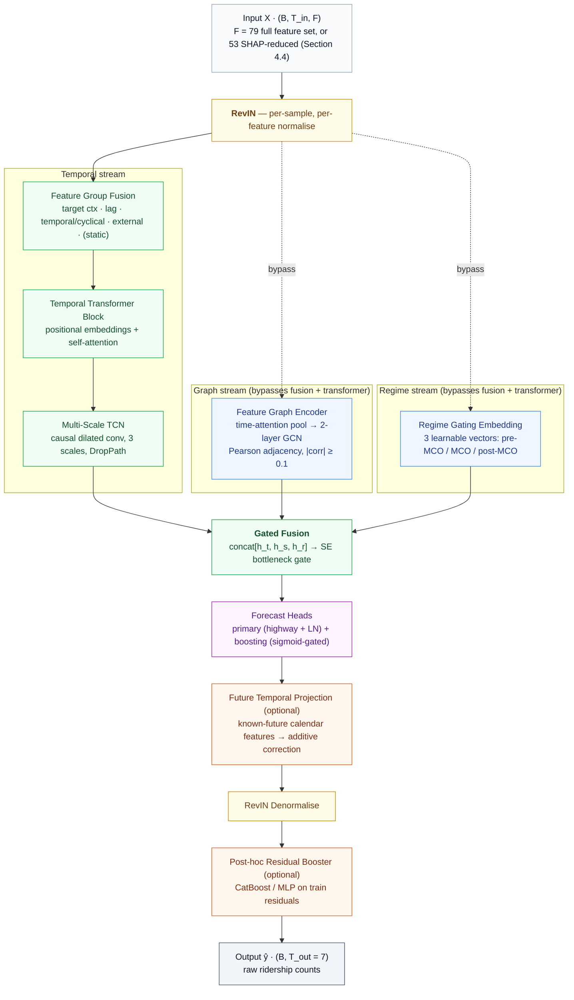
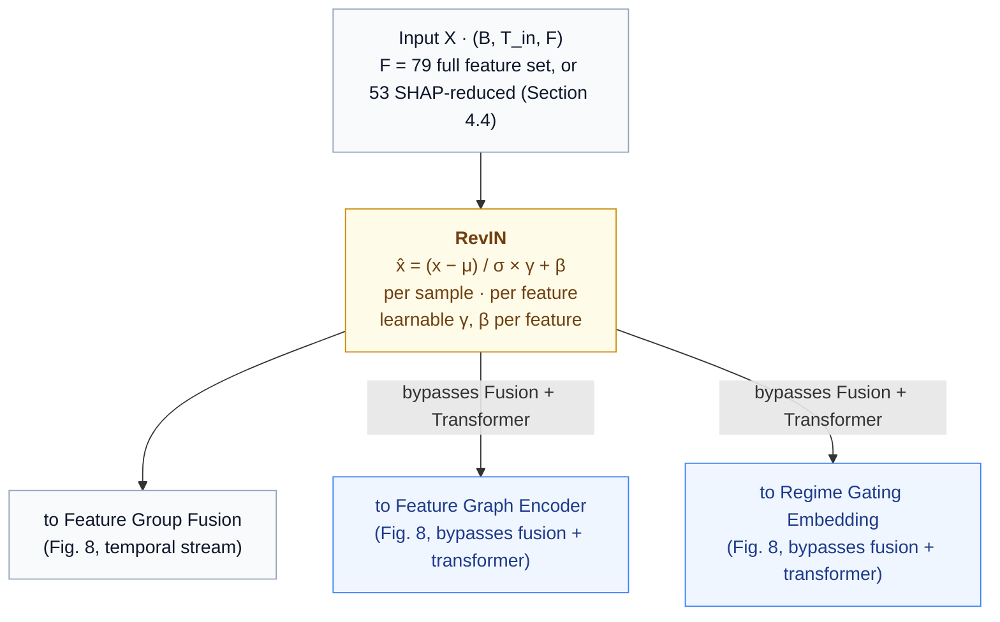
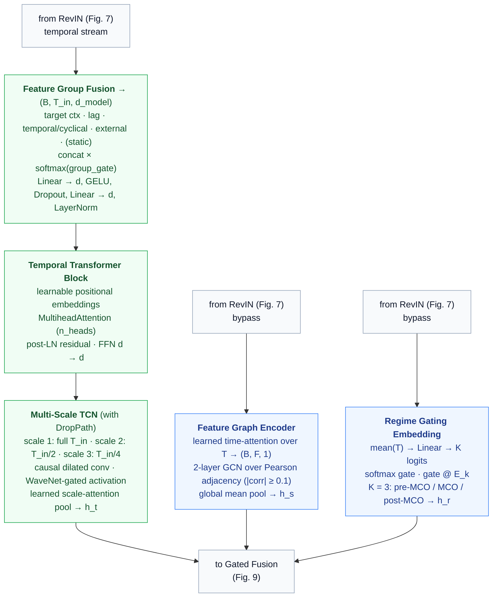
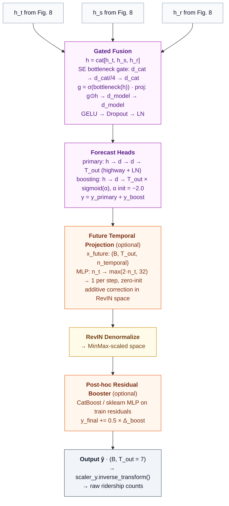

# Hybrid Multi-Scale Temporal Spatio-Feature Forecasting of Daily Public Transit Ridership in Malaysia under Structural Break

*Author 1 1 & Author 2 2*

1 Affiliation 1 (i.e. institution, (department), city, (state), country)
2 Affiliation 2 (i.e. institution, (department), city, (state), country)

Corresponding author: [NAME]
Email: [EMAIL]

## Abstract

Predicting daily public transit ridership in Malaysia is complicated by a severe structural break: the Movement Control Order (MCO) produced an 85–90% ridership collapse that contaminates any model trained across it. This study benchmarks fourteen deep learning architectures spanning sequential, graph-based, and attention paradigms against a purpose-built hybrid, the Hybrid Multi-Scale Temporal Spatio-Feature (HMT-TSF) Forecaster, which fuses causal-convolutional temporal encoding, feature-graph relational encoding, and regime-gated normalisation in one end-to-end trainable model. Eight heterogeneous sources — GTFS schedules, weather, fuel prices, holidays, population density, and points of interest — form a 79-feature daily matrix for twelve Malaysian transit lines (2019–2025), evaluated under both MCO-inclusive and MCO-exclusive segmentations using a composite Combined% index alongside MAPE, MAE, RMSE, and R². At the fourteen-day look-back that proves optimal across nearly all models, HMT-TSF reaches 85.78% Combined% (R² = 0.897), 6.65 points ahead of the strongest tuned baseline, and a SHAP-reduced 53-feature variant (HMT-TSF-FR) improves further to 86.59% under normal conditions. Fit diagnostics show several high-ranking baselines achieve their accuracy through memorisation — train/validation gap ratios up to 38.6× — while HMT-TSF retains a clean fit and the smallest accuracy loss under the MCO break (81.99% Combined% with MCO included). These results show principled multi-paradigm fusion with regime-aware normalisation outperforms single-paradigm deep learning for structural-break-prone forecasting, and that test-set accuracy alone is an unreliable deployment criterion. The study gives transport authorities a validated architecture and concrete deployment rules: a 14-day look-back, feature-reduced deployment for normal operations, and the full model reserved for shock-prone regimes.

## Keywords

Public Transit Reliability, Deep Learning Analytics, Ridership Forecasting, Urban Mobility Pattern Analysis, Structural Break, Graph Neural Networks

## 1 Introduction

Prioritising public transport over private vehicles improves national economic performance while advancing environmental sustainability (Lu et al. 2020), aligning with the United Nations Sustainable Development Goals. For Malaysia, a developing nation undergoing rapid urbanisation, an efficient public transit system is a prerequisite for developed-country status (Wang et al. 2025). Yet unreliable service prediction, driven by weather, socio-economic activity, and geopolitical events, pushes citizens back toward private vehicles, accelerating congestion and air pollution (Amir et al. 2025). Reliable transit therefore addresses environmental and social challenges simultaneously, improving quality of life and mobility across metropolitan and rural areas (Wang et al. 2025).

Despite substantial government investment in Mass Rapid Transit (MRT) Putrajaya, Shah Alam, and the planned MRT Circle Line, national public transport usage remains near 20%, far short of the 40% target set by the National Transport Policy 2019–2030 (Amir et al. 2025). Prolonged travel times, untimely delays, and limited accessibility are the primary causes of passenger dissatisfaction in Kuala Lumpur (Mee et al. 2022). These deficiencies compound the spatiotemporal complexity that conventional statistical models such as ARIMA cannot resolve, establishing a clear need for a predictive model that forecasts ridership accurately, consistently, and reliably.

Advances in big data analytics and deep learning (DL) offer a route to modelling the intricate spatiotemporal relationships within transit networks (Chen et al. 2022). Unlike ARIMA, architectures such as LSTM and Graph Convolutional Networks (GCN) integrate multiple heterogeneous sources: General Transit Feed Specification (GTFS) schedules, historical weather, and Points of Interest (POIs), to capture multidimensional dependencies (Chen et al. 2022; Ge et al. 2021). Applying state-of-the-art (SOTA) DL architectures addresses Malaysia's present reliance on conventional models.

A critical barrier lies in the historical record itself. Malaysia's Movement Control Order (MCO), enforced from 18 March 2020 to 31 December 2021, produced an 85–90% passenger collapse, generating noisy patterns unrepresentative of normal operations (Amir et al. 2025). Training on such data introduces severe predictive bias, because pandemic-era containment behaviour differs fundamentally from typical urban mobility (Zhao and Lan 2025). Models fitted to contaminated series subsequently fail to recognise true ridership peaks once daily life normalises (Lv et al. 2021). This study therefore compares two dataset segmentations, one including and one excluding the MCO period, to determine empirically whether this anomaly should be treated as noise before training.

Three research questions follow. First, which spatiotemporal factors most strongly affect Malaysian ridership? Second, how accurately and consistently do spatiotemporal, graph-based, and attention-based DL architectures perform relative to one another and to a purpose-built hybrid? Third, how does the inclusion of MCO-period anomalies distort predictive accuracy and bias? The corresponding objectives are to identify and categorise the dominant spatiotemporal factors through systematic analysis of historical performance data; to develop the Hybrid Multi-Scale Temporal Spatio-Feature (HMT-TSF) Forecaster; to benchmark it against spatiotemporal, graph-based, and attention-based baselines using a composite accuracy index and R²; and to quantify the effect of extreme outlier data by evaluating every model under both dataset segmentations.

The study is scoped to national daily granularity across twelve Malaysian service lines (LRT, MRT, Monorail, KTM, and RapidBus) over 2019–2025, with a seven-day forecast horizon.

This work makes four contributions. First, it establishes an empirical ranking of ridership drivers across 79 features drawn from eight heterogeneous sources, using SHAP attribution rather than linear correlation to surface non-linear and time-invariant effects that correlation screening misses. Second, it introduces HMT-TSF, an end-to-end trainable hybrid that composes three distinct modelling paradigms under regime-aware normalisation, together with HMT-TSF-FR, a 53-feature variant that exceeds the full model's accuracy under normal operating conditions. Third, it delivers a unified benchmark of fourteen architectures spanning sequential, graph, and attention paradigms across multiple look-back windows and both MCO segmentations, in which fit diagnostics rather than test-set accuracy alone determine practical deployment ranking. Fourth, it quantifies structural-break-driven predictive bias and translates the findings into concrete deployment rules — a 14-day look-back, and feature-reduced deployment for normal operation with the full model reserved for shock-prone regimes — realised as a command-line inference tool predicting seven-day ridership for twelve transit networks.

## 2 Literature Review

### 2.1 Public Transport Reliability and Demand Dynamics

Reliability is a multi-dimensional construct combining objective operational performance with subjective passenger experience. Travel time reliability is defined as the gap between expected and actual travel times, with route length, signalised intersections, and departure delays as the primary structural causes of unreliability (Mohamed et al. 2021). Satisfaction within the Klang Valley Light Rail Transit (LRT) system, however, is mediated by "soft" factors: accurate real-time information and station amenity quality (Ibrahim et al. 2022). Agencies traditionally prioritise hard metrics such as headway adherence, yet perceived reliability is shaped by the immediate physical environment and by transparent communication. Chronic unreliability then generates a demand-erosion cycle: passengers allocate buffer time against systemic delay, and that temporal penalty outweighs the fare saving, producing stagnant modal share even as fuel costs rise (Amir et al. 2025; Mee et al. 2022). High private vehicle ownership in states such as Sarawak persists precisely because bus service tangibility and responsiveness are perceived as inadequate (Ubaidillah et al. 2022). Physical network expansion alone therefore cannot shift commuter habits; infrastructure must be paired with localised, data-driven operational optimisation.

### 2.2 Transit Data Ecosystems and Anomalies

Modern transit data ecosystems combine endogenous operational streams with exogenous environmental inputs. Core endogenous sources are Automated Fare Collection systems for ridership, Automated Vehicle Location for GPS tracking, Automated Passenger Counting sensors, and static GTFS schedules (Ge et al. 2021; Liu et al. 2025); critical exogenous variables are real-time weather, road traffic, POIs derived from land-use profiles, and regional socio-economic demographics (Amir et al. 2025). These raw streams are fragmented and noisy. Agencies frequently collect disjointed data that impedes system-wide interpretation (Keller et al. 2022), while sensor omissions, GPS telemetry errors, formatting inconsistencies across legacy systems, and extreme outliers are pervasive (S.K.B. et al. 2024). Beyond ordinary noise, spatiotemporal profiles are vulnerable to extreme structural anomalies: the MCO caused an abrupt 85–90% ridership drop across all networks (Maria-Arribas et al. 2026). Networks ingesting uncorrected outlier sequences overfit to anomalous troughs and fail to recognise normal peaks once operations resume (Zhao and Lan 2025). Statistical-threshold anomaly detection performs poorly in high-dimensional spatiotemporal settings, motivating strategic dataset segmentation as adopted here.

### 2.3 Evolution from Traditional to Deep Learning Models

Classical frameworks — ARIMA, Historical Average, Vector Autoregression, Support Vector Regression, and Random Forest Regression — offer interpretability but demand strict stationarity and rigid distributional assumptions that conflict with highly fluctuating traffic data (Yin et al. 2022; Sobrie et al. 2023). DL architectures circumvent these restrictions by learning hierarchical non-linear spatiotemporal features directly. Convolutional Neural Networks capture spatial correlation over grid structures, recurrent networks such as LSTM track sequential dependency, GCNs model non-Euclidean topology, and attention mechanisms weight feature significance dynamically. A multi-modal geospatial-temporal LSTM achieved a 15% MAPE reduction and 20% RMSE reduction over traditional methods and standard DL baselines (S.K.B. et al. 2024). Verifying such claims requires standardised multi-metric benchmarking: comprehensive surveys adopt MAE, RMSE, and MAPE as primary metrics (Jiang et al. 2021), and pairing relative with absolute indices is essential because a single metric can mask critical performance flaws (Mystakidis et al. 2025). A rigorous framework must also combine comparison against established baselines with sensitivity and robustness testing across anomalous contexts.

### 2.4 AI-Driven Operational Strategies and Sustainability

Moving from reactive to predictive management enables proactive scheduling and optimised resource allocation (Jevinger et al. 2024). An LSTM encoder-decoder outperformed rule-based business systems by 18–23% in real-time delay forecasting (Sobrie et al. 2023), and AI-powered planning platforms maximise schedule efficiency and fleet deployment by anticipating demand shifts (Levner 2025; CCS Global Tech 2026). Traditional dispatch adjusts frequency only after disruption occurs, whereas DL models predict surges in advance, permitting dynamic intervals and coach allocation. Adoption is nonetheless obstructed by organisational data silos (Keller et al. 2022), implementation cost, and stakeholder resistance (Suwaidi et al. 2022; Hashimzai and Mohammadi 2024). Where overcome, the payoff is direct: AI-driven headway regularisation lowers transportation emissions and fuel waste (Son et al. 2025; Vujadinovic et al. 2024), and reduced waiting times accelerate modal shift from private vehicles (CCS Global Tech 2026).

### 2.5 Research Gap

The literature lacks a hybrid ridership forecaster that integrates multi-scale spatiotemporal structure while explicitly isolating predictive bias arising from severe structural breaks. Recent studies apply DL to transit ridership (Amir et al. 2025; Farahmand et al. 2023) but rely on single-paradigm architectures that do not jointly model multi-scale temporal dynamics and multi-dimensional spatial interaction. Pandemic-era anomalies further confound training (Maria-Arribas et al. 2026), yet no Malaysian study systematically quantifies how such breaks distort graph-based and attention-based SOTA models. Excluding the MCO period disrupts series continuity; retaining it uncorrected introduces bias. Without a unified benchmark spanning sequential, graph, and attention paradigms under both MCO conditions, operators have no evidence base for selecting a robust forecaster. This study addresses that gap through HMT-TSF, enabling a shift from reactive to proactive, data-driven transit management.

## 3 Methodology

### 3.1 Data Collection and Understanding

Eight heterogeneous sources are integrated into a single spatiotemporal forecasting dataset: daily ridership, GTFS network supply, GADM administrative boundaries, retail fuel prices, public and school holidays, state-level rainfall, gridded population density, and OSM point-of-interest counts.

Daily ridership counts for twelve Malaysian service lines (LRT, MRT, Monorail, KTM, and RapidBus) and static GTFS data were obtained from data.gov.my; combining GTFS with spatial layers supports granular assessment of network efficiency and accessibility (Hassan et al. 2025). Real-time GTFS streams are excluded because the national portal supplies only vehicle positions, and deriving metrics from raw coordinates would degrade inference efficiency. GADM level-1 boundaries were standardised to WGS-84 to construct binary and border-length-weighted adjacency matrices, since graph-based spatial structures capture regional heterogeneity in demand (Jin et al. 2022). Weekly retail fuel prices (RON95, RON97, diesel) were forward-filled to a daily index, and Malaysian public and school holidays for 2019–2026 were extracted from timeanddate.com; fuel price increases correlate positively with transit ridership in developing countries (Ahmad et al. 2024). Gridded population density, seven-category POI counts within a 500 m stop radius, and sub-national daily rainfall were added as environmental covariates, because non-linear ridership relationships require joint semantic and spatial encoding (Shi et al. 2024). The full series (1 January 2019 – 31 December 2025) was split into MCO-inclusive and MCO-exclusive configurations to measure how atypical operational periods affect generalisation.

### 3.2 Feature Engineering

Eight independent preprocessing scripts transform the raw formats into a standardised daily matrix. Percent-change fuel features are retained alongside level series to capture short-run economic response (Pour et al. 2026), and cyclic sine/cosine encoding avoids ordinal discontinuity at calendar boundaries (Casolaro et al. 2023). All variables were aligned to consecutive daily indexes for both research periods under explicit merge and null-handling rules, with interpolation capped at seven days. Autoregressive lags at 7, 14, and 28 days were computed from the full historical ridership series before merging (Wu et al. 2023; Yusuf et al. 2025), yielding a 79-feature matrix organised into five semantic groups: targets, temporal, external, lag, and static.

The aligned matrix was converted to sliding-window tensors with look-back Tin and a fixed Tout = 7-day horizon, under a 70%/15%/15% chronological train/validation/test split. MinMax scaling was fitted on training data only, preventing information leakage across the split boundary (Casolaro et al. 2023).

### 3.3 Exploratory Data Analysis

Four findings from the exploratory analysis directly determined design decisions in the proposed architecture.

Fig. 1 Total daily transit volume, 2019 to 2025, with six detected MCO structural shifts.

The MCO enforced between 18 March 2020 and 31 December 2021 is the largest disturbance in the series, spanning roughly a quarter of the observations. Fig. 1 shows volume falling by 85–90% at onset, with six structural shifts delimiting four behavioural phases. The collapse is near-instantaneous while the return is staged, indicating recovery governed by the sequential release of activities rather than one policy date. Recovery is also mode-unequal: rail returned to a lower fraction of its own baseline than bus, because rail serves fixed corridors feeding the Kuala Lumpur central business district whose office commuters retained the option of remote work, so part of that demand was removed rather than displaced, whereas bus carries more trips that cannot be performed from home (Lv et al. 2021). The mapping from calendar and weather inputs to ridership is therefore not the same function before and after the break, with both mean level and variance shifting — motivating the dual MCO-inclusive / MCO-exclusive dataset construction and the regime-aware components of Section 3.5 (Amir et al. 2025).

Fig. 2 Ridership response under heavy-rain versus normal conditions.

The rainfall-ridership relationship is not monotonic. Fig. 2 shows that heavy-rain days do not carry the reduction a simple discouragement effect would predict; pooling every day returns an overall correlation of only r = 0.14. Two opposing mechanisms operate at different intensities. At low intensity, suppression prevails as discretionary trips are deferred and the disutility of the walking leg rises. Above roughly the 75th percentile, substitution takes over: surface roads flood, driving becomes hazardous, and car users transfer onto grade-separated rail, while buses gain far less because they share the flooded carriageway (Huang et al. 2022). The weak pooled coefficient reflects cancellation between these effects, not an unimportant covariate. Three design decisions follow. Rainfall is kept continuous rather than a binary wet-day flag, since a flag can express only one sign of effect. All twelve services are forecast alongside the national total, so a response positive for rail and negative for bus need not collapse into one parameter (Farahmand et al. 2023). Rainfall is kept at state level, because east-coast states record several times the extreme-day count of the Klang Valley while generating little of the national ridership, so a national mean would attenuate or reverse the relationship (Ngo and Bashar 2024; Jiang and Cai 2023).

Fig. 3 Holiday-period demand showing pre-dip and post-surge patterns.

Holiday effects extend well beyond the holiday itself. Fig. 3 isolates the holiday window, where ridership falls by approximately 18% one to two days before a public holiday and rises sharply on the first working day afterwards. Dip and spike are two halves of one displacement, and the asymmetry is informative: departure can be brought forward at the traveller's discretion whereas employment resumes on a fixed date, so the outflow spreads across two days while the return compresses into one. The driver is the *balik kampung* practice — major festivals trigger migration out of the Klang Valley, with commuters taking leave on bracketing days to extend the break. Short holidays produce the deepest dip, counter-intuitive under a proportional model but natural under displacement, since a short break forces the entire outflow and return into a narrow window. A binary flag would capture only the trough and force the model to treat flanking days as noise, so four directional counters — days until and days since each holiday type — supply a monotone ramp on either side, with public and academic holidays kept separate because merging a sharp one-day commuter drop with a multi-week academic break weakens both signals (Wu et al. 2023; Rahmani et al. 2025). Because these quantities are deterministic for any future date, this finding motivates the known-future conditioning branch of Section 3.5.

Fig. 4 Correlation matrix of key demand-forecasting indicators and dominant predictor coefficients.

Fig. 4 pairs a 6 × 6 correlation matrix of the key inputs with the standardised coefficients of the dominant predictors. Ridership lags at 7, 14, and 28 days carry the largest weights, and a principal component analysis of the same matrix attributes approximately 72% of total variance to a first component loading primarily on those lags. Lag dominance reflects the demand process rather than a modelling artefact: transit trips are generated by recurring work and school commitments that reproduce weekly, so the same weekday one week earlier is a near-sufficient statistic under normal conditions. The informative part is where that baseline fails — residuals from a naïve seven-day-lag predictor are largest around public holidays and at the regime boundary, precisely where calendar, weather, and fuel features earn their place. By contrast, static network and demographic features return near-zero linear correlation with the targets and with one another. Population counts, GTFS stop statistics, POIs, and administrative areas are constant across the window by construction, and a column with no temporal variance has essentially no linear correlation with anything that varies, regardless of causal importance; such features can act only as fixed scalings interacting multiplicatively with time-varying drivers, which linear screening cannot detect (Shi et al. 2024). This is evidence of an inadequate measure, not of irrelevant features, and is why the reduction in Section 4.4 uses SHAP attribution rather than correlation ranking (Cui et al. 2025).

Two further findings are stated briefly. Rainfall peaks between November and January under the Northeast Monsoon, concentrated in east-coast states sheltered by the Titiwangsa range; this sets the seven-day interpolation cap, since a monsoon event lasts a few days and seven days bridges one event without fabricating a wet spell (Jiang and Cai 2023). Fuel prices are revised weekly and held constant between announcements, making the level series a staircase whose apparent +0.35 post-MCO correlation with ridership is shared upward drift rather than elasticity; the genuine mechanism is threshold-and-lag, with the response to price *changes* peaking one to three days later, so signed weekly change series are added alongside the levels (Pour et al. 2026; Chevance et al. 2024). The subsidised RON95 variants introduced from mid-2023 are administratively frozen and carry almost no variance, which is why they later fall out under SHAP-guided reduction.

Fig. 5 Spatial alignment of population, points of interest, and transit supply across Peninsular and East Malaysia.

Fig. 5 pairs four panels — population against transit stops, POIs against transit stops, per-state network coverage, and transit stop access within the top decile of population density — built from the same gridded population, GTFS, and OSM sources as Sections 3.1 and 4.4. The static structure is real and strongly patterned: transit supply concentrates along two Klang Valley and Johor corridors, while East Malaysia carries substantial population and POI density with almost no network coverage at all, and 5,981 stops fall within the top 10% of national population density. Yet this spatial structure is fixed across the study window by construction — the same figure that shows the pattern also explains why it is invisible to linear screening in Fig. 4 and why the static feature group is the one SHAP removes in Section 4.4: a covariate with no temporal variance cannot correlate with a time-varying target no matter how large its cross-sectional effect, so its contribution is redundant with information the model already recovers from historical ridership given sufficient look-back.

### 3.4 Baseline and Comparative Models

Fourteen baseline DL models form a progressive comparison chain isolating each architectural contribution, from sequential encoding through graph propagation to series decomposition.

The spatiotemporal family comprises LSTM, the foundational sequential baseline whose gated memory captures daily and weekly commuter cycles without graph or attention bias (Barath et al. 2026); BiLSTM, testing bidirectional encoding over the look-back window (Krishnasamy et al. 2025); TPA-LSTM, testing pattern-level attention over LSTM hidden states for multi-scale periodicity (Wei et al. 2023); CNN-LSTM, testing 1-D convolutional local feature extraction before recurrent encoding across sequential, parallel, and augmented fusion modes (Topilin et al. 2025); CNN-BiLSTM, combining local extraction with bidirectional context (Zhuang and Cao 2022); and ST-LSTM, a bridge model decoupling temporal (LSTM) and spatial (MLP) streams (Cui et al. 2025).

The graph family comprises STGCN, with fixed Pearson inter-feature adjacency and Chebyshev graph convolution (Deng 2025); PDR-STGCN, combining dynamic attention adjacency with periodicity-aware two-channel input (Hu et al. 2026); STSGCN, fusing spatial and temporal graph operations in a single synchronous 3N × 3N adjacency (Chen et al. 2023); STFGNN, using dual graphs for cross-feature co-variation and intra-window temporal-profile similarity fused by a learnable gate (Chang et al. 2025); and MTGNN, learning an asymmetric adjacency end-to-end from node embeddings (Wu et al. 2025). The attention family comprises ASTGCN, adding learnable spatial and temporal attention over the STGCN backbone (Cui et al. 2025); Autoformer, applying series decomposition with FFT-based autocorrelation attention (Ma and Zhang 2025); and Informer, a ProbSparse efficient transformer with a generative multi-step decoder (Song et al. 2024). At Tin = 14, ProbSparse degenerates to near-full attention, ensuring fair comparison with Autoformer.

### 3.5 Hybrid Multi-Scale Temporal Spatio-Feature Forecaster

#### 3.5.1 Motivation and Problem Analysis

HMT-TSF addresses three limitations shared by all fourteen baselines, each traceable to a specific finding of Section 3.3. No baseline captures temporal, relational, and regime structure simultaneously, despite Section 3.3 showing that ridership is jointly driven by lag-dominated weekly periodicity (Fig. 4), inter-feature relationships invisible to linear screening (Fig. 5), and a structural break that shifts both the mean level and the variance of the series (Fig. 1). None explicitly handles the MCO regime shift: static Pearson graphs and fixed-scale normalisation are both invalidated once the mapping from calendar and weather inputs to ridership becomes a different function before and after the break. None uses domain-aware feature grouping, treating all 79 features as an undifferentiated flat vector, even though Section 3.3 shows that lag, calendar, and static features carry structurally different relationships to the target — the first two dominate attribution, while the third is systematically zero under linear screening without being causally irrelevant.

The three paradigms chosen to answer these limitations are non-redundant because each carries an inductive bias tied to a different axis of the input tensor. Causal dilated convolution supplies a scale prior over the time axis — locality plus an exponentially widening receptive field. Graph convolution over a features-as-nodes adjacency supplies a permutation-equivariant relational prior over the feature axis, one the temporal encoder cannot address since it never mixes across feature channels. Regime gating over discrete learnable state vectors supplies a latent-state prior with no continuous analogue in either of the other two streams. This is the discriminating line against multi-component baselines: CNN-LSTM (Topilin et al. 2025) and ASTGCN (Cui et al. 2025; Hu et al. 2026) combine components within one paradigm family, operating on the same tensor axis under the same class of prior, so they are composite rather than hybrid. HMT-TSF's three streams instead read the tensor along different axes and are independently ablatable, which is why the graph and regime streams bypass group fusion and read the instance-normalised raw tensor directly, as detailed in Section 3.5.2 — fusing first would destroy the feature identity that two of the three priors depend on. The Squeeze-and-Excitation bottleneck then learns per-context stream weights, so the combination is data-dependent rather than a fixed concatenation.

*Hybrid* is used here in its established architectural sense: a model is hybrid when it integrates two or more distinct modelling paradigms, each carrying a different inductive bias, inside a single end-to-end trainable predictor whose paradigms are co-trained under one loss with gradients flowing between them, so representations are learned jointly rather than composed after the fact. This is distinct from ensemble hybridity, which averages outputs of separately trained models, and from pre-processing hybridity, which chains a statistical decomposition to a neural predictor (Casolaro et al. 2023). Every primitive used is prior art and attributed as such; what is claimed is the composition — the selection of paradigms, the routing between them, and the gating that combines their representations.

Known trade-offs follow directly from this design and are stated here so they are read alongside the problem they are the price of, not discovered only in the results. HMT-TSF carries a higher parameter count and tuning complexity than any single baseline; its static Pearson graph remains sensitive to distributional shift, only partially offset by RevIN and regime gating; its regime boundaries are manually specified and tied to Malaysian MCO chronology rather than learned; and its optional post-hoc gradient-boosted residual correction adds a less interpretable second stage. These trade-offs are the cost of the asymmetric tri-stream routing described next.

#### 3.5.2 The HMT-TSF Architecture

Three named, separately ablatable modules realise the design of Section 3.5.1, organised here in the order data flows through them: input normalisation and routing (Fig. 7), three parallel encoders (Fig. 8), and gated fusion with output (Fig. 9). Fig. 6 gives the full architecture end to end before each stage is expanded in turn: RevIN normalises the input and fans it out three ways; the temporal stream alone passes through feature-group fusion and self-attention before multi-scale convolution, while the graph and regime streams read the normalised tensor directly; the three resulting context vectors are combined by a gated fusion bottleneck; and the forecast heads, future-temporal correction, RevIN denormalisation, and optional residual booster produce the final seven-day output.

Fig. 6 Full HMT-TSF architecture, from the input tensor through RevIN and three parallel encoder streams — temporal, graph, and regime — to gated fusion, forecast heads, and denormalised output.

**Stage 1 — Input and Normalisation (Fig. 7).** HMT-TSF accepts a sliding-window tensor X ∈ ℝ^(B×Tin×F), where F = 79 for the full feature set of Section 3.2 or F = 53 for the SHAP-reduced configuration developed in Section 4.4 (HMT-TSF-FR). Reversible Instance Normalisation (RevIN) then normalises the raw input by each sample's per-feature mean and variance under learnable affine parameters γ, β, reducing the within-batch distribution shift caused by the MCO regime change (Kim et al. 2023); without it, a minibatch spanning multiple regimes produces gradient conflicts that impair convergence. RevIN's output fans out three ways. The temporal stream passes through Feature Group Fusion and the Temporal Transformer Block before reaching the Multi-Scale TCN (Fig. 8); the graph and regime streams instead read the RevIN output directly, deliberately bypassing both feature-group fusion and the temporal transformer block, because that projection maps feature channels into an abstract latent space and destroys the feature identity that a features-as-nodes graph and a regime detector both require. Predictions are denormalised by RevIN's inverse transform after the forecast heads (Fig. 9), so the training loss is measured in the original scaled space.

Fig. 7 Input tensor and RevIN normalisation, fanning out to the temporal stream and, bypassing fusion and the transformer, to the graph and regime streams.

**Stage 2 — Three Parallel Encoders (Fig. 8).** The temporal stream first passes through **Feature Group Fusion**: the F input features are organised into the semantic groups of Section 3.2 — target context, lag, temporal/cyclical, external, and, for the full F = 79 configuration, static — each independently projected to a common embedding dimension so internal structure is learned without cross-group interference, then concatenated and passed through a learned softmax gate that weights each group per timestep — on holiday dates the temporal group receives higher weight, on normal weekdays the target-context and lag groups dominate. The gated output is projected with LayerNorm to a unified d_model representation, then passed through a **Temporal Transformer Block** — learnable positional embeddings and multi-head self-attention with a post-LN residual and a d→d feed-forward layer — so the model can weight which time steps matter most across the full look-back window before local extraction. The **Multi-Scale Temporal Convolution Network** then applies causal dilated convolutions at up to three scales — the full window with exponentially increasing dilation, the first half for medium-range structure, and the first quarter for long-range baselines — with WaveNet-style gated activations, DropPath stochastic depth, and learned attention pooling across active scales, yielding the temporal context vector h_t.

In parallel, the **Feature Graph Encoder** reads the RevIN output directly (Fig. 7). It compresses the time dimension by learned temporal attention rather than using the raw sequence as node features, then propagates signals through a two-layer graph convolutional network over the Pearson-correlation adjacency (|corr| ≥ 0.1, matching the STGCN and ASTGCN construction); decoupling relational encoding from temporal dynamics is what distinguishes this branch from graph baselines (Jin et al. 2022; Deng 2025), yielding the spatial context vector h_s. The **Regime Gating Embedding**, also reading the RevIN output directly, maintains three learnable vectors for pre-MCO, MCO, and post-MCO operation and projects the mean-pooled input to three soft logits, blending adjacent regime characteristics during transitional periods without hard chronological boundaries and requiring no date metadata at inference, yielding the regime context vector h_r.

Fig. 8 Three parallel encoders: Feature Group Fusion and the Temporal Transformer Block feeding the Multi-Scale TCN (h_t), the Feature Graph Encoder over the Pearson adjacency (h_s), and the Regime Gating Embedding (h_r).

**Stage 3 — Gated Fusion and Output (Fig. 9).** The three encoder outputs h_t, h_s, h_r are concatenated and passed through a Squeeze-and-Excitation bottleneck gate — a d_cat → d_cat//4 → d_cat projection calibrating which stream contributes most per input context, avoiding an expensive 3d × 3d weight matrix (Jiang et al. 2021). Two forecast heads follow: a primary head with highway residual and LayerNorm, and a boosting head whose scalar gate is initialised so its contribution is suppressed early and activates as training converges. This asymmetric tri-stream routing — the graph and regime streams bypassing fusion and self-attention while the temporal stream alone is projected and self-attended — is what allows one model to address all three limitations of Section 3.5.1 at once (Hu et al. 2026). The custom loss penalises accuracy and smoothness jointly, weighting the one-day-ahead step at 1.0 and decaying to approximately 0.53 at seven days. Finally, the sixteen temporal features are deterministic for any future calendar date and are pre-computed for the forecast steps of each window as Xfuture; a per-step zero-initialised MLP learns an additive correction from this known-future context, letting the model anticipate weekend dips and holiday effects inside the horizon rather than extrapolating them — the direct architectural consequence of the displacement pattern in Fig. 3. RevIN then denormalises the corrected prediction back to the MinMax-scaled space, and an optional post-hoc gradient-boosted residual booster, trained on training-set residuals, applies a further correction only when validated to improve Combined%.

Fig. 9 Gated fusion of h_t, h_s, h_r through the SE bottleneck, forecast heads, future-temporal correction, RevIN denormalisation, and optional residual booster to the seven-day output.

### 3.6 Evaluation Metrics

Combined% is a composite index aggregating absolute, proportional, and squared error into a single comparison rank. All three constituent terms are mean-demand-normalised percentages, making them dimensionally homogeneous and directly addable; the index is clipped so it cannot be negative, and higher is better. Equal weighting reflects the operational reality of transit management, where percentage error relative to daily volume (MAPE%), average absolute passenger discrepancy (MAE%), and large individual forecast failures (RMSE%) are equally critical.

Raw MAE and RMSE in absolute passenger counts are reported separately as operational diagnostics. R² measures explained variance and discriminates between models with similar error magnitudes but different directional tracking, with values below zero indicating performance worse than predicting the mean. Together with Combined%, these five metrics evaluate HMT-TSF against the fourteen baselines across look-back horizons and both MCO conditions.

## 4 Findings and Results

### 4.1 Experimental Setup

The central question is whether a purpose-built hybrid architecture can outperform established DL paradigms for seven-day Malaysian ridership forecasting, and under what conditions each paradigm succeeds or fails. Default-configuration performance under normal operating conditions (MCO-excluded, 14-day look-back) establishes the baseline ranking; hyperparameter tuning tests whether capacity increases translate into genuine generalisation; look-back sensitivity across 14, 28, and 56 days examines how much historical context a seven-day horizon requires; and structural-break robustness under the MCO period stress-tests each model against the 85–90% collapse.

All models follow a shared training protocol (AdamW, Huber loss, 70/15/15 chronological split) and are ranked by Combined%, with R², MAE, and RMSE completing the profile. The headline configuration is `base_nomco_lb14`. Fit diagnostics flag validation drift exceeding 25% above the best checkpoint and a train/validation gap ratio above 3×.

### 4.2 Baseline Model Performance

Under the project default, baseline accuracy is tightly clustered: the top eight models occupy a 1.5 Combined% band, indicating a saturated regime in which architectural differences yield incremental rather than step-change gains.

**Table 1.** Default-configuration (base_nomco_lb14) performance of all sixteen baseline variants.

| Rank | Model | Combined% | MAPE% | R² | MAE | RMSE |
| ---- | ---------- | --------- | ----- | ----- | ------ | ------ |
| 1 | Informer | 79.13 | 6.59 | 0.772 | 69,476 | 110,050 |
| 2 | BiLSTM | 79.04 | 6.52 | 0.776 | 72,460 | 109,007 |
| 3 | TPA-LSTM | 78.67 | 6.62 | 0.776 | 75,871 | 109,009 |
| 4 | CNN-BiLSTM | 78.18 | 6.81 | 0.764 | 76,884 | 111,782 |
| 5 | LSTM | 78.13 | 6.71 | 0.760 | 77,719 | 112,801 |
| 6 | ST-LSTM | 78.01 | 6.93 | 0.770 | 78,779 | 110,453 |
| 7 | MTGNN | 77.93 | 6.91 | 0.775 | 81,292 | 109,185 |
| 8 | CNN-LSTM | 77.64 | 6.92 | 0.752 | 79,375 | 114,632 |
| 9 | STSGCN | 76.97 | 7.18 | 0.736 | 80,703 | 118,391 |
| 10 | STGCN | 76.81 | 7.24 | 0.750 | 85,077 | 115,297 |
| 11 | ASTGCN | 75.69 | 7.42 | 0.703 | 86,631 | 125,606 |
| 12 | CNN-LSTM-Augmented | 75.36 | 7.77 | 0.721 | 90,356 | 121,639 |
| 13 | Autoformer | 74.73 | 7.86 | 0.708 | 94,414 | 124,408 |
| 14 | CNN-LSTM-Parallel | 74.18 | 8.18 | 0.704 | 96,477 | 125,240 |
| 15 | STFGNN | 73.94 | 8.21 | 0.688 | 95,547 | 128,777 |
| 16 | PDR-STGCN | 73.91 | 8.15 | 0.688 | 96,801 | 128,694 |

Recurrent architectures are the strongest single-paradigm family under normal conditions, occupying six of the top eight positions, because gated sequential memory aligns with the daily and weekly periodicity identified in Section 3.3 (Barath et al. 2026). Bidirectional encoding provides a measurable advantage, with BiLSTM gaining 0.91 Combined% over LSTM by contextualising mid-sequence events (Krishnasamy et al. 2025), and TPA-LSTM matching BiLSTM's R² of 0.776, validating temporal pattern attention over hidden states (Wei et al. 2023). CNN-BiLSTM and sequential CNN-LSTM approach the same band through hierarchical local-then-global encoding (Chen et al. 2022), while ST-LSTM ranks sixth with decoupled spatial encoding (Cui et al. 2025). Graph models show wider dispersion, reflecting heterogeneous strategies for encoding inter-feature correlation: MTGNN leads the family at 77.93% because asymmetric learned edges can represent directed relationships — fuel-price signals influencing ridership without the reverse — which symmetric Pearson graphs cannot (Wu et al. 2025). At the lower end of the ranking, the two remaining CNN-LSTM fusion modes and the two simple-convolution graph models (STFGNN, PDR-STGCN) trail the leaders by 3.8–5.2 Combined% points, underscoring that fusion-mode and adjacency-construction choices carry more weight than family membership alone.

Test-set accuracy alone is an unreliable deployment criterion, because several high-ranking baselines achieve their position partly through memorisation. Across all twelve configurations per model, all six spatiotemporal-family models (LSTM, BiLSTM, TPA-LSTM, CNN-LSTM, CNN-BiLSTM, ST-LSTM) and both simple-convolution graph models (STGCN, PDR-STGCN) record zero good-fit verdicts despite strong headline scores. Gap ratios span 3.2× to 13.5× for the spatiotemporal family, and PDR-STGCN is the most extreme memoriser at 38.61×. Informer alone achieves a perfect 6/6 good-fit rate at base configuration, with gap ratios of 2.16×–2.98× consistently below threshold; MTGNN and STSGCN are cleanest thereafter, consistent with intrinsic regularisation from learned adjacency (Wu et al. 2025). Tuning uniformly harms diagnostics, with the good-fit rate falling from 22/84 (26.2%) to 12/84 (14.3%) across all fourteen baselines.

**Table 2.** Fit diagnostics per baseline architecture across look-back windows. Good-fit is out of 4 runs per cell (base/tuned × MCO-exclude/include); gap-ratio range and max validation drift pool all twelve configurations per model.

| Model | lb14 Good-fit | lb28 Good-fit | lb56 Good-fit | Gap-ratio range | Max validation drift % |
| --- | --- | --- | --- | --- | --- |
| Informer | 2/4 | 2/4 | 2/4 | 2.16×–3.69× | 20.9 |
| BiLSTM | 0/4 | 0/4 | 0/4 | 3.44×–12.77× | 88.7 |
| TPA-LSTM | 0/4 | 0/4 | 0/4 | 3.16×–5.64× | 70.4 |
| CNN-BiLSTM | 0/4 | 0/4 | 0/4 | 3.89×–13.51× | 170.0 |
| LSTM | 0/4 | 0/4 | 0/4 | 3.35×–6.68× | 36.0 |
| ST-LSTM | 0/4 | 0/4 | 0/4 | 3.28×–5.34× | 19.7 |
| MTGNN | 2/4 | 2/4 | 3/4 | 1.40×–2.91× | 133.7 |
| CNN-LSTM† | 0/4 | 0/4 | 0/4 | 4.57×–10.56× | 93.1 |
| STSGCN | 4/4 | 2/4 | 1/4 | 2.03×–2.80× | 72.4 |
| STGCN | 0/4 | 0/4 | 0/4 | 3.09×–10.53× | 102.2 |
| ASTGCN | 1/4 | 1/4 | 1/4 | 2.00×–4.03× | 565.3 |
| Autoformer | 1/4 | 3/4 | 3/4 | 2.05×–3.65× | 37.4 |
| STFGNN | 1/4 | 1/4 | 2/4 | 1.72×–3.59× | 58.6 |
| PDR-STGCN | 0/4 | 0/4 | 0/4 | 3.20×–38.61× | 288.3 |

†Diagnostics were run on the sequential-fusion CNN-LSTM configuration; the Augmented and Parallel fusion-mode variants of Table 1 share the same encoder backbone and were not separately diagnosed.

### 4.3 HMT-TSF Model Performance

HMT-TSF was evaluated across ten configurations spanning two MCO conditions and five look-back windows.

**Table 3.** HMT-TSF (79 features) results across all ten configurations.

| Configuration | Combined% | MAPE% | MAE% | RMSE% | R² | MAE | RMSE |
| ------------- | --------- | ----- | ---- | ----- | ----- | ------ | ------- |
| nomco_lb7 | 84.88 | 4.74 | 4.25 | 6.13 | 0.888 | 53,325 | 76,951 |
| nomco_lb14 | 85.78 | 4.39 | 3.97 | 5.87 | 0.897 | 49,897 | 73,757 |
| nomco_lb28 | 84.23 | 4.94 | 4.55 | 6.28 | 0.883 | 57,268 | 78,910 |
| nomco_lb56 | 82.53 | 5.52 | 5.11 | 6.84 | 0.859 | 64,198 | 85,874 |
| nomco_lb84 | 77.68 | 6.99 | 6.59 | 8.73 | 0.773 | 82,174 | 108,800 |
| mco_lb7 | 78.61 | 6.89 | 6.12 | 8.38 | 0.807 | 75,401 | 103,170 |
| mco_lb14 | 81.99 | 5.68 | 5.18 | 7.15 | 0.859 | 63,853 | 88,228 |
| mco_lb28 | 79.89 | 6.26 | 5.83 | 8.02 | 0.822 | 72,032 | 99,059 |
| mco_lb56 | 79.47 | 6.68 | 5.91 | 7.95 | 0.825 | 73,334 | 98,598 |
| mco_lb84 | 78.45 | 6.73 | 6.17 | 8.64 | 0.791 | 76,593 | 107,293 |

Performance peaks at a 14-day look-back under both conditions, declining at longer windows once Xfuture supplies explicit future calendar structure. At `nomco_lb14` the full deployable system leads every baseline on every headline metric — 85.78 Combined% against Informer's 79.13%, a margin of 6.65 points, with MAE 28.2% lower (49,897 against 69,476). The best tuned baseline, Informer at 79.99%, remains 5.79 points behind. HMT-TSF is also the most robust model under structural break at lb14, with degradation of only Δ −3.79, and retains the highest absolute MCO accuracy at 81.99%. It posts 19/20 good-fit verdicts with Xfuture enabled (gap ratios 1.57×–2.64×); only `nomco_lb84` is overfit.

Three sequential non-overlapping out-of-sample blocks test whether the headline depends on one favourable temporal partition. No block falls below 71.99 Combined% or 0.707 R² across all ten configurations; at `nomco_lb14` block scores are 90.62, 82.14, and 85.12. The configuration `mco_lb84` is the most temporally stable (block spread 3.7 points) while `nomco_lb14` spreads 8.5 points, linking peak-accuracy deployment to short windows and cross-period consistency to longer MCO-trained ones.

Because HMT-TSF alone receives the known-future calendar tensor, all ten configurations were retrained with the conditioning disabled to separate input design from architecture. Without Xfuture, HMT-TSF still leads Informer at `nomco_lb14` by +1.76 Combined% and cuts MAE by roughly 10%, a modest but positive architecture-only margin within the saturated baseline band. Disabling it also worsens MCO degradation at lb14 from Δ −3.79 to Δ −5.40, showing that known-future holiday and weekend structure aids structural-break transfer rather than serving only as a deployment convenience. The 14-day optimum holds under both settings, though `nomco_lb56` becomes overfit in the ablated runs.

### 4.4 Feature-Reduced Variant: HMT-TSF-FR

SHAP values computed for the trained `nomco_lb14` model recover a domain-consistent hierarchy. Annual-cycle encodings dominate attribution magnitude, anchoring seven-day forecasts on seasonal position — school terms, festive seasons, and the Northeast Monsoon. Total ridership is the strongest non-seasonal driver and the only feature in the top fifteen of all ten configurations. Holiday structure forms the second calendar tier, with days-to-next-public-holiday in the headline top ten, quantifying the displacement pattern of Fig. 3. Among external covariates, unfrozen fuel grades and monsoon-corridor rainfall complete the top ten (Cui et al. 2025).

Cross-configuration aggregation reveals 23 zero-SHAP features plus three near-zero RON95 variants, defining a 26-feature removal set — the entire static group plus nine near-constant administered fuel columns — and yielding HMT-TSF-FR on a 53-feature input. Their persistent inactivity independently validates the exploratory conclusion of Section 3.3: static descriptors are redundant because time-invariant structural capacity is implicitly encoded in historical ridership given sufficient look-back, and administered fuel columns carry near-zero day-to-day variance across the post-MCO window.

**Table 4.** HMT-TSF-FR versus HMT-TSF Combined% by look-back window.

| Look-back | HMT-TSF | HMT-TSF-FR | Δ |
| --------- | ------- | ---------- | ----- |
| lb14 | 85.78 | 86.59 | +0.81 |
| lb28 | 84.23 | 86.07 | +1.84 |
| lb56 | 82.53 | 84.04 | +1.52 |
| lb84 | 77.68 | 81.94 | +4.26 |

HMT-TSF-FR reaches 86.59 Combined% at `nomco_lb14` (R² = 0.906, MAE = 46,323), the study-wide headline. The graph adjacency shrinks from 79 × 79 to 53 × 53 and explainability memory falls by roughly 33%. As Table 4 shows, the advantage grows with look-back and repairs the `nomco_lb84` overfit verdict. The trade-off appears under structural break: HMT-TSF-FR loses to the full model in every MCO configuration, from Δ −0.85 at lb7 to Δ −5.22 at lb84, indicating that near-constant fuel-price columns stabilise predictions under lockdown-spanning shift. The full model should therefore be retained for shock-prone conditions and FR deployed for normal operations. All FR configurations remain good-fit with gap ratios of 1.66×–2.72×, confirming that reduction introduces no overfitting.

## 5 Discussion and Conclusion

Principled fusion of complementary inductive biases outperforms any single architectural paradigm for seven-day Malaysian ridership forecasting. HMT-TSF achieved 85.78 Combined% and R² 0.897 at `nomco_lb14` (86.59 and 0.906 for the feature-reduced variant), leading Informer by 6.65 points and cutting daily MAE by 28.2%, with the best tuned baseline still 5.79 points behind. Because HMT-TSF alone receives known-future calendar conditioning — legitimately available at deployment but absent from baseline inputs — the ablation of Section 4.3 is what bounds the claim: a positive but modest architecture-only margin of +1.76 points remains without it. Within the 1.5 Combined% saturation band separating the top eight baselines, marginal gains therefore lie in multi-modal fusion combined with task-appropriate input design rather than in incremental paradigm refinement.

Nominal test-set accuracy is an unreliable indicator of deployment readiness. All six spatiotemporal-family models and both simple-convolution graph models record zero good-fit verdicts across twelve configurations, with train/validation gaps of 3.2×–13.5× and PDR-STGCN at 38.61×, despite BiLSTM and TPA-LSTM ranking second and third. This dissociation reflects memorisation at the expense of adaptability (Topilin et al. 2025) and contrasts with Informer's unique clean-fit record achieved through ProbSparse regularisation (Song et al. 2024). Had only Combined% been reported, BiLSTM would appear nearly equivalent to Informer, yet diagnostics place them at opposite ends of the generalisation spectrum. Hyperparameter tuning further eroded fit quality for small, inconsistent test gains, so fit diagnostics must be evaluated alongside accuracy.

Two structural results follow. A 14-day look-back is decisively optimal for a seven-day horizon: it was best for ten of sixteen baseline variants, and HMT-TSF is single-peaked there. Fragile architectures collapse at longer windows when structural priors mislead (Chang et al. 2025), whereas MTGNN's multi-scale dilated inception remains near-stable (Wu et al. 2025); predictability concentrates in two weekly cycles, with slower seasonal structure supplied through calendar features rather than extended history (Ma and Zhang 2025). Robustness under distributional shift, meanwhile, is governed by the rigidity or adaptivity of structural assumptions rather than by nominal accuracy — HMT-TSF degrades by only Δ −3.79 under MCO inclusion, while several baselines fall below naïve mean-prediction despite strong default rankings. This reveals an expressiveness–stability trade-off in which constrained designs (Deng 2025) and sparse attention (Song et al. 2024) transfer more reliably than flexible learners that memorise pre-break regularities; RevIN and regime gating resolve it for HMT-TSF, which retains 81.99% MCO accuracy under a clean fit.

The study contributes three theoretical results: that the features-as-nodes graph formulation transfers graph-based traffic methods to multivariate national ridership data while exposing where transfer breaks down; that fit diagnostics are a necessary complement to test-set accuracy, materially reordering practical rankings; and that regime gating combined with RevIN is an effective mechanism for structural-break robustness. Practically, accurate seven-day forecasts enable frequency setting, rolling-stock allocation, and staffing matched to predicted demand, with HMT-TSF-FR recommended for normal operations and the full model for shock-prone regimes (Hassan et al. 2025). Both variants are exposed through a command-line interface that loads a trained checkpoint and a service-line's recent window to produce a seven-day forecast on demand, keeping deployment lightweight enough for an agency operations team to run without a dedicated ML pipeline. Established networks such as the Klang Valley and Penang systems support phased integration in parallel with existing planning, while developing corridors in Johor and East Malaysia — where Fig. 5 shows population and POI density persisting well ahead of network coverage — can be designed around demand forecasts from the outset. Limitations bound these claims: the study operates at national daily granularity and does not address station-level or intra-day crowd management (Cui et al. 2025; Wei et al. 2023); it relies on one national dataset, leaving cross-network external validity untested; the MCO supplies only one observed structural break, so the three-regime gating embedding is calibrated to a single shock type; headline results are single-seed point estimates, so sub-percentage gaps within the saturation band should be treated as indicative; and only demand-side unreliability is modelled, since no public Malaysian daily dataset covers supply-side disruption.

Future work should re-run headline configurations across multiple seeds with bootstrap or Diebold-Mariano tests, and either equip top baselines with the same per-horizon future-calendar tensors or retrain all models under a shared no-conditioning protocol, separating input-design gains from architecture gains. Integrating supply-side reliability data — AVL traces, on-time-performance records, and disruption logs — would link demand forecasting to service reliability management, while real-time service alerts and trip updates would move the system from offline planning toward operational decision support. Extending the features-as-nodes design to station-level nodes with geographic adjacency would enable intra-day forecasting, and an open-set regime detector recognising fare reforms or new-line openings online would turn retrospective robustness into prospective deployment capability. This study set out to determine whether a purpose-built hybrid architecture could outperform established DL paradigms for seven-day Malaysian ridership forecasting, and to characterise when each paradigm succeeds or fails. The answer is affirmative and well-bounded: HMT-TSF leads all baselines on headline metrics and structural-break robustness, a modest architecture-only margin persists without calendar conditioning, and deployment should follow the 14-day window, fit-diagnostic, and feature-reduction rules established here — together, a credible foundation for demand-responsive transit planning in Malaysia.

## List of Abbreviations

AFC, Automated Fare Collection; APC, Automated Passenger Counting; ARIMA, AutoRegressive Integrated Moving Average; ASTGCN, Attention-based Spatial-Temporal Graph Convolutional Network; AVL, Automated Vehicle Location; BiLSTM, Bidirectional Long Short-Term Memory; CNN, Convolutional Neural Network; DL, Deep Learning; FR, Feature-Reduced; GADM, Global Administrative Areas; GCN, Graph Convolutional Network; GTFS, General Transit Feed Specification; HMT-TSF, Hybrid Multi-Scale Temporal Spatio-Feature Forecaster; KTM, Keretapi Tanah Melayu; LRT, Light Rail Transit; LSTM, Long Short-Term Memory; MAE, Mean Absolute Error; MAPE, Mean Absolute Percentage Error; MCO, Movement Control Order; MRT, Mass Rapid Transit; MTGNN, Multivariate Time series Graph Neural Network; OSM, OpenStreetMap; PDR-STGCN, Periodic Dynamic Relational STGCN; POI, Point of Interest; RevIN, Reversible Instance Normalisation; RMSE, Root Mean Square Error; SE, Squeeze-and-Excitation; SHAP, SHapley Additive exPlanations; SOTA, State of the Art; STFGNN, Spatial-Temporal Fusion Graph Neural Network; STGCN, Spatio-Temporal Graph Convolutional Network; ST-LSTM, Spatio-Temporal LSTM; STSGCN, Spatial-Temporal Synchronous Graph Convolutional Network; TCN, Temporal Convolutional Network; TPA-LSTM, Temporal Pattern Attention LSTM.

## Statements and Declarations

**Competing Interests:** [TO BE COMPLETED — disclose any financial or non-financial interests directly or indirectly related to the submitted work, or state that the authors have no relevant interests to declare.]

**Funding:** [TO BE COMPLETED — state funding sources with full organisation names, or state that no funding was received.]

**Ethics Approval:** [TO BE COMPLETED — not applicable if the study used only publicly available aggregate data.]

**Data Availability:** [TO BE COMPLETED — all primary sources are publicly available from data.gov.my, worldpop.org, OpenStreetMap, and timeanddate.com.]

**Author Contributions:** [TO BE COMPLETED — describe individual author contributions, e.g. using the CRediT taxonomy: conceptualisation, methodology, software, formal analysis, writing.]

**Acknowledgments:** [TO BE COMPLETED.]

## References

Ahmad, M., Anwer, I., Yousuf, M.I., et al.: Investigating the key factors affecting public transport ridership in developing countries through structural equation modeling. Sustainability 16(11), 4426 (2024). https://doi.org/10.3390/su16114426

Amir, N.N., Anuar, N.S., Ismail, B., et al.: Ridership prediction system for Rapid Bus Kuantan and Penang using multi-feature analysis. Journal of the Malaysian Institute of Planners 23(6), 332–347 (2025). https://doi.org/10.21837/pm.v23i39.1913

Barath, Z., Veres, P., Banyai, A.: Beyond traditional forecasting methods: evaluating LSTM performance on diverse time series. Mathematics 14(5), 838 (2026). https://doi.org/10.3390/math14050838

Casolaro, A., Capone, V., Iannuzzo, G., et al.: Deep learning for time series forecasting: advances and open problems. Information 14(11), 598 (2023). https://doi.org/10.3390/info14110598

CCS Global Tech: From reactive to proactive decisions: how AI enablement is solving everyday transit challenges (2026). https://ccsglobaltech.com/from-reactive-to-proactive-decisions-how-ai-enablement-is-solving-everyday-transit-challenges/. Accessed 9 March 2026

Chang, J., Yin, J., Hao, Y., et al.: STFDSGCN: spatio-temporal fusion graph neural network based on dynamic sparse graph convolution GRU for traffic flow forecast. Sensors 25(11), 3446 (2025). https://doi.org/10.3390/s25113446

Chen, L., Ren, Q., Zheng, J., et al.: CSFPre: expressway key sections based on CEEMDAN-STSGCN-FCM during the holidays for traffic flow prediction. PLoS One 18(4), 1–22 (2023). https://doi.org/10.1371/journal.pone.0283898

Chen, P., Fu, X., Wang, X.: A graph convolutional stacked bidirectional unidirectional-LSTM neural network for metro ridership prediction. IEEE Transactions on Intelligent Transportation Systems 23(7), 6950–6962 (2022). https://doi.org/10.1109/TITS.2021.3065404

Chevance, G., Andrieu, B., Koch, N., et al.: How gasoline prices influence the effectiveness of interventions targeting sustainable transport modes. Sustainable Mobility and Transport 1, 1–8 (2024). https://doi.org/10.1038/s44333-024-00017-1

Cui, H., Si, B., Chi, D., et al.: Short-term passenger flow prediction for urban rail systems: a deep learning approach utilizing multi-source big data. PLoS One 20(10), 1–23 (2025). https://doi.org/10.1371/journal.pone.0333094

Deng, H.: Traffic-forecasting model with spatio-temporal kernel. Electronics 14(7), 1410 (2025). https://doi.org/10.3390/electronics14071410

Farahmand, Z.H., Gkiotsalitis, K., Geurs, K.T.: Predicting bus ridership based on the weather conditions using deep learning algorithms. Transportation Research Interdisciplinary Perspectives 19, 100833 (2023). https://doi.org/10.1016/j.trip.2023.100833

Ge, L., Sarhani, M., Voss, S., et al.: Review of transit data sources: potentials, challenges and complementarity. Sustainability 13(20), 11450 (2021). https://doi.org/10.3390/su132011450

Hashimzai, I.A., Mohammadi, M.Q.: The integration of artificial intelligence in project management: a systematic literature review of emerging trends and challenges. TIERS Information Technology Journal 5(2), 152–164 (2024). https://doi.org/10.38043/tiers.v5i2.5963

Hassan, M., Mahin, H.D., Ahmed, F., et al.: Assessing public transit network efficiency and accessibility in Johor Bahru and Penang, Malaysia: a data-driven approach. Results in Engineering 27, 106126 (2025). https://doi.org/10.1016/j.rineng.2025.106126

Hu, J., Tang, B., Zhu, L., et al.: PDR-STGCN: an enhanced STGCN with multi-scale periodic fusion and a dynamic relational graph for traffic forecasting. Systems 14(1), 102 (2026). https://doi.org/10.3390/systems14010102

Huang, S., Li, W., Wen, J., et al.: Spatiotemporal variations in Shanghai metro commuting flows during rainfall events. Weather, Climate and Society 14(3), 979–991 (2022). https://doi.org/10.1175/WCAS-D-21-0167.1

Ibrahim, A.N., Borhan, M.N., Osman, M.H., et al.: The influence of service quality on user's perceived satisfaction with light rail transit service in Klang Valley, Malaysia. Mathematics 10, 2213 (2022). https://doi.org/10.3390/math10132213

Jevinger, A., Zhao, C., Persson, J.A., et al.: Artificial intelligence for improving public transport: a mapping study. Public Transport 16, 99–158 (2024). https://doi.org/10.1007/s12469-023-00334-7

Jiang, R., Yin, D., Wang, Z., et al.: DL-Traff: survey and benchmark of deep learning models for urban traffic prediction. In: Proceedings of the 30th ACM International Conference on Information and Knowledge Management, pp. 4515–4525 (2021). https://doi.org/10.1145/3459637.3482000

Jiang, S., Cai, C.: The impacts of weather conditions on metro ridership: an empirical study from three mega cities in China. Travel Behaviour and Society 31, 166–177 (2023). https://doi.org/10.1016/j.tbs.2022.12.003

Jin, S., Jing, C., Wang, Y., et al.: Spatiotemporal graph convolutional neural networks for metro flow prediction. The International Archives of the Photogrammetry, Remote Sensing and Spatial Information Sciences XLIII, 403–409 (2022). https://doi.org/10.5194/isprs-archives-XLIII-B4-2022-403-2022

Keller, C., Gluck, F., Gerlach, C.F., et al.: Investigating the potential of data science methods for sustainable public transport. Sustainability 14, 4211 (2022). https://doi.org/10.3390/su14074211

Kim, T., Kim, J., Tae, Y., et al.: Reversible instance normalization for accurate time-series forecasting against distribution shift. In: International Conference on Learning Representations (ICLR 2022), pp. 1–25 (2023). https://openreview.net/forum?id=cGDAkQo1C0p

Krishnasamy, L., C., S., Dhanaraj, R.K., et al.: Intelligent traffic congestion forecasting using BiLSTM and adaptive secretary bird optimizer for sustainable urban transportation. Scientific Reports 15, 18423 (2025). https://doi.org/10.1038/s41598-025-02933-9

Levner, A.: AI-powered public transportation gains momentum as Optibus platform hits one million optimizations. Optibus (2025). https://blog.optibus.com/ai-powered-public-transportation-gains-momentum-as-optibus-platform-hits-one-million-optimizations. Accessed 31 March 2025

Liu, C., Xiao, Z., Long, W., et al.: Vehicle trajectory data processing, analytics and applications: a survey. ACM Computing Surveys 57(9), 1–36 (2025). https://doi.org/10.1145/3715902

Lu, K., Liu, J., Zhou, X., et al.: A review of big data applications in urban transit systems. IEEE Transactions on Intelligent Transportation Systems 22(5), 2535–2552 (2020). https://doi.org/10.1109/TITS.2020.2973365

Lv, Z., Li, J., Dong, C., et al.: Deep learning in the COVID-19 epidemic: a deep model for urban traffic revitalization index. Data & Knowledge Engineering 135, 101912 (2021). https://doi.org/10.1016/j.datak.2021.101912

Ma, X., Zhang, H.: Time series forecasting method based on multi-scale feature fusion and Autoformer. Applied Sciences 15(7), 3768 (2025). https://doi.org/10.3390/app15073768

Maria-Arribas, D., Pantrigo, J.J., Cuesta-Infante, A.: A massive, graph augmented, traffic dataset for machine learning and deep learning spatio-temporal traffic analysis. Research Square, 1–17 (2026). https://doi.org/10.21203/rs.3.rs-8670080/v1

Mee, C.K., Subramaniam, G., Ating, R., et al.: Willingness to use public transport in Kuala Lumpur and Manila. Environment-Behaviour Proceedings Journal 7(21), 1–9 (2022). https://doi.org/10.21834/ebpj.v7i21.3751

Mohamed, A.H., Adwan, I.A., Ahmeda, A.G., et al.: Identification of affecting factors on the travel time reliability for bus transportation. Knowledge-based Engineering and Science 2(1), 19–30 (2021). https://doi.org/10.51526/kbes.2021.2.1.19-30

Mystakidis, A., Koukaras, P., Tjortjis, C.: Advances in traffic congestion prediction: an overview of emerging techniques and methods. Smart Cities 8(1), 25 (2025). https://doi.org/10.3390/smartcities8010025

Ngo, N.S., Bashar, S.: The impacts of extreme weather events on U.S. public transit ridership. Transportation Research Part D: Transport and Environment 137, 104504 (2024). https://doi.org/10.1016/j.trd.2024.104504

Pour, M.A., Zargari, F., Samimi, A., et al.: Analyzing the influence of fuel price shock on urban public transit and interurban automobile travel demand: evidence from a country with fixed fuel price regulation. Transportation Research Interdisciplinary Perspectives 36, 101829 (2026). https://doi.org/10.1016/j.trip.2025.101829

Rahmani, B., Moghaddam, A.M., Maghrebi, M.: Forecasting demand fluctuations of public bus transit during special events and adverse weather conditions through smart card data analysis. Travel Behaviour and Society 40, 101033 (2025). https://doi.org/10.1016/j.tbs.2025.101033

S.K.B., S., Mathivanan, S.K., Rajadurai, H., et al.: A multi-modal geospatial-temporal LSTM based deep learning framework for predictive modeling of urban mobility patterns. Scientific Reports 14, 1–19 (2024). https://doi.org/10.1038/s41598-024-74237-3

Shi, B., Wang, Z., Yan, J., et al.: A novel spatial-temporal deep learning method for metro flow prediction considering external factors and periodicity. Applied Sciences 14(5), 1949 (2024). https://doi.org/10.3390/app14051949

Sobrie, L., Verschelde, M., Hennebel, V., et al.: Capturing complexity over space and time via deep learning: an application to real-time delay prediction in railways. European Journal of Operational Research 310(3), 1201–1217 (2023). https://doi.org/10.1016/j.ejor.2023.03.040

Son, H., Jang, J., Park, J., et al.: Leveraging advanced technologies for (smart) transportation planning: a systematic review. Sustainability 17(5), 2245 (2025). https://doi.org/10.3390/su17052245

Song, Y., Luo, R., Zhou, T., et al.: Graph attention Informer for long-term traffic flow prediction under the impact of sports events. Sensors 24(15), 4796 (2024). https://doi.org/10.3390/s24154796

Suwaidi, J.A., Aydin, R., Rashid, H.: Investigating barriers and challenges to artificial intelligence (AI) implementation in logistics operations: a systematic review of literature. In: Proceedings of the 5th European International Conference on Industrial Engineering and Operations Management, pp. 1600–1616 (2022). https://doi.org/10.46254/EU05.20220308

Topilin, I., Jiang, J., Feofilova, A., et al.: Traffic flow prediction via a hybrid CPO-CNN-LSTM-attention architecture. Smart Cities 8(5), 148 (2025). https://doi.org/10.3390/smartcities8050148

Ubaidillah, N.Z., Sa'ad, N.H., Ismail, F., et al.: The impact of public bus service quality on the users' satisfaction: evidence from a developing Asian city. Review of Applied Socio-Economic Research 23(1), 83–96 (2022). https://doi.org/10.54609/reaser.v23i1.185

Vujadinovic, V.L., Damnjanovic, A., Cakic, A., et al.: AI-driven approach for enhancing sustainability in urban public transportation. Sustainability 16(17), 7763 (2024). https://doi.org/10.3390/su16177763

Wang, J., Liu, C., Wu, Z., et al.: The roadmap and strategy for prioritizing the development of public transport in China. Multimodal Transportation 4(1), 100184 (2025). https://doi.org/10.1016/j.multra.2024.100184

Wei, L., Guo, D., Chen, Z., et al.: Forecasting short-term passenger flow of subway stations based on the temporal pattern attention mechanism and the long short-term memory network. ISPRS International Journal of Geo-Information 12(1), 25 (2023). https://doi.org/10.3390/ijgi12010025

Wu, J.-L., Lu, M., Wang, C.-Y.: Forecasting metro rail transit passenger flow with multiple-attention deep neural networks and surrounding vehicle detection devices. Applied Intelligence 53, 18531–18546 (2023). https://doi.org/10.1007/s10489-023-04483-x

Wu, Z., Liu, X., Zhang, X.: Multi dynamic temporal representation graph convolutional network for traffic flow prediction. Scientific Reports 15, 16734 (2025). https://doi.org/10.1038/s41598-025-01157-1

Yin, X., Wu, G., Wei, J., et al.: Deep learning on traffic prediction: methods, analysis, and future directions. IEEE Transactions on Intelligent Transportation Systems 23(6), 4927–4943 (2022). https://doi.org/10.1109/TITS.2021.3054840

Yusuf, O., Rasheed, A., Lindseth, F.: Data-driven predictive modelling of stop-level public transit patterns. Transportation, 1–53 (2025). https://doi.org/10.1007/s11116-025-10689-4

Zhao, M., Lan, C.-L.: Modeling travel time reliability for non-interstate national highway system routes. Virginia Transportation Research Council, 1–68 (2025). https://vtrc.virginia.gov/media/vtrc/vtrc-pdf/vtrc-pdf/26-R23.pdf

Zhuang, W., Cao, Y.: Short-term traffic flow prediction based on CNN-BILSTM with multicomponent information. Applied Sciences 12(17), 8714 (2022). https://doi.org/10.3390/app12178714
