# HMT-TSF — Hybrid Multi-scale Temporal Spatio-Feature Forecaster

> Last updated: 2026-07-02

HMT-TSF is the study's proposed model. In plain terms, it reads the same daily data as
the other models but processes it through three parallel "views" at once — a time view,
a relationship view, and a regime (before/during/after COVID) view — then blends them
into a seven-day forecast. This page documents its architecture, settings, and results.
The reasoning behind each novel piece is in `NOVEL.md`.

## Architecture Diagram

```
Input: (B, T_in, F=79)   [MinMax-scaled by data pipeline]
        │
        │  SHAP reduction at load time (default, --no-feat-reduce retains F=79)
        │  26 zero-importance features dropped: 9 fuel-price, 17 static
        ▼
Input: (B, T_in, F=53)
        │
┌───────┴──────────────────────────────────────────────────────────┐
│                 RevIN (input-only instance norm)                 │
│  x̂ = (x − μ_sample) / σ_sample * γ + β   (per B per F)           │
└───────┬──────────────────────────────────────────────────────────┘
        │  x̂: (B, T_in, F=53)
        ├────────────────────────────────────────────────────────--───┐
        │                                                             │ (bypasses
        │                                                             │  Fusion +
        │                                                             │  Transformer)
┌───────▼─────────────────────────────────────────────────────────-─┐ │
│              Feature Group Fusion  →  (B, T_in, d_model)          │ │
│                                                                   │ │
│  ┌────────────────┐ ┌──────────────┐ ┌───────────────┐ ┌───────┐  │ │
│  │ Target context │ │Temporal/Cyc. │ │   External    │ │  Lag  │  │ │
│  │   idx  0–12    │ │ idx 16–17 &  │ │ idx 18–23 &   │ │13–15  │  │ │
│  │   MLP → d/2    │ │ 24–37 →d/2   │ │ 38–52 → d/2   │ │MLP→d/2│  │ │
│  └──────┬─────────┘ └──────┬───────┘ └───────┬───────┘ └───┬───┘  │ │
│         └──────────────────┴─────────────────┴─────────────┘      │ │
│              concat × softmax(group_gate) — learned group weights │ │
│              Linear(d_concat → d_model), GELU, Dropout            │ │
│              Linear(d_model → d_model), LayerNorm                 │ │
└───────┬──────────────────────────────────────────────────────-────┘ │
        │  (B, T_in, d_model)                                         │
┌───────┴───────────────────────────────────────────────────────-───┐ │
│         Temporal Transformer Block (global self-attention)        │ │
│  Learnable positional embeddings + MultiheadAttention (n_heads)   │ │
│  Post-LN residual + FFN (d → d)                                   │ │
└───────┬────────────────────────────────────────────────────────-──┘ │
        │  (B, T_in, d_model)                                         │
        │                                     ┌───────────────────────┘
        │                                     │ x̂: (B, T_in, F=53)
        │                                     ├───────────────────────┐
        ▼                                     ▼                       ▼
┌──────────────────┐            ┌─────────────────────────┐  ┌────────────────────┐
│  Multi-Scale TCN │            │  Feature Graph Encoder  │  │  Regime Gating     │
│  (with DropPath) │            │                         │  │  Embedding         │
│                  │            │  Learned time-attn →    │  │                    │
│  Scale 1 (T_in)  │            │  (B, F, 1) node feats   │  │  x.mean(T) →       │
│  CausalConv d=1  │            │  Linear(1, g_hid)       │  │  Linear→K logit    │
│  CausalConv d=2  │            │  GCN(g_hid, g_hid)      │  │  Softmax → gate    │
│  CausalConv d=4  │            │  GCN(g_hid, d_model)    │  │  gate @ E_k        │
│  …               │            │  mean(F) → (B, d_model) │  │  → (B, d_model)    │
│                  │            │                         │  │                    │
│  Scale 2 (T_in/2)│            │  Pearson adj (F×F):     │  │  K=3 regime        │
│  (if T_in ≥ 28)  │            │  soft weights           │  │  embeddings        │
│                  │            │  |corr|≥threshold       │  │  (pre/MCO/post)    │
│  Scale 3 (T_in/4)│            │  sym-norm               │  │                    │
│  (if T_in ≥ 56)  │            │                         │  │                    │
│                  │            │                         │  │                    │
│  learned scale   │            │                         │  │                    │
│  attn pool       │            │                         │  │                    │
│  → (B, d_model)  │            │                         │  │                    │
└────────┬─────────┘            └────────────┬────────────┘  └──────────┬─────────┘
         │ h_t (B, d)                        │ h_s (B, d)               │ h_r (B, d)
         └───────────────────────────────────┴──────────────────────────┘
                                             │
                             ┌───────────────▼─────────────────-──┐
                             │           Gated Fusion             │
                             │  h = cat[h_t, h_s, h_r]            │
                             │  SE bottleneck gate:               │
                             │  d_cat → d_cat//4 → d_cat          │
                             │  g = σ(bottleneck(h))              │
                             │  proj: g⊙h → d_model → d_model    │
                             │  GELU → Dropout → LN               │
                             └───────────────┬─────────────────-──┘
                                             │ (B, d_model)
                             ┌───────────────▼───────────────────┐
                             │          Forecast Heads           │
                             │                                   │
                             │  Primary:                         │
                             │   h → d → d → T_out               │
                             │   (highway residual + LayerNorm)  │
                             │                                   │
                             │  Boosting:                        │
                             │   h → d → T_out                   │
                             │   × sigmoid(α), α init=−2.0       │
                             │   (sigmoid(−2.0) ≈ 0.12)          │
                             │                                   │
                             │  y = y_primary + y_boost          │
                             └───────────────┬───────────────────┘
                                             │ (B, T_out)  [RevIN-normalised space]
                             ┌───────────────▼───────────────────────-───┐
                             │  Future Temporal Projection               │
                             │  (optional; requires X_future)            │
                             │  x_future: (B, T_out, n_temporal)         │
                             │  MLP: n_t → max(2·n_t, 32) → 1 per step   │
                             │  zero-init output (starts as no-op)       │
                             │  additive correction in RevIN space       │
                             └───────────────┬────────────────────────-──┘
                                             │
                             ┌───────────────▼───────────────────┐
                             │       RevIN Denormalize           │
                             │   → MinMax-scaled space           │
                             └───────────────┬───────────────────┘
                                             │
                             ┌───────────────▼───────────────────┐
                             │   Post-hoc Residual Booster       │
                             │   (optional, out-of-graph)        │
                             │   CatBoost / sklearn MLP          │
                             │   trained on train residuals      │
                             │   y_final += 0.5 * Δ_boost        │
                             └───────────────────────────────────┘

Output: (B, T_out=7)  [MinMax-scaled]
        → scaler_y.inverse_transform() → raw ridership counts
```

---

## Architecture Diagram (Mermaid)

```mermaid
flowchart TD
    IN79["Input X · (B, T_in, F=79) · MinMax-scaled"]
    SHAP["SHAP Reduction at load time<br/>79 → 53 features<br/>−9 fuel-price · −17 static<br/><i>--no-feat-reduce retains F=79</i>"]
    IN53["Input X · (B, T_in, F=53)"]

    REVIN["<b>RevIN</b><br/>x̂ = (x − μ) / σ × γ + β<br/>per sample · per feature<br/>learnable γ, β per feature"]

    FGF["<b>Feature Group Fusion</b> → (B, T_in, d_model)<br/>Target ctx  idx 0–12  → MLP → d/2<br/>Lag  idx 13–15  → MLP → d/2<br/>Temporal/Cyc.  idx 16–17 ∪ 24–37  → MLP → d/2<br/>External  idx 18–23 ∪ 38–52  → MLP → d/2<br/>concat × softmax(group_gate)<br/>Linear→d, GELU, Dropout, Linear→d, LayerNorm"]

    TTB["<b>Temporal Transformer Block</b><br/>Learnable positional embeddings<br/>MultiheadAttention (n_heads)<br/>Post-LN residual · FFN d → d"]

    TCN["<b>Multi-Scale TCN</b> (with DropPath)<br/>Scale 1: full T_in<br/>Scale 2: T_in/2  (if T_in ≥ 28)<br/>Scale 3: T_in/4  (if T_in ≥ 56)<br/>CausalConv · WaveNet-gated activation<br/>exp. dilation 1, 2, 4, …<br/>learned scale attn pool → (B, d_model)"]

    GCN["<b>Feature Graph Encoder</b><br/>Learned time-attn over T → (B, F, 1)<br/>Linear(1, g_hid) · 2-layer GCN<br/>global mean pool → (B, d_model)<br/>Pearson adj · soft weights · sym-norm"]

    RGE["<b>Regime Gating Embedding</b><br/>x̂.mean(T) → Linear → K logits<br/>Softmax → gate · gate @ E_k<br/>K=3 embeddings: pre / MCO / post"]

    GF["<b>Gated Fusion</b><br/>h = cat[h_t, h_s, h_r]<br/>SE bottleneck gate: d_cat → d_cat//4 → d_cat<br/>g = σ(bottleneck(h))<br/>proj: g⊙h → d_model → d_model<br/>GELU → Dropout → LN"]

    FH["<b>Forecast Heads</b><br/>Primary: h → d → d → T_out (highway + LN)<br/>Boosting: h → d → T_out × sigmoid(α)<br/>α init = −2.0  ⟹  sigmoid(α) ≈ 0.12<br/>y = y_primary + y_boost"]

    FTP["<b>Future Temporal Projection</b> (optional)<br/>x_future: (B, T_out, n_temporal)<br/>MLP: n_t → max(2·n_t, 32) → 1 per step<br/>zero-init output · starts as no-op<br/>additive correction in RevIN space"]

    REVIND["<b>RevIN Denormalize</b><br/>→ MinMax-scaled space"]

    BOOST["<b>Post-hoc Residual Booster</b> (optional, out-of-graph)<br/>CatBoost / sklearn MLP<br/>trained on train residuals<br/>y_final += 0.5 × Δ_boost"]

    OUT["<b>Output</b> · (B, T_out=7) · MinMax-scaled<br/>→ scaler_y.inverse_transform()<br/>→ raw ridership counts"]

    IN79   --> SHAP --> IN53 --> REVIN
    REVIN  --> FGF
    REVIN  -- "bypasses Fusion + Transformer" --> GCN
    REVIN  -- "bypasses Fusion + Transformer" --> RGE
    FGF    --> TTB --> TCN
    TCN    -->|h_t| GF
    GCN    -->|h_s| GF
    RGE    -->|h_r| GF
    GF     --> FH --> FTP --> REVIND --> BOOST --> OUT

    classDef default  fill:#f8fafc,stroke:#94a3b8,color:#0f172a
    classDef norm     fill:#fefce8,stroke:#ca8a04,color:#713f12
    classDef fusion   fill:#f0fdf4,stroke:#16a34a,color:#14532d
    classDef bypass   fill:#eff6ff,stroke:#3b82f6,color:#1e3a8a
    classDef head     fill:#fdf4ff,stroke:#a21caf,color:#581c87
    classDef optional fill:#fff7ed,stroke:#ea580c,color:#7c2d12
    classDef out      fill:#f1f5f9,stroke:#475569,color:#0f172a

    class REVIN,REVIND norm
    class FGF,TTB,TCN fusion
    class GCN,RGE bypass
    class GF head
    class FH head
    class FTP,BOOST optional
    class OUT out
```



---

## Component Rationale

### RevIN (Reversible Instance Normalisation)
- Source: Kim et al. (2021), "Reversible Instance Normalization for Accurate Time-Series Forecasting against Distribution Shift"
- Applied to **input only** in this implementation (data pipeline uses pre-scaled MinMax data; `scaler_y.inverse_transform` handles the final conversion)
- Reduces within-batch distribution shift caused by MCO/COVID regime changes
- Learnable affine parameters γ, β per feature
- `denormalize()` maps predictions back to MinMax-scaled space before the loss — required so scaler_y sees the space it was fitted on

### Temporal Transformer Block
- Source: Vaswani et al. (2017); PatchTST (2022)
- Single Transformer encoder block with learnable positional embeddings and MultiheadAttention
- Positioned **between** FeatureGroupFusion and the Multi-Scale TCN
- Post-LN residual: `x = norm(x + attn(x))`; FFN is `d → d` (no 2× expansion — avoids head overfitting at large d_model)
- Purpose: TCN only captures local patterns via dilated convolutions; this block adds global temporal self-attention so the model can weight which time steps matter most across the full lookback window before local extraction
- Note: Feature Graph Encoder and Regime Gating Embedding both receive raw `x̂` (after RevIN only) — they bypass this block intentionally so the graph and regime branches see the unprocessed feature signal rather than the projected d_model representation

### Multi-Scale TCN
- Source: WaveNet (van den Oord 2016), TCN (Bai 2018), TimesNet (Wu 2023)
- Causal, left-padded dilated convolutions — no future leakage
- WaveNet-style gated activation: `tanh(h₁) ⊙ σ(h₂)` with residual
- Three temporal scales: full T_in, T_in//2 (≥28), T_in//4 (≥56)
- Each scale uses fewer TCN blocks (full=n, half=n-1, quarter=n-2) to avoid over-parameterising shorter windows
- Learned attention blending across scales — short-term and long-term patterns co-exist
- **DropPath** (stochastic depth) applied per TCN block with linearly increasing rates from 0 to `drop_path`

### DropPath (Stochastic Depth)
- Source: Huang et al. (2016), "Deep Networks with Stochastic Depth"
- Randomly drops the residual path of each TCN block during training
- Acts as structured regularisation preventing co-adaptation between consecutive blocks
- Rate linearly scaled from 0 (first block) to `--drop-path` (last block)

### Feature Graph Encoder (GCN)
- Source: Kipf & Welling (2016), same adjacency strategy as project's STGCN/ASTGCN
- Features-as-nodes (not geographic locations)
- Pearson correlation adjacency, threshold=`--adj-threshold` (default 0.1), symmetric normalisation
- **Learned temporal attention** aggregates across the T dimension (instead of naive mean-pool) so the graph branch can weight recent or peak-demand time steps
- 2-layer GCN, global mean pooling → spatial context vector

### Regime Gating Embedding
- Source: Inspired by MoE (Mixture of Experts) and domain-adaptive normalisation
- Addresses the MCO/COVID structural break in Malaysian transit data
- Learns K=3 embeddings for pre-COVID, COVID, post-COVID regimes
- Gate computed from mean input features (no date metadata required at inference)
- Soft mixture → smooth transitions at boundary periods

### Gated Fusion
- Source: Highway networks (Srivastava 2015), Gated Linear Units, SE-Net (Hu 2018)
- Combines temporal, spatial, and regime information with learned gates
- **SE-style bottleneck gate**: d_cat → d_cat//4 → d_cat (avoids a massive square weight matrix at d_model=256); projection then maps `g⊙h` through `d_cat → d_model → d_model` (not `2d`)
- Prevents any single modality from dominating

### Future Temporal Projection
- Learns a per-step additive correction from known future temporal features (day-of-week, weekend flag, holiday flags, sin/cos encodings)
- These features are deterministic for any calendar date and are pre-computed for the forecast horizon as `X_future: (B, T_out, n_temporal)` by `sequence_builder.py`
- MLP: `n_temporal → max(2·n_temporal, 32) → 1` per step, squeezed to `(B, T_out)`
- Output weights zero-initialised — starts as a no-op; only diverges from baseline as gradient evidence accumulates
- Applied in RevIN-normalised space (before denormalization) so the correction scales with each sample's ridership level
- Enabled automatically when `X_future_*.npy` files are present in the sequence directory; falls back to no-op otherwise

### Weighted Huber Loss
- Step 1 carries weight 1.0, decaying geometrically (default decay=0.9)
- Prioritises accurate near-term forecasts; tail steps still contribute to training
- Huber δ=`--huber-delta` (default 1.0) for robustness to ridership outliers
- Both `--huber-delta` and `--loss-decay` are configurable via CLI flags

### Temporal Smoothness Regularisation
- Penalises `||y_{t+1} - y_t||²` across the forecast horizon
- Prevents unrealistic ridership oscillations in multi-step outputs
- Default weight λ=0.01 (light regularisation)

---

## Training Strategy

### Full Training
```
Epochs:        150 (default)
Batch size:    32
Optimiser:     AdamW (lr=1e-3, weight_decay=1e-3)
LR schedule:   Linear warmup (8 ep) → ReduceLROnPlateau (factor=0.5, patience=8)
Gradient clip: max_norm=1.0
Early stopping: patience=20 (raw val loss)
Mixed precision: AMP fp16 on CUDA (GradScaler)
Loss:          WeightedHuber + TemporalSmoothness
Input noise:   Gaussian noise std=0.02 added to training inputs (data augmentation)
```

### Post-Hoc Residual Boosting
- Collect neural predictions on the **training set** (no shuffle, preserving row alignment)
- Compute residuals: `Δ = y_true − y_neural`
- Fit CatBoost (if installed) or sklearn MLP on flattened `(X_train, Δ)`
- Apply correction to test predictions: `y_final = y_neural + 0.5 × Δ_boost`
- Only applied if correction improves Combined% (automatic validation)

### Walk-Forward Evaluation
- Split test set chronologically into 3 equal blocks
- Report Combined%, R² per block to detect temporal degradation
- Stable models show <3% Combined% variance across blocks

---

## Base Configuration (Current Defaults)

Parameters baked into `parse_args()` defaults — what runs when no flags are passed.

| Parameter       | Default | Notes |
|-----------------|---------|-------|
| `d_model`       | 64      | Intentionally conservative; use `--d-model 128` for more capacity |
| `n_tcn_blocks`  | 3       | Dilation doubles per block (1, 2, 4, …) |
| `tcn_kernel`    | 3       | Temporal kernel size |
| `graph_hidden`  | 64      | GCN hidden dimension |
| `n_regimes`     | 3       | Pre-MCO / MCO / Post-MCO |
| `n_attn_heads`  | 4       | Temporal Transformer heads |
| `adj_threshold` | 0.1     | Pearson correlation threshold for graph edges |
| `drop_path`     | 0.2     | Stochastic depth max rate across TCN blocks |
| `dropout`       | 0.1     | Applied throughout |
| `lr`            | 1e-3    | AdamW initial learning rate |
| `weight_decay`  | 1e-3    | AdamW weight decay |
| `warmup_epochs` | 8       | Linear LR warm-up before ReduceLROnPlateau |
| `patience`      | 20      | Early-stopping patience (raw val loss) |
| `input_noise`   | 0.02    | Gaussian noise std added to training inputs |
| `loss_decay`    | 0.9     | Per-step geometric weight decay in WeightedHuber |
| `smooth_weight` | 0.01    | Temporal smoothness regularisation weight λ |

---

## Model Scaling Recommendations

| Use Case              | d_model | n_tcn_blocks | graph_hidden | dropout | Expected Params |
|-----------------------|---------|--------------|--------------|---------|-----------------|
| Default (argparse)    | 64      | 3            | 64           | 0.1     | ~850K           |
| Balanced              | 128     | 3            | 64           | 0.1     | ~3.2M           |
| High capacity         | 192     | 4            | 128          | 0.15    | ~7.1M           |
| Max (A100 32GB)       | 256     | 5            | 128          | 0.20    | ~12.4M          |

All configurations comfortably fit on the A100 32GB with batch size 32 and T_in≤84.

---

## Lookback Window Guidance

Each lookback window has two sequence directories — MCO excluded (default training) and MCO included.

| Lookback | No-MCO dir | MCO dir | Best For |
|----------|-----------|---------|----------|
| 7  | `data/sequences/lookback_7/`  | `data/sequences/lookback_7_mco/`  | Weekly patterns, low latency |
| 14 | `data/sequences/lstm/`        | `data/sequences/lstm_mco/`        | Default; holiday cycle capture |
| 28 | `data/sequences/lookback_28/` | `data/sequences/lookback_28_mco/` | Monthly seasonality |
| 56 | `data/sequences/lookback_56/` | `data/sequences/lookback_56_mco/` | Bi-monthly; enables Scale 2+3 |
| 84 | `data/sequences/lookback_84/` | `data/sequences/lookback_84_mco/` | Quarterly; maximum context |

Sequence directories for lookback 7 and 84 must be built first (both MCO conditions):
```bash
python src/features/sequence_builder.py --features-path data/features/features_aligned_no_mco.csv --T-in 7  --out-dir data/sequences/lookback_7
python src/features/sequence_builder.py --features-path data/features/features_aligned.csv         --T-in 7  --out-dir data/sequences/lookback_7_mco
python src/features/sequence_builder.py --features-path data/features/features_aligned_no_mco.csv --T-in 84 --out-dir data/sequences/lookback_84
python src/features/sequence_builder.py --features-path data/features/features_aligned.csv         --T-in 84 --out-dir data/sequences/lookback_84_mco
```

---

## CLI Flag Reference

### Architecture flags

| Flag | Default | Description |
|------|---------|-------------|
| `--d-model {64,128,192,256}` | `64` | Model hidden dimension |
| `--n-tcn-blocks N` | `3` | TCN blocks per scale |
| `--tcn-kernel N` | `3` | Temporal kernel size for all TCN convolutions |
| `--graph-hidden {32,64,128}` | `64` | GCN hidden dimension |
| `--n-regimes N` | `3` | Regime embedding count |
| `--adj-threshold F` | `0.1` | Pearson correlation threshold for graph adjacency |
| `--drop-path F` | `0.2` | Stochastic depth rate for TCN blocks (0 = disabled) |
| `--n-attn-heads N` | `4` | Attention heads in the temporal Transformer block |
| `--no-revin` | off | Disable RevIN input normalisation |

### Training flags

| Flag | Default | Description |
|------|---------|-------------|
| `--epochs N` | `150` | Maximum training epochs |
| `--batch-size N` | `32` | Batch size |
| `--lr F` | `1e-3` | Initial learning rate |
| `--weight-decay F` | `1e-3` | AdamW weight decay |
| `--patience N` | `20` | Early-stopping patience (raw val loss) |
| `--warmup-epochs N` | `8` | Linear LR warm-up before ReduceLROnPlateau |
| `--dropout F` | `0.1` | Dropout rate |
| `--input-noise F` | `0.02` | Std-dev of Gaussian noise added to training inputs (0 = off) |

### Loss flags

| Flag | Default | Description |
|------|---------|-------------|
| `--loss {mse,huber,mae}` | `huber` | Base training loss |
| `--loss-decay γ` | `0.9` | Geometric decay for weighted Huber steps |
| `--huber-delta F` | `1.0` | Huber loss transition point |
| `--smooth-weight λ` | `0.01` | Temporal smoothness regularisation |

### Feature / boosting / analysis flags

| Flag | Default | Description |
|------|---------|-------------|
| `--use-catboost` | off | CatBoost for residual boosting (requires catboost) |
| `--no-boost` | off | Skip neural boost head and post-hoc boosting |
| `--shap` | off | Run SHAP feature importance analysis |
| `--shap-samples N` | `100` | SHAP background samples |

---

## Example Run Commands

### Baseline (default hyperparameters)
```bash
python src/models/hybrid/hmttsf.py
```

### Longer lookback with more TCN blocks
```bash
python src/models/hybrid/hmttsf.py --lookback 28 --n-tcn-blocks 4 --d-model 192
```

### With SHAP feature importance
```bash
python src/models/hybrid/hmttsf.py --shap --shap-samples 150
```

### With CatBoost residual boosting
```bash
python src/models/hybrid/hmttsf.py --use-catboost
```

### Maximum configuration (84-day lookback, SHAP, CatBoost)
```bash
python src/models/hybrid/hmttsf.py \
  --lookback 84 --d-model 256 --n-tcn-blocks 5 \
  --graph-hidden 128 --dropout 0.15 \
  --use-catboost --shap \
  --epochs 150
```

### 16-way comparison with all prior models
```bash
python src/models/hybrid/hmttsf.py \
  --lstm-results      src/outputs/lstm/.../results.json \
  --informer-results  src/outputs/informer/.../results.json
  # (omit paths for auto-detection of latest run)
```

---

## Theoretical Connections

| Component             | Inspired by                                  |
|-----------------------|----------------------------------------------|
| Temporal Transformer  | Vaswani 2017, PatchTST, iTransformer         |
| Multi-scale TCN       | WaveNet, TCN (Bai 2018), TimesNet            |
| DropPath              | Stochastic Depth (Huang 2016)                |
| Feature graph GCN     | STGCN, ASTGCN (existing project models)      |
| Regime embedding      | Domain adaptation, MoE, NLinear              |
| RevIN                 | PatchTST, TimesNet, iTransformer             |
| Gated fusion (SE)     | Highway networks, SE-Net                     |
| Weighted Huber        | TiDE, N-BEATS loss variants                  |
| Temporal smoothness   | Modern tabular DL regularisation             |
| Residual boosting     | GBM ensembles (LightGBM / CatBoost stacking) |
| SHAP explainability   | Modern tabular DL (TabNet, XGBoost)          |

---

## Achieved Results

All 10 configurations (nomco + mco × lb7/14/28/56/84) have been trained and evaluated for both the full-feature model (F=79) and the feature-reduced variant (F=53), using the corrected pipeline: true-layout feature groups, calendar-feature `X_future`, validation-gated residual boost (`--use-catboost`; applied only at extreme lookbacks — full: nomco_lb7/nomco_lb84/mco_lb84; FR: nomco_lb7/mco_lb84). Aggregate results are stored in `src/outputs/aggregate_hmttsf.csv`. Run IDs are recorded therein.

**Optimisation targets:** Combined% ≥ 75%, R² ≥ 0.70 (both simultaneously). **HMT-TSF (F=79): 10 of 10** configurations meet both targets. **HMT-TSF-FR (F=53): 9 of 10** — only mco_lb84 (73.23%, R² 0.680) falls below both thresholds.

### HMT-TSF Full (F=79) — Overall Performance

| Configuration | Combined% | MAPE% | MAE% | RMSE% | R² | MAE | RMSE |
|---------------|-----------|-------|------|-------|-----|-----|------|
| nomco_lb7 | 84.88 | 4.74 | 4.25 | 6.13 | 0.888 | 53,325 | 76,951 |
| **nomco_lb14** | **85.78** | **4.39** | **3.97** | **5.87** | **0.897** | **49,897** | **73,757** |
| nomco_lb28 | 84.23 | 4.94 | 4.55 | 6.28 | 0.883 | 57,268 | 78,910 |
| nomco_lb56 | 82.53 | 5.52 | 5.11 | 6.84 | 0.859 | 64,198 | 85,874 |
| nomco_lb84 | 77.68 | 6.99 | 6.59 | 8.73 | 0.773 | 82,174 | 108,800 |
| mco_lb7 | 78.61 | 6.89 | 6.12 | 8.38 | 0.807 | 75,401 | 103,170 |
| **mco_lb14** | **81.99** | 5.68 | 5.18 | 7.15 | 0.859 | 63,853 | 88,228 |
| mco_lb28 | 79.89 | 6.26 | 5.83 | 8.02 | 0.822 | 72,032 | 99,059 |
| mco_lb56 | 79.47 | 6.68 | 5.91 | 7.95 | 0.825 | 73,334 | 98,598 |
| mco_lb84 | 78.45 | 6.73 | 6.17 | 8.64 | 0.791 | 76,593 | 107,293 |

**Best configurations:** nomco_lb14 (Combined%=85.78%, R²=0.897) and, under MCO, mco_lb14 (81.99%, R²=0.859) — with correct future-calendar conditioning, lb14 is optimal in both regimes.

---

### HMT-TSF Feature-Reduced (FR, F=53)

SHAP-guided ablation removed 26 zero-importance features: 9 fuel-price columns (administered prices frozen or near-constant in the post-MCO window, plus East Malaysia variants) and all 17 static features (population, GTFS route/stop counts, OSM POI counts, GADM area metrics). The retained 53 features span: 13 target-context columns, 3 ridership lag features, 16 temporal/cyclical encodings (year, day_of_year, holiday flags/lead–lag, dow/month encodings), and 21 external series (6 fuel-price + 15 rainfall). Outputs are in `src/outputs/hmttsf_feat_reduced/`.

### HMT-TSF-FR (F=53) — Overall Performance

| Configuration | Combined% | MAPE% | MAE% | RMSE% | R² | MAE | RMSE |
|---------------|-----------|-------|------|-------|-----|-----|------|
| nomco_lb7 | 84.81 | 4.77 | 4.28 | 6.14 | 0.888 | 53,708 | 77,101 |
| **nomco_lb14** | **86.59** | **4.11** | **3.69** | **5.62** | **0.906** | **46,323** | **70,664** |
| nomco_lb28 | 86.07 | 4.27 | 3.94 | 5.71 | 0.903 | 49,541 | 71,806 |
| nomco_lb56 | 84.04 | 5.04 | 4.54 | 6.37 | 0.878 | 57,053 | 79,924 |
| nomco_lb84 | 81.94 | 5.89 | 5.04 | 7.13 | 0.848 | 62,778 | 88,894 |
| mco_lb7 | 77.76 | 6.99 | 6.36 | 8.89 | 0.783 | 78,305 | 109,448 |
| **mco_lb14** | **78.74** | 6.35 | 5.97 | 8.95 | 0.780 | 73,630 | 110,319 |
| mco_lb28 | 76.45 | 7.10 | 6.64 | 9.81 | 0.733 | 82,013 | 121,240 |
| mco_lb56 | 75.90 | 7.60 | 7.14 | 9.36 | 0.757 | 88,563 | 116,166 |
| mco_lb84 | 73.23 | 8.31 | 7.75 | 10.71 | 0.680 | 96,192 | 132,961 |

**Best configurations:** FR nomco_lb14 (Combined%=86.59%, R²=0.906 — the global best across the study) and, under MCO, FR mco_lb14 (78.74%, R²=0.780).

### FR vs Full Comparison (Δ Combined%, Δ R²)

| Configuration | Full Combined% | FR Combined% | Δ Combined% | Full R² | FR R² | Δ R² |
|---------------|---------------|-------------|-------------|---------|-------|------|
| nomco_lb7 | 84.88 | 84.81 | −0.07 | 0.888 | 0.888 | −0.000 |
| nomco_lb14 | 85.78 | 86.59 | **+0.81** | 0.897 | 0.906 | **+0.008** |
| nomco_lb28 | 84.23 | 86.07 | **+1.84** | 0.883 | 0.903 | **+0.020** |
| nomco_lb56 | 82.53 | 84.04 | **+1.52** | 0.859 | 0.878 | **+0.019** |
| nomco_lb84 | 77.68 | 81.94 | **+4.26** | 0.773 | 0.848 | **+0.075** |
| mco_lb7 | 78.61 | 77.76 | −0.85 | 0.807 | 0.783 | −0.024 |
| mco_lb14 | 81.99 | 78.74 | **−3.25** | 0.859 | 0.780 | **−0.079** |
| mco_lb28 | 79.89 | 76.45 | −3.44 | 0.822 | 0.733 | −0.089 |
| mco_lb56 | 79.47 | 75.90 | −3.57 | 0.825 | 0.757 | −0.068 |
| mco_lb84 | 78.45 | 73.23 | **−5.22** | 0.791 | 0.680 | **−0.112** |

The post-fix runs cleanly split the FR trade-off along the regime axis. **Under nomco, FR wins every lookback ≥14**, with the margin growing with window length (+0.81 at lb14 up to +4.26 at lb84) — removing the 26 zero-signal features acts as noise regularisation under long autocorrelation windows, and even converts the full model's only `overfit` configuration (nomco_lb84, validation drift +36.9%) into a comfortable `good_fit`. **Under mco, FR loses every lookback** (−0.85 to −5.22, deepening with window length): with an input that spans or follows the COVID structural break, the redundant near-constant fuel-price columns evidently provide a stabilising anchor whose removal costs accuracy and robustness.

**Lookback sensitivity (no-MCO):** FR peaks at lb14 (86.59%) with lb28 (86.07%) a close second; even FR nomco_lb84 (81.94%) outscores every baseline in the study.

**Lookback sensitivity (MCO):** both variants peak at lb14 (Full 81.99, FR 78.74). All Full MCO configs clear the 75% target; FR clears it at lb7/lb14/lb28/lb56 and fails only at mco_lb84 (73.23%).

**MCO degradation:** at lb14, FR degrades by 7.85 pp (86.59→78.74) versus Full's 3.79 pp (85.78→81.99). Feature redundancy is part of the robustness budget: use FR for normal operations, Full for shock-prone regimes.

---

### Comparison Against Best Tuned Baselines — No-MCO, Lookback 14

| Model | Combined% | R² | MAE | RMSE |
|-------|-----------|-----|-----|------|
| **HMT-TSF-FR** | **86.59** | **0.906** | **46,323** | **70,664** |
| HMT-TSF | 85.78 | 0.897 | 49,897 | 73,757 |
| Informer (tuned) | 79.99 | 0.778 | 65,360 | 108,628 |
| TPA-LSTM (tuned) | 79.95 | 0.782 | 66,703 | 107,475 |
| BiLSTM (tuned) | 79.44 | 0.794 | 73,516 | 104,667 |
| ST-LSTM (tuned) | 79.13 | 0.774 | 70,796 | 109,604 |
| ASTGCN (tuned) | 78.82 | 0.754 | 72,053 | 114,259 |
| LSTM (tuned) | 78.43 | 0.777 | 78,339 | 108,676 |

HMT-TSF-FR sets the study-wide headline at nomco_lb14: Combined% 86.59% and R² 0.906, leading all 16 models on every metric, with HMT-TSF Full second at 85.78%. The next baseline tier (Informer, TPA-LSTM, BiLSTM) sits 6.6–7.2 pp below FR. Part of this margin reflects HMT-TSF's exclusive access to known-future calendar conditioning (`X_future`).

---

### Comparison Against Best Tuned Baselines — MCO-Inclusive, Lookback 14

| Model | Combined% | R² | MAE | RMSE |
|-------|-----------|-----|-----|------|
| **HMT-TSF** | **81.99** | **0.859** | **63,853** | **88,228** |
| HMT-TSF-FR | 78.74 | 0.780 | 73,630 | 110,319 |
| Informer (tuned) | 75.79 | 0.742 | 85,636 | 119,628 |
| ST-LSTM (tuned) | 75.05 | 0.726 | 86,892 | 123,067 |
| TPA-LSTM (tuned) | 74.77 | 0.721 | 87,921 | 124,327 |
| BiLSTM (tuned) | 70.66 | 0.666 | 111,167 | 135,981 |
| CNN-LSTM-Aug (tuned) | 67.98 | 0.604 | 121,399 | 148,024 |
| LSTM (tuned) | 66.23 | 0.581 | 130,969 | 152,325 |

Under MCO at lb14 the full HMT-TSF leads the entire study at 81.99% — 6.20 pp ahead of the strongest baseline (Informer tuned, 75.79%) — with FR second at 78.74%. Both HMT-TSF variants clear the 75% target; the remaining baselines drop to 66–76% as the COVID structural break overwhelms pure temporal/spatial pattern transfer.

---

### Walk-Forward Evaluation (Temporal Stability)

Test set split chronologically into 3 equal blocks. Combined% and R² per block; Range = max − min across blocks:

**HMT-TSF Full (F=79):**

| Configuration | Block 1 | R² | Block 2 | R² | Block 3 | R² | Range |
|---------------|---------|-----|---------|-----|---------|-----|-------|
| nomco_lb7 | 88.36 | 0.936 | 81.72 | 0.843 | 84.88 | 0.887 | 6.64 |
| nomco_lb14 | 90.62 | 0.960 | 82.14 | 0.846 | 85.12 | 0.887 | 8.48 |
| nomco_lb28 | 87.08 | 0.927 | 78.57 | 0.810 | 87.50 | 0.915 | 8.93 |
| nomco_lb56 | 75.81 | 0.757 | 86.81 | 0.929 | 85.71 | 0.893 | 11.00 |
| nomco_lb84 | 73.44 | 0.707 | 78.28 | 0.803 | 81.50 | 0.819 | 8.06 |
| mco_lb7 | 71.99 | 0.712 | 84.66 | 0.899 | 79.47 | 0.804 | 12.67 |
| mco_lb14 | 77.66 | 0.807 | 87.33 | 0.929 | 81.27 | 0.840 | 9.67 |
| mco_lb28 | 73.74 | 0.740 | 85.94 | 0.901 | 80.27 | 0.825 | 12.20 |
| mco_lb56 | 75.42 | 0.790 | 81.64 | 0.841 | 81.36 | 0.843 | 6.22 |
| mco_lb84 | 76.12 | 0.767 | 79.45 | 0.809 | 79.78 | 0.794 | 3.66 |

**HMT-TSF-FR (F=53):**

| Configuration | Block 1 | R² | Block 2 | R² | Block 3 | R² | Range |
|---------------|---------|-----|---------|-----|---------|-----|-------|
| nomco_lb7 | 87.90 | 0.932 | 82.18 | 0.849 | 84.61 | 0.884 | 5.73 |
| nomco_lb14 | 91.39 | 0.966 | 83.26 | 0.860 | 85.70 | 0.891 | 8.13 |
| nomco_lb28 | 88.09 | 0.939 | 81.50 | 0.844 | 89.04 | 0.930 | 7.53 |
| nomco_lb56 | 79.60 | 0.807 | 86.27 | 0.919 | 86.69 | 0.909 | 7.08 |
| nomco_lb84 | 75.42 | 0.756 | 83.41 | 0.890 | 87.62 | 0.917 | 12.20 |
| mco_lb7 | 69.64 | 0.645 | 84.71 | 0.901 | 79.47 | 0.799 | 15.07 |
| mco_lb14 | 73.53 | 0.712 | 82.12 | 0.798 | 80.59 | 0.826 | 8.59 |
| mco_lb28 | 67.00 | 0.540 | 81.67 | 0.827 | 81.36 | 0.839 | 14.68 |
| mco_lb56 | 67.22 | 0.631 | 80.32 | 0.823 | 80.56 | 0.827 | 13.33 |
| mco_lb84 | 69.64 | 0.590 | 74.73 | 0.742 | 75.44 | 0.705 | 5.80 |

**No-MCO pattern:** At short lookbacks (lb7–lb28) Block 2 is the weakest segment in both variants — a lower-ridership seasonal phase in the mid-test window — while at lb56–lb84 the ordering flips and Block 1 is weakest. No nomco block falls below 73.4 (Full) / 75.4 (FR) Combined%. FR nomco_lb14, the study headline, holds 91.39 / 83.26 / 85.70 across blocks (range 8.13).

**MCO pattern:** MCO Block 1 is consistently the weakest in both variants (COVID disruption at test start), with Blocks 2–3 recovering. FR's MCO instability is visible block-wise too: FR mco_lb28 and mco_lb56 drop to 67.0–67.2 in Block 1 versus Full's 73.7–75.4, confirming the redundancy-as-robustness effect. The most stable configurations are mco_lb84 in both variants (range 3.66 Full, 5.80 FR), though at lower absolute accuracy.

---

## Journal References

Scopus-indexed journal articles (2022–2027) supporting each architectural component of HMT-TSF. All DOIs link to the primary Scopus-indexed venue.

| Component | Citation |
|-----------|----------|
| RevIN | Kim, T., Kim, J., Tae, Y., Park, C., Choi, J.-H., & Choo, J. (2022). Reversible instance normalization for accurate time-series forecasting against distribution shift. *International Conference on Learning Representations (ICLR 2022)*. https://openreview.net/forum?id=cGDAkQo1C0p |
| Temporal Transformer | Bouchiat, K., Kosorus, H., & Prieler, V. (2023). Persistence initialization: A novel adaptation of the Transformer architecture for time series forecasting. *Applied Intelligence*, 53, 27931–27946. https://doi.org/10.1007/s10489-023-04927-4 |
| Multi-Scale TCN | Gao, H., Fu, Z., Sun, J., Bian, G., & Li, C. (2023). MD-GCN: A multi-scale temporal dual graph convolution network for traffic flow prediction. *Sensors*, 23(2), 841. https://doi.org/10.3390/s23020841 |
| DropPath (Stochastic Depth) | Huang, G., Sun, Y., Liu, Z., Sedra, D., & Weinberger, K. Q. (2016). Deep networks with stochastic depth. *European Conference on Computer Vision (ECCV 2016)*, LNCS 9908. https://doi.org/10.1007/978-3-319-46493-0_39 |
| Feature Graph GCN | Jiang, W., & Luo, J. (2022). Graph neural network for traffic forecasting: A survey. *Expert Systems with Applications*, 207, 117921. https://doi.org/10.1016/j.eswa.2022.117921 |
| Regime Gating (MoE) | Hou, Z., Han, J., & Yang, G. (2025). Analysis of passenger flow characteristics and origin–destination passenger flow prediction in urban rail transit based on deep learning. *Applied Sciences*, 15(5), 2853. https://doi.org/10.3390/app15052853 |
| SE-Net Gated Fusion | Xu, L., Hu, Y., Wei, X., Zhou, X., & Yu, X. (2024). SE-MAConvLSTM: A deep learning framework for short-term traffic flow prediction combining squeeze-and-excitation network and multi-attention convolutional LSTM. *PLoS ONE*, 19(11), e0312601. https://doi.org/10.1371/journal.pone.0312601 |
| Weighted Huber Loss | Liu, Y., Li, Q., Ma, C., & Xu, X. (2026). A CatBoost-based prediction framework for logistics industry prosperity index to support sustainable decision-making: An empirical study from China. *Sustainability*, 18(5), 2178. https://doi.org/10.3390/su18052178 |
| Temporal Smoothness Reg. | Casolaro, A., Capone, V., Iannuzzo, G., & Camastra, F. (2023). Deep learning for time series forecasting: Advances and open problems. *Information*, 14(11), 598. https://doi.org/10.3390/info14110598 |
| Post-hoc Residual Boosting | Huber, T., Aksan, E., & Ratsch, G. (2024). LTBoost: Boosted hybrids of ensemble linear and gradient algorithms for the long-term time series forecasting. *Proceedings of the 33rd ACM International Conference on Information and Knowledge Management (CIKM 2024)*. https://doi.org/10.1145/3627673.3679527 |
| Walk-Forward Evaluation | AlKhereibi, S., Wakjira, T. W., Kucukvar, M., & Onat, N. C. (2023). Predictive machine learning algorithms for metro ridership based on urban land use policies in support of transit-oriented development. *Sustainability*, 15(2), 1718. https://doi.org/10.3390/su15021718 |
