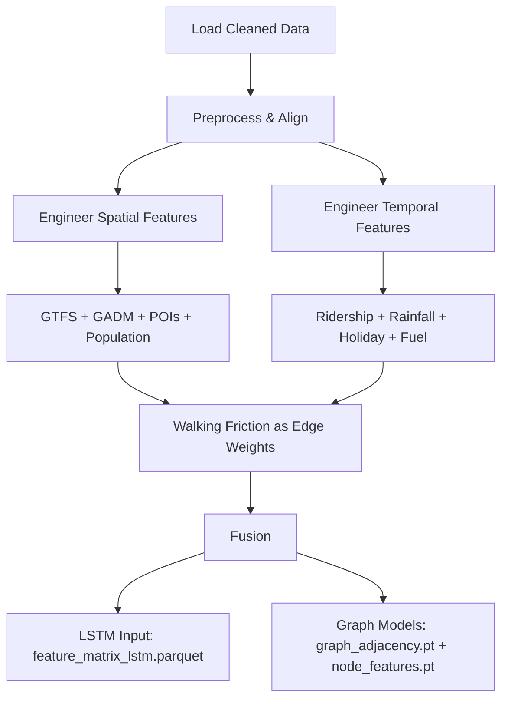

# Feature Engineering Pipeline Implementation

## Overview
This document outlines the implementation plan for integrating **9 cleaned datasets** into a unified feature engineering pipeline, supporting **LSTM, BiLSTM, TGACN, GCN-SBULSTM, TPA-LSTM, and SGCNN-STEP** models.

All datasets are sourced from `@data/cleaned/`. Graph models will use **PyTorch Geometric** with **PyTorch** for modeling.

---

## Data Inventory
| **Dataset**               | **File**                                  | **Key Features**                          |
|---------------------------|------------------------------------------|------------------------------------------|
| GTFS                      | `gtfs_ktmb/`, `gtfs_rapid_bus_*/`, `gtfs_rapid_rail_kl`        | Trips/day, headways, stop density        |
| GADM                      | `gadm_mys_l1_clean.geojson`              | Administrative boundaries, adjacency     |
| POIs                      | `osm_pois_clean.json`                    | Density, diversity, proximity            |
| Ridership                 | `ridership_headline_clean.csv`            | Rolling windows, lags, anomalies         |
| Fuel Price                | `fuelprice_cleaned.csv`                  | Daily trends, spatial alignment          |
| Holiday                   | `school_public_holiday_clean.csv`        | Binary flags, lagged effects             |
| Rainfall                  | `rainfall_combined_final.csv`            | Daily aggregates, spatial joins          |
| Walking Friction          | `walking_friction_clean.tif`             | Impedance values (edge weights)          |
| Population                | `population_density_clean.csv`           | Density (log-transformed)                |

---

## Pipeline Workflow

---

## Implementation Steps

### 1. Scripts to Create

#### **Temporal Feature Engineering Scripts**
- **`ridership_features.py`**:
  - Loads `ridership_headline_clean.csv`.
  - Engineers rolling windows (7/14/30-day), lags (±1/3/7 days), and anomalies.
  - Aligns timestamps with fuel/holiday/rainfall.
  - Output: `ridership_temporal.parquet`.

- **`fuel_features.py`**:
  - Loads `fuelprice_cleaned.csv`.
  - Resamples to daily timestamps.
  - Aligns with ridership dates.
  - Output: `fuel_temporal.parquet`.

- **`holiday_features.py`**:
  - Loads `school_public_holiday_clean.csv`.
  - Engineers binary flags (±1-day lags).
  - Output: `holiday_flags.parquet`.

- **`rainfall_features.py`**:
  - Loads `rainfall_combined_final.csv`.
  - Resamples to daily aggregates.
  - Spatial joins with GTFS stops.
  - Output: `rainfall_temporal.parquet`.

#### **Spatial Feature Engineering Scripts**
- **`spatial_features.py`**:
  - Loads `gadm_mys_l1_clean.geojson`, `osm_pois_clean.json`, `population_density_clean.csv`.
  - Computes:
    - POI density/diversity per GADM zone.
    - Population density (log-transformed).
    - GTFS stop density.
  - Output: `spatial_features.parquet`.

- **`walking_friction.py`**:
  - Loads `walking_friction_clean.tif`.
  - Extracts impedance values for GTFS stops/GADM zones.
  - Output: `walking_friction_weights.parquet`.

#### **Graph Construction**
- **`graph_construction.py`**:
  - Builds PyTorch Geometric graphs:
    - **GADM Graph**: Adjacency matrix from boundaries.
    - **GTFS Graph**: Nodes = stops, edges = routes (weighted by walking friction + distance).
    - Node features: POI density, population, GTFS service metrics.
    - Edge features: Walking friction impedance.
  - Output: `graph_adjacency.pt`, `node_features.pt`.

#### **Fusion Pipeline**
- **`pipeline.py`**:
  - Orchestrates feature engineering:
    1. **Temporal Features**: Ridership + fuel + holiday + rainfall.
    2. **Spatial Features**: POIs + population + GTFS + walking friction.
    3. **Fusion**: Merge temporal/spatial features.
  - Outputs:
    - `feature_matrix_lstm.parquet` (LSTM/BiLSTM/TPA-LSTM).
    - `graph_adjacency.pt` + `node_features.pt` (TGACN/GCN-SBULSTM/SGCNN-STEP).

---

### 2. Model-Specific Adaptations
| **Model**         | **Input**                                      | **Implementation**                          |
|-------------------|-----------------------------------------------|---------------------------------------------|
| LSTM/BiLSTM       | `[batch, timesteps, features]`                | Reshape fused temporal features.            |
| TGACN             | Graph + temporal sequences                    | `graph_adjacency.pt` + ridership sequences. |
| GCN-SBULSTM       | Graph + sequential tensors                    | Graph (GTFS/GADM) + temporal features.      |
| TPA-LSTM          | Temporal sequences + attention                | Holiday/fuel binary flags.                  |
| SGCNN-STEP        | Spatial graphs                                | GADM graph with POIs/population as nodes.   |

---

### 3. Validation
- **Spatial**: Verify GTFS-GADM alignment (`geopandas.sjoin`).
- **Temporal**: Check rolling window correlations (`pandas.rolling`).
- **Graphs**: Validate adjacency matrices (symmetry, connectivity).

---

## Dependencies
- **Libraries**: `geopandas`, `pandas`, `networkx`, `rasterio`, `PyTorch`, `PyTorch Geometric`.
- **Tools**: `src/features/` scripts.

---

## Next Steps
1. Draft `spatial_features.py`, `temporal_features.py`, `holiday_features.py`, `fuel_features.py`, `walking_friction.py`, `ridership_features.py`.
2. Create `pipeline.py` for full dataset fusion.
3. Implement `graph_construction.py` for PyTorch Geometric graphs.
4. Validate pipeline outputs.