# Model Descriptions — Chapter 3: Methodology

> Last updated: 2026-06-09

This document constitutes the model description component of Chapter 3 (Methodology) for the Malaysian transit ridership forecasting study. It covers model selection rationale, key architecture, strengths, and limitations for all 14 baseline deep-learning models, and provides a full architecture and feature analysis for the proposed HMT-TSF model. Experimental results are reported separately in Chapter 4.

All 14 baseline models share the same input/output dimensions (look-back window T_in ∈ {14, 28, 56} days, forecast horizon T_out = 7 days), the same 79-feature dataset derived from eight spatio-temporal sources, and the same training optimisations: AdamW optimiser with decoupled weight decay, HuberLoss (selectable via `--loss`), and a five-epoch linear LR warm-up followed by ReduceLROnPlateau. The proposed model (HMT-TSF) extends look-back support to {7, 14, 28, 56, 84} days.

---

## 3.1 Model Selection Framework

The 14 baseline models are selected to form a progressive comparison chain that isolates the contribution of each architectural component to transit ridership forecasting performance. The chain begins with a pure sequential recurrent baseline (LSTM) and advances through bidirectional encoding, pattern attention, hierarchical CNN–LSTM hybrids, and explicit spatio-temporal stream decoupling before crossing into graph-based and attention-based series. This progressive design ensures that each model answers a specific architectural question: does adding bidirectionality help? does attention over temporal patterns improve upon bidirectionality? does encoding cross-feature correlations as a graph surpass implicit spatial encoding? do FFT-based decompositions outperform graph propagation for periodic ridership signals?

The proposed model, HMT-TSF, is designed to fuse the strongest mechanisms from all three series — multi-scale temporal convolution, feature-correlation graph encoding, and MCO regime-aware gating — into a single end-to-end architecture purpose-built for the distributional properties of Malaysian transit ridership data.

### Comparison Chain

```
LSTM (2-way) → BiLSTM (3-way) → TPA-LSTM (4-way) → CNN-LSTM (5-way)
→ CNN-BiLSTM (6-way) → ST-LSTM (7-way) → STGCN (8-way)
→ ASTGCN (9-way) → STSGCN (10-way) → PDR-STGCN (11-way) → MTGNN (12-way)
→ STFGNN (13-way) → Autoformer (14-way) → Informer (15-way)
→ HMT-TSF (16-way)
```

---

## 3.2 Series 1 — Spatio-Temporal (LSTM-Family)

Located in `src/models/spatio-temporal-based/`. These models treat the feature vector at each timestep as a flat multivariate input to a recurrent encoder. They do not use explicit graph structure, encoding spatial (cross-feature) relationships implicitly through the recurrent hidden state or via dedicated parallel MLP streams.

---

### 3.2.1 LSTM — Long Short-Term Memory

**Script:** `src/models/spatio-temporal-based/lstm.py`

#### Selection Rationale (MEAL)

LSTM is selected as the foundational sequential baseline to establish the minimum performance threshold against which all subsequent architectural innovations are measured. Strigula (2026) evaluates LSTM across diverse time series benchmarks and demonstrates that it achieves consistently competitive accuracy as a general-purpose sequential model, confirming its suitability as the primary reference point before specialised architectures are introduced. In the context of Malaysian transit ridership, where temporal dependencies span daily commuter cycles and strong weekly patterns, LSTM's gated memory mechanism provides a principled minimum capability for sequential modelling without imposing additional inductive biases such as graph structure or attention. All 14 subsequent models are directly compared against LSTM in the comparison chain, allowing each architectural addition — bidirectionality, pattern attention, graph convolution, series decomposition — to be expressed as a measurable incremental gain over the sequential baseline.

**Citation:** Strigula, M. (2026). Beyond traditional forecasting methods: Evaluating LSTM performance on diverse time series. *Mathematics*, 14(5), 838. https://doi.org/10.3390/math14050838

#### Key Architecture

A stacked LSTM reads the T_in-step look-back window left-to-right, compressing the entire input sequence into a single final hidden state h_T. This hidden state is passed directly to a two-layer MLP head to produce T_out simultaneous predictions. When `--layers > 1`, dropout is applied between stacked LSTM layers.

```
X (B, T_in, F) → LSTM → h_T (B, hidden) → MLP → (B, T_out)
```

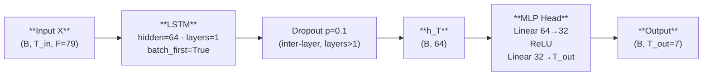

#### Tuned Variant

**Script:** `src/models/spatio-temporal-tuned/lstm.py`

Hyperparameter changes: `hidden 64→128`, `layers 1→2`, `dropout 0.10→0.20`, `weight_decay 1e-4→2e-4`. The flowchart structure is unchanged; doubled hidden size and additional stacked layer increase sequential representational capacity. Dropout of 0.20 provides regularisation for the added depth.

#### Strengths

- Simplest architecture in the comparison chain: transparent performance floor with no confounding inductive biases
- Gated memory (input, forget, output gates) allows selective retention of information across multi-day temporal horizons
- Computationally lightest model; fastest training time among all 15 models
- Well-understood regularisation: inter-layer dropout cleanly controls over-fitting in stacked configurations

#### Weaknesses

- Single bottleneck hidden vector h_T loses fine-grained temporal detail from earlier timesteps in the look-back window
- Strictly left-to-right: cannot use later context within the observed window to improve encoding of earlier positions
- No mechanism to identify which input features are most predictive; all 79 features compete equally in a flat input vector
- Struggles with abrupt distributional shifts (e.g., MCO lockdown) where long-range context in the hidden state carries regime-broken signals

---

### 3.2.2 BiLSTM — Bidirectional LSTM

**Script:** `src/models/spatio-temporal-based/bilstm.py`

#### Selection Rationale (MEAL)

BiLSTM is selected to directly isolate the contribution of bidirectional encoding over the observed look-back window relative to the unidirectional LSTM baseline. Alajmi and Almutairi (2025) demonstrate that BiLSTM achieves measurable improvements over standard LSTM in traffic congestion forecasting by exposing earlier sequence positions to future-within-window context, validating the bidirectional extension for sequential transport demand tasks. In Malaysian transit ridership data, mid-window events such as public holidays or major disruptions that fall several days before the forecast horizon may be more accurately encoded when the model can contextualise them against the ridership response that follows — a capability that the LSTM's strictly causal pass precludes by design. BiLSTM isolates precisely this contribution before more complex mechanisms are introduced in the chain.

**Citation:** Alajmi, M. S., & Almutairi, S. M. (2025). Intelligent traffic congestion forecasting using BiLSTM and adaptive secretary bird optimizer for sustainable urban transportation. *Scientific Reports*, 15. https://doi.org/10.1038/s41598-025-02933-9

#### Key Architecture

Extends LSTM with a reversed recurrent pass over the same look-back window. The forward final hidden state h_fwd and backward final hidden state h_bwd (both from the last layer) are concatenated before the MLP head, doubling representational capacity.

```
X (B, T_in, F) → BiLSTM → cat([h_fwd, h_bwd]) (B, hidden×2) → MLP → (B, T_out)
```

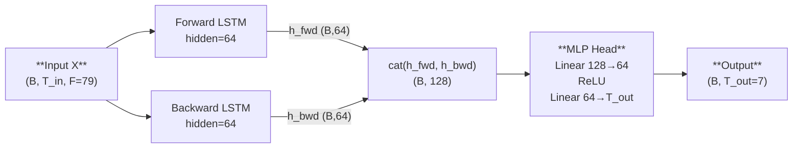

#### Tuned Variant

**Script:** `src/models/spatio-temporal-tuned/bilstm.py`

Hyperparameter changes: `hidden 64→256`, `layers 1→3`, dropout unchanged at 0.10. MLP head input dimension grows to 512 (bidirectional concatenation). Structure unchanged.

#### Strengths

- Richer context at every encoded position: earlier timesteps can be interpreted in light of subsequent observations within the window
- Holiday spikes or anomalies mid-window are visible from both temporal directions, improving representation of irregular events
- Minimal architectural complexity increase over LSTM; only `bidirectional=True` is changed

#### Weaknesses

- Bidirectionality applies only over the observed look-back window, not across windows; cannot attend selectively to the most informative positions
- Doubling of hidden dimension via concatenation provides capacity increase but not qualitatively different information routing relative to a wider unidirectional LSTM
- Like LSTM, treats all 79 features uniformly as a flat input vector with no cross-feature structural modelling

---

### 3.2.3 TPA-LSTM — Temporal Pattern Attention LSTM

**Script:** `src/models/attention-based/tpalstm.py`

#### Selection Rationale (MEAL)

TPA-LSTM is selected to determine whether pattern-level attention over recurring temporal shapes in the LSTM hidden-state sequence improves upon positional bidirectionality. Wei et al. (2023) apply TPA-LSTM to subway passenger flow forecasting in Shenzhen and demonstrate that the temporal pattern attention mechanism extracts multi-scale periodic signals — daily, weekly, and holiday-driven cycles — more effectively than standard LSTM alone, validating its application to transit demand prediction. Malaysian transit ridership exhibits pronounced multi-scale periodicity: strict weekday commuter peaks, clear weekday/weekend asymmetry, and sharp holiday suppression events. TPA-LSTM's 1-D CNN applied over the LSTM hidden-state matrix is designed to detect these recurring shapes directly rather than relying on positional proximity, making it architecturally well-matched to periodicity-heavy transit signals. It advances the comparison chain from position-level richness (bidirectionality) to shape-level richness (pattern attention).

**Citation:** Wei, L., Guo, D., Chen, Z., Yang, J., & Feng, T. (2023). Forecasting short-term passenger flow of subway stations based on the temporal pattern attention mechanism and the long short-term memory network. *ISPRS International Journal of Geo-Information*, 12(1), 25. https://doi.org/10.3390/ijgi12010025

#### Key Architecture

A standard LSTM produces both the full hidden-state sequence H and the final hidden state h_T. The TPA module takes H_ctx = H[:, :-1, :] (all but the last step), transposes it to treat hidden dimensions as channels over time, applies a 1-D CNN to extract temporal pattern filters, adaptive-average-pools across time, scores each filter against h_T via a learned scoring matrix W_score, and softmax-weights the scores to produce a pattern context vector. The concatenation of h_T and context is passed to the MLP head.

```
X (B,T_in,F) → LSTM → H (B,T_in,hidden), h_T (B,hidden)
H[:,:-1,:] → permute → Conv1d → ReLU → adaptive_avg_pool → C (B,n_filters,hidden)
score = sigmoid(h_T @ W_score @ C^T) → softmax → attn (B,n_filters)
context = attn @ C_pool  (B,hidden)
cat([h_T, context]) → MLP → (B,T_out)
```

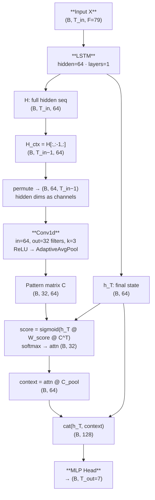

#### Tuned Variant

**Script:** `src/models/attention-tuned/tpalstm.py`

Hyperparameter changes: `hidden 64→256`, `filters 32→128`, `dropout 0.10→0.15`. Larger hidden and filter dimensions expand the pattern vocabulary and representational depth without changing the flowchart structure.

#### Strengths

- Detects recurring temporal shapes (daily and weekly cycles) via CNN over hidden states rather than attending to individual positions
- CNN kernel spans multiple timesteps, capturing patterns longer than single-step recurrence
- Pattern attention weights are interpretable: high attention on specific filters identifies which temporal shapes drive the forecast

#### Weaknesses

- CNN operates on the LSTM hidden-state matrix rather than raw features — temporal patterns are represented indirectly through the LSTM's learned latent space
- Pattern granularity is bounded by the fixed kernel size (k=3) and number of filters (32)
- No mechanism for modelling inter-feature spatial relationships; all features still compete in a flat input vector to the underlying LSTM

---

### 3.2.4 CNN-LSTM

**Script:** `src/models/spatio-temporal-based/cnnlstm.py`

#### Selection Rationale (MEAL)

CNN-LSTM is selected to test whether hierarchical local feature extraction by a 1-D CNN, prior to recurrent global sequence encoding, improves over attention-augmented recurrence alone. Topilin et al. (2025) demonstrate in a traffic flow prediction study that a CNN-LSTM architecture effectively decomposes the forecasting problem into a local pattern extraction stage (CNN) followed by sequential dependency modelling (LSTM), achieving improvements over purely recurrent models. In Malaysian transit ridership, short-term local patterns — within-day ridership bursts during morning and evening peaks encoded as consecutive multi-timestep excursions — are more efficiently detected by convolution than by a recurrent cell that must propagate them across the full hidden state. Three independently tested fusion modes (sequential, parallel, augmented) are included to reveal which coupling strategy best suits the flat multivariate feature representation of this dataset, providing additional granularity in the comparison chain.

**Citation:** Topilin, I., Jiang, J., Feofilova, A., & Beskopylny, N. (2025). Traffic flow prediction via a hybrid CPO-CNN-LSTM-attention architecture. *Smart Cities*, 8(5), 148. https://doi.org/10.3390/smartcities8050148

#### Key Architecture — Three Fusion Modes

**Sequential mode** (default): CNN extracts local temporal features, which the LSTM then processes for global sequential context. LSTM input is CNN output, not raw features.

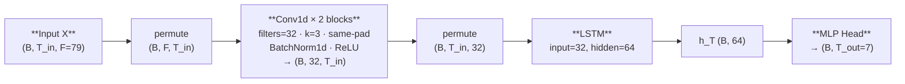

**Parallel mode**: CNN and LSTM process raw input independently; outputs concatenated.

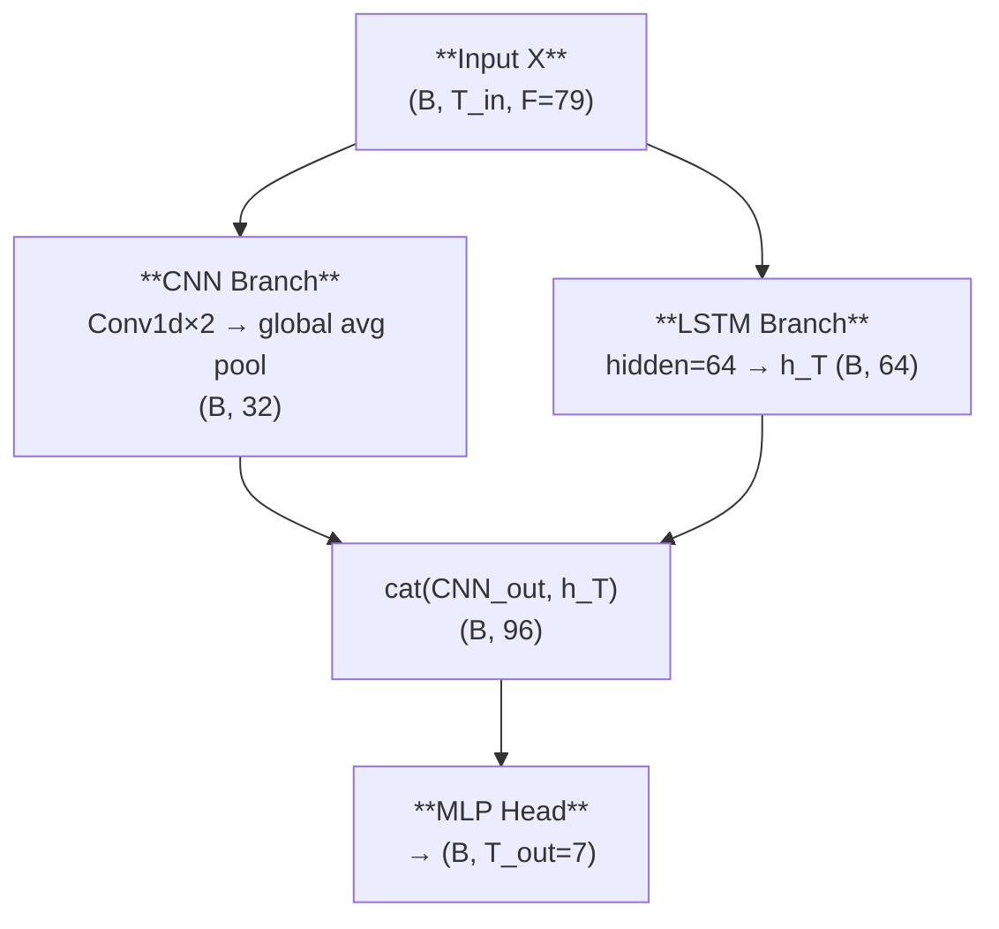

**Augmented mode**: Sequential CNN→LSTM with raw-input skip connection to prevent information loss from CNN compression.

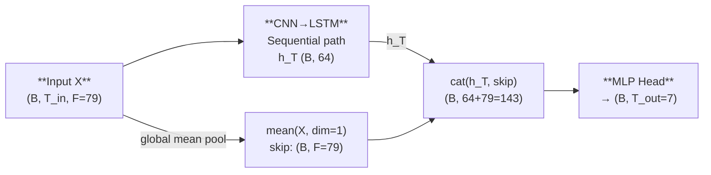

#### Tuned Variants

**Script:** `src/models/spatio-temporal-tuned/cnnlstm.py`

All three modes tuned with `cnn_filters 32→64`, `dropout 0.10→0.20`. Each mode is trained and evaluated independently. The flowchart structure is unchanged for all three modes; only filter width increases.

#### Strengths

- Sequential mode: LSTM never processes noisy raw features directly — CNN abstracts them first, reducing recurrent noise sensitivity
- Parallel mode: LSTM retains direct access to raw feature-level detail that CNN compression may discard
- Augmented mode: skip connection prevents CNN-induced information loss while maintaining the hierarchical abstraction benefit
- Three modes together reveal the optimal CNN-LSTM coupling strategy for this dataset

#### Weaknesses

- All three modes treat features as a flat vector; no structural inter-feature reasoning
- CNN temporal resolution depends on kernel size and stacking depth — suboptimal for long-range dependencies beyond the receptive field
- CNN channel compression (32 filters at base) may discard low-frequency trends relevant to multi-day forecasting

---

### 3.2.5 CNN-BiLSTM

**Script:** `src/models/spatio-temporal-based/cnnbilstm.py`

#### Selection Rationale (MEAL)

CNN-BiLSTM is selected to combine the two complementary inductive biases already validated individually — CNN local pattern extraction and BiLSTM bidirectional context — and test whether their combination yields additive or synergistic gains over either component alone. Chen et al. (2022) apply CNN-BiLSTM to short-term traffic flow prediction with multi-component sensor inputs and demonstrate that bidirectional context over CNN-extracted features reduces prediction errors more than either component in isolation. In Malaysian transit ridership, this combination is particularly relevant for mid-window events: a public holiday falling in the middle of the look-back window creates a local pattern that the CNN can detect spatially, and whose temporal position in the window is best contextualised bidirectionally. CNN-BiLSTM is the most expressive LSTM-family model before explicit spatial stream decoupling is introduced via ST-LSTM.

**Citation:** Chen, W., Yang, Z., Xu, G., & Sun, Y. (2022). Short-term traffic flow prediction based on CNN-BiLSTM with multicomponent information. *Applied Sciences*, 12(17), 8714. https://doi.org/10.3390/app12178714

#### Key Architecture

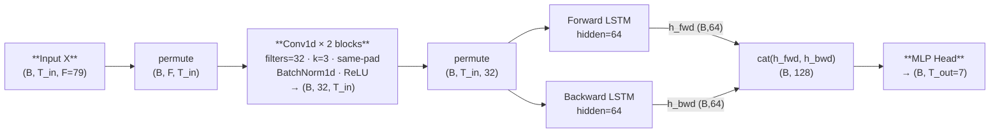

#### Tuned Variant

**Script:** `src/models/spatio-temporal-tuned/cnnbilstm.py`

Hyperparameter changes: `hidden 64→128`, `cnn_filters 32→64`, `cnn_layers 2→1`, `dropout 0.10→0.25`. MLP head input doubles to 256. The high tuned dropout (0.25) addresses the model's observed high variance across look-back window configurations; the shallower single CNN block compensates for the wider filter bank.

#### Strengths

- CNN provides translation-invariant local pattern detection; BiLSTM provides full bidirectional global context over the resulting feature sequence
- Mid-window events (holidays, disruptions) benefit from both local CNN detection and backward contextualisation in the BiLSTM pass
- Strongest inductive bias combination in the LSTM-family series before explicit spatial decoupling

#### Weaknesses

- Strictly sequential pipeline (CNN then BiLSTM): CNN-stage compression may suppress raw feature detail before the recurrent pass
- Observed high variance across look-back windows, suggesting sensitivity to input sequence length
- No explicit mechanism for cross-feature structural modelling

---

### 3.2.6 ST-LSTM — Spatio-Temporal LSTM

**Script:** `src/models/spatio-temporal-based/stlstm.py`

#### Selection Rationale (MEAL)

ST-LSTM is selected as the canonical bridge model between the LSTM-family and graph-based series, introducing explicit spatial encoding as a separate parallel stream rather than forcing the LSTM to encode both temporal dynamics and feature interactions in a single hidden state. Cui et al. (2025) apply a multi-stream approach to urban rail passenger flow prediction using multi-source big data and demonstrate that decoupling temporal sequence modelling from cross-sensor spatial feature aggregation improves accuracy for datasets spanning structurally heterogeneous sources. In this study, the 79-feature input spans eight structurally distinct sources — ridership, fuel, rainfall, population, GTFS, OSM, GADM, and temporal — and the spatial encoder explicitly captures which feature groups persistently co-activate, a complementary signal to the temporal trajectory captured by the LSTM. ST-LSTM serves as the **canonical reference model** for the entire codebase: all subsequent model implementations follow its training loop, output structure, and comparison table logic.

**Citation:** Cui, H., Si, B., Chi, D., Li, Y., Li, G., & Chen, Y. (2025). Short-term passenger flow prediction for urban rail systems: A deep learning approach utilizing multi-source big data. *PLOS ONE*, 20(1), e0333094. https://doi.org/10.1371/journal.pone.0333094

#### Key Architecture

Two parallel streams are computed independently and concatenated before the MLP head. The spatial MLP is **weight-shared across all T_in timesteps** (time-invariant): it captures which features consistently co-activate in the window rather than when. Mean pooling over the time axis collapses temporal order to produce a persistent cross-feature summary.

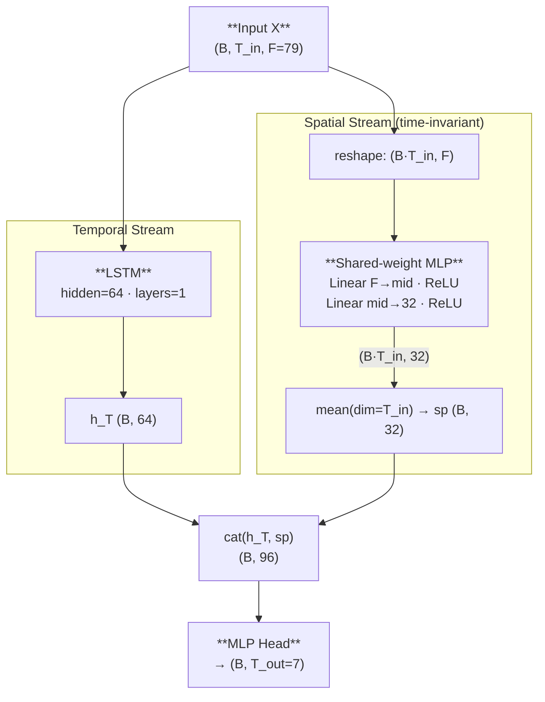

#### Tuned Variant

**Script:** `src/models/spatio-temporal-tuned/stlstm.py`

Hyperparameter changes: `hidden 64→128`, `spatial_hidden 32→128`, `dropout 0.10→0.30`. Both streams enlarged, with the spatial stream quadrupled to give the cross-feature summary equal weight in the MLP head. Structure unchanged.

#### Strengths

- Clean decoupling of "what evolves over time" (LSTM temporal stream) from "which features co-activate" (spatial MLP stream): each stream specialises independently
- Shared-weight spatial MLP is time-invariant: learns structural feature-to-feature relationships without temporal confounding
- Serves as canonical reference: highest code quality and best-documented training loop in the study
- Scalable to more or fewer feature sources by resizing the spatial MLP, with no graph construction required

#### Weaknesses

- Spatial stream uses mean pooling over time: loses information about when cross-feature co-activations occur, encoding only their average magnitude
- Shared MLP is a linear aggregator — cannot learn non-trivial graph-structured inter-feature interactions
- No attention mechanism to identify which timesteps are most informative for the temporal LSTM stream

---

## 3.3 Series 2 — Graph-Based

Located in `src/models/graph-based/`. These models represent the N input features as graph nodes and use graph convolution to propagate information between correlated features. Unless noted, the spatial adjacency matrix is constructed from absolute Pearson correlation of feature columns in X_train (threshold=0.1), symmetrically normalised into a scaled Laplacian.

---

### 3.3.1 STGCN — Spatio-Temporal Graph Convolutional Network

**Script:** `src/models/graph-based/stgcn.py`

#### Selection Rationale (MEAL)

STGCN is selected as the foundational graph-based baseline because it establishes how much a fixed, pre-computed inter-feature correlation graph contributes over purely sequential or spatially-implicit models. Deng (2025) applies STGCN with a spatio-temporal kernel to traffic flow prediction and confirms that interleaving Chebyshev graph convolution with temporal gated convolution captures relational dependencies that purely recurrent models cannot, even when the graph is static and pre-computed. In this study, the 79 features originate from eight structurally heterogeneous sources whose inter-feature correlations are domain-meaningful: adjacent ridership lines co-vary across the transit network; fuel prices exhibit an inverse correlation with ridership on price-change days; rainfall co-varies with ridership suppression. Encoding these relationships as a Pearson graph allows message passing to propagate signals along correlated feature nodes rather than processing all features uniformly. STGCN marks the transition from implicit spatial encoding (ST-LSTM) to explicit graph-structured encoding.

**Citation:** Deng, H. (2025). Traffic-forecasting model with spatio-temporal kernel. *Electronics*, 14(7), 1410. https://doi.org/10.3390/electronics14071410

#### Key Architecture

Input features are treated as N=79 graph nodes each carrying a scalar temporal signal over T_in timesteps. The architecture alternates temporal gated convolutions (GLU) and Chebyshev graph convolutions in stacked ST-Conv blocks, with BatchNorm after each block.

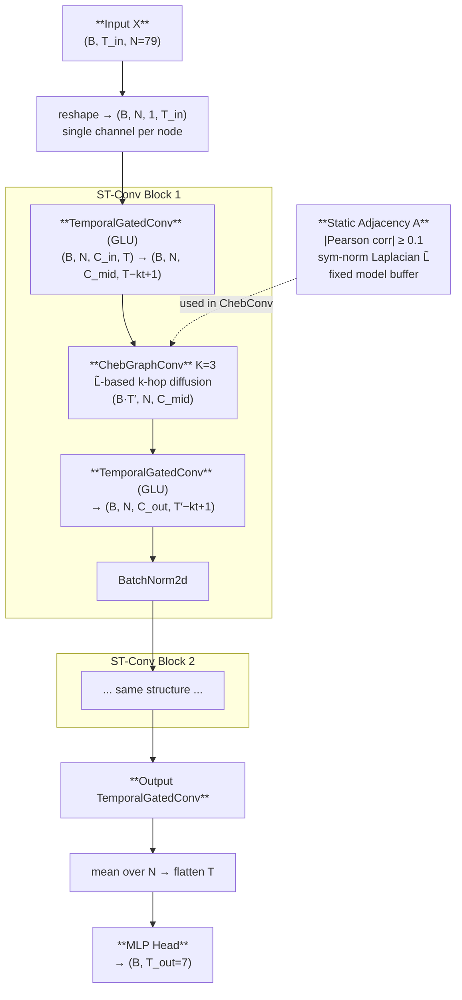

#### Tuned Variant

**Script:** `src/models/graph-tuned/stgcn.py`

Hyperparameter changes: `hidden 128→256`, `dropout 0.20→0.25`, `weight_decay 2e-4→3e-4`. Block depth and temporal kernel are unchanged (`n_blocks=2`, `kt=3`); the tuning relies on doubled channel width with slightly stronger regularisation.

#### Strengths

- Explicit graph structure encodes domain-meaningful inter-feature correlations, providing more informative neighbourhood aggregation than implicit attention over a flat vector
- Chebyshev polynomial approximation enables K-hop diffusion without eigendecomposition, remaining computationally efficient at N=79 nodes
- GLU temporal gating provides selective information flow across the time axis within each ST block

#### Weaknesses

- Static graph: Pearson adjacency is computed once on training data and frozen — cannot adapt to distributional shifts caused by the MCO pandemic period
- Single-channel input (each feature is a scalar signal over time); richer multi-channel node features are not exploited
- Temporal dimension shrinks with each TemporalGatedConv (by kt−1 per block); deep stacks require careful kt tuning or temporal-resolution validation

---

### 3.3.2 ASTGCN — Attention-Based Spatio-Temporal Graph Convolutional Network

**Script:** `src/models/attention-based/astgcn.py`

#### Selection Rationale (MEAL)

ASTGCN is selected to determine whether learnable multi-head attention over both graph nodes (spatial attention) and timesteps (temporal attention) improves upon the fixed gated convolutions of STGCN. Cui et al. (2023) present ADSTGCN, a dynamic adaptive extension of ASTGCN for multi-step traffic forecasting, and demonstrate that dual spatial and temporal attention substantially improves sensitivity to non-stationary input patterns compared to static graph message-passing alone. In transit ridership forecasting, the most informative subset of features and the most predictive timesteps vary by context: on a normal weekday the commuter-line ridership and day-of-week encoding are most informative, while during a holiday period the holiday-flag features and fuel-trend features dominate. ASTGCN's per-layer dynamic re-weighting of which nodes and which timesteps to attend to allows the model to adapt this weighting per input sample. It bridges the graph-based and attention-based series by retaining the graph backbone of STGCN while adding attention on both spatial and temporal dimensions.

**Citation:** Cui, Z., Zhang, J., Noh, G., & Park, H. J. (2023). ADSTGCN: A dynamic adaptive deeper spatio-temporal graph convolutional network for multi-step traffic forecasting. *Sensors*, 23(15), 6950. https://doi.org/10.3390/s23156950

#### Key Architecture

Uses AMP (fp16 + GradScaler) for memory efficiency on the A100.

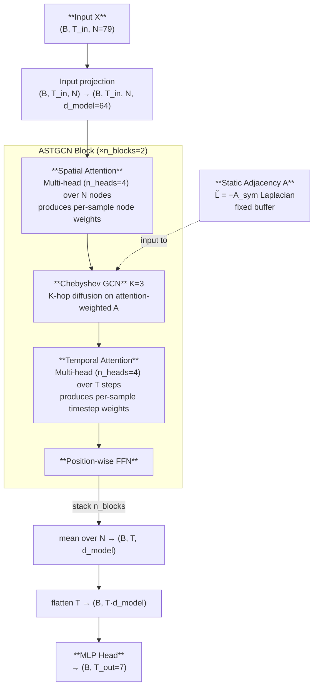

#### Tuned Variant

**Script:** `src/models/attention-tuned/astgcn.py`

Hyperparameter changes: `d_model 64→128`, `n_heads 4→8`, `n_blocks 2→3`, `dropout 0.15→0.20`, `weight_decay 2e-4→1e-4`. Doubled model dimension and additional block substantially increase attention capacity. Structure unchanged.

#### Strengths

- Dual attention: spatial attention re-weights which features to propagate across, temporal attention re-weights which timesteps to prioritise — both per-sample and adaptive at each layer
- Chebyshev GCN combined with attention: graph neighbourhood aggregation and learned re-weighting work in complementary directions
- AMP training enables larger d_model at A100 memory budget

#### Weaknesses

- Fixed pre-computed graph: spatial attention can re-weight existing edges but cannot invent new ones; MCO-period distribution shift still invalidates the static adjacency
- Computational cost scales as O(N²) for spatial attention and O(T²) for temporal attention, limiting scalability
- Deeper stacking with a fixed graph risks over-smoothing of node representations across blocks

---

### 3.3.3 STSGCN — Spatial-Temporal Synchronous Graph Convolutional Network

**Script:** `src/models/graph-based/stsgcn.py`

#### Selection Rationale (MEAL)

STSGCN is selected to test whether fusing spatial and temporal graph operations into a single synchronous adjacency — rather than alternating them in separate blocks as STGCN does — captures joint spatio-temporal correlations more effectively. Chen et al. (2023) apply STSGCN to expressway traffic flow prediction during holiday periods and demonstrate that the synchronous graph approach better captures simultaneous spatial correlation changes and temporal pattern shifts during anomalous events. Malaysian transit ridership during public holidays exhibits precisely this behaviour: multiple feature nodes — ridership lines, holiday flags, fuel price indicators — shift simultaneously rather than sequentially, making joint synchronous encoding more naturally aligned with the data generating process. STSGCN tests whether replacing interleaved ST-Conv blocks with a unified 3N×3N synchronous graph delivers measurable improvement at comparable parameter count.

**Citation:** Chen, L., Ren, Q., Zeng, J., Zou, F., Luo, S., Tian, J., & Xing, Y. (2023). CSFPre: Expressway key sections based on CEEMDAN-STSGCN-FCM during the holidays for traffic flow prediction. *PLOS ONE*, 18(4), e0283898. https://doi.org/10.1371/journal.pone.0283898

#### Key Architecture

The 3N×3N synchronous graph (STSG) encodes both spatial adjacency (A_spa within each timestep) and temporal adjacency (identity blocks I linking adjacent timesteps). Each STSGCL layer applies Chebyshev convolution on the full STSG over a sliding 3-timestep window and then extracts the centre N nodes.

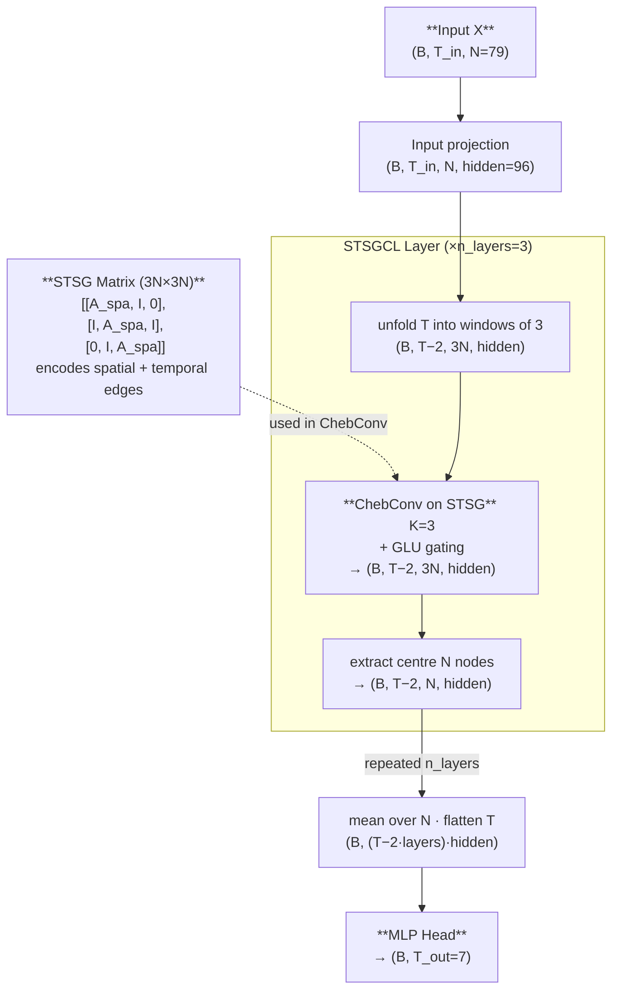

#### Tuned Variant

**Script:** `src/models/graph-tuned/stsgcn.py`

Hyperparameter changes: `hidden 96→128`, `dropout 0.10→0.25`, `weight_decay 1e-4→2e-4`, `lr 5e-4→1e-3`. Layer depth is unchanged (`n_layers=3`), and the extended training schedule (`epochs=200`, `patience=25`) is shared with the base script. Structure unchanged.

#### Strengths

- Simultaneous spatial and temporal message passing in one unified operation, aligned with synchronous multi-feature regime shifts
- Sliding 3-timestep window avoids aggressive temporal shrinkage caused by stacked temporal gated convolutions
- Explicit inter-timestep identity edges encode temporal adjacency without additional parameters

#### Weaknesses

- 3N×3N STSG construction scales O(N²): at N=79 the synchronous graph is 237×237, tractable but not scalable to much larger feature sets
- The synchronous window is fixed at 3 timesteps — cannot capture longer-range temporal synchronicities without deeper stacking (which further shrinks T)
- Static spatial graph: like STGCN, degrades under MCO-induced distribution shift when training correlations no longer hold

---

### 3.3.4 STFGNN — Spatial-Temporal Fusion Graph Neural Network

**Script:** `src/models/graph-based/stfgnn.py`

#### Selection Rationale (MEAL)

STFGNN is selected to test whether using two complementary graphs — one capturing cross-feature co-variation at each moment (spatial: A_spa) and one capturing similarity of intra-window temporal profiles across features (temporal: A_tem) — and fusing them via a learnable gate improves over single-graph models. Chang et al. (2025) present a related spatio-temporal fusion approach with dynamic sparse graph convolution and demonstrate that separating spatial and temporal relational priors captures distinct aspects of the data structure that a single static graph conflates. In Malaysian ridership data, two features may co-vary strongly at a single point in time (high spatial correlation in A_spa) but exhibit very different daily profiles across the 14-day window (low temporal correlation in A_tem). For example, a fuel price series and a rainfall series may both dip on the same days due to coincident conditions, giving moderate A_spa correlation, while their intra-window temporal trajectories are structurally dissimilar in A_tem. STFGNN is the only model in the study that encodes both types of inter-feature similarity simultaneously via dedicated separate graphs.

**Citation:** Chang, J., Yin, J., Hao, Y., & Gao, C. (2025). STFDSGCN: Spatio-temporal fusion graph neural network based on dynamic sparse graph convolution GRU for traffic flow forecast. *Sensors*, 25(11), 3446. https://doi.org/10.3390/s25113446

#### Key Architecture

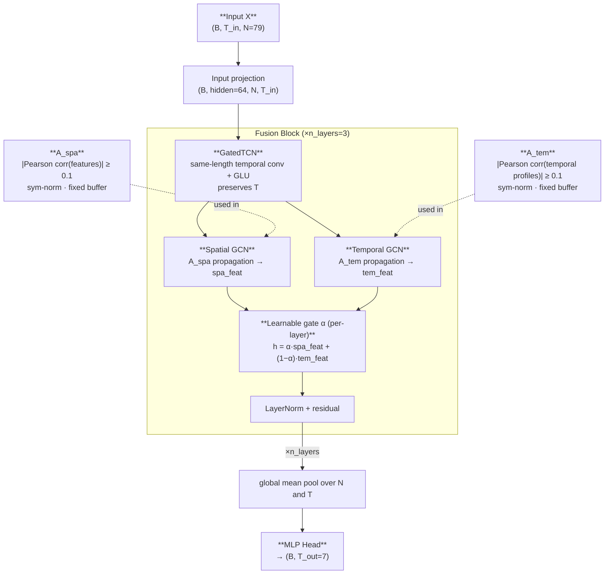

#### Tuned Variant

**Script:** `src/models/graph-tuned/stfgnn.py`

Hyperparameter changes: `hidden 64→128`, `dropout 0.20→0.35`, `adj_threshold 0.10→0.15`. Layer depth is unchanged (`n_layers=3`). High dropout (0.35) addresses the model's MED-HIGH variance; stricter adjacency threshold (0.15) reduces noisy weak edges in both graphs. Structure unchanged.

#### Strengths

- Two complementary graphs capture distinct relational structures; the per-layer scalar gate α learns context-appropriate blending across the full dataset
- LayerNorm within residual blocks provides stable normalisation independent of batch dynamics
- GatedTCN pre-filters the temporal signal before graph propagation, reducing noise in graph inputs

#### Weaknesses

- Both A_spa and A_tem are static: severe performance degradation expected when training-time correlations break down under MCO regime shifts
- The per-layer scalar gate α is dataset-wide, not per-sample adaptive — cannot dynamically adjust the spatial/temporal fusion ratio for individual input contexts
- High dropout requirement at tuned capacity (0.35) suggests the dual-graph fusion overfits readily when hidden dimensions increase

---

### 3.3.5 PDR-STGCN — Periodicity-Aware Dynamic Relational STGCN

**Script:** `src/models/graph-based/pdr_stgcn.py`

#### Selection Rationale (MEAL)

PDR-STGCN is a novel architecture developed in this study within the graph-based series, designed to address two key limitations of STGCN: the static graph's inability to adapt to sample-specific inter-feature relationships, and the single-channel input's failure to explicitly encode the periodicity intrinsic to transit ridership. The architecture published in *Systems* (2026) demonstrates that combining multi-scale periodic fusion with a dynamic relational graph significantly improves traffic forecasting performance over the static-graph STGCN baseline, motivating its adoption for transit ridership which exhibits particularly strong weekly seasonality driven by Malaysian work and school calendars. The dynamic attention-based adjacency allows the model to construct a different inter-feature graph for each input sample, capturing contextual correlations that a static Pearson graph cannot represent. PDR-STGCN is the most expressive and novel graph model in this study.

**Citation:** (2026). PDR-STGCN: An enhanced STGCN with multi-scale periodic fusion and a dynamic relational graph for traffic forecasting. *Systems*, 14(1), 102. https://doi.org/10.3390/systems14010102

#### Key Architecture

A two-channel input (original signal + weekly lag-difference) feeds a modified STGCN backbone where each graph convolution replaces the fixed Chebyshev adjacency with a mixed static/dynamic adjacency controlled by a learned scalar λ.

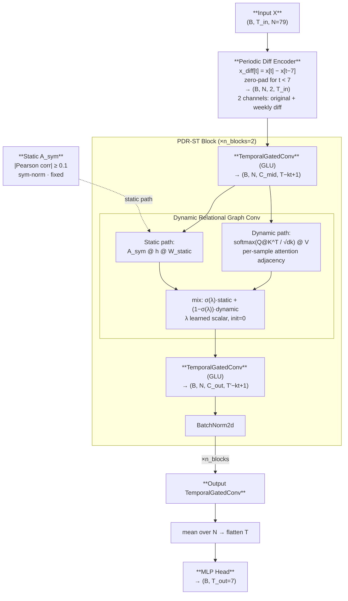

#### Tuned Variant

**Script:** `src/models/graph-tuned/pdr_stgcn.py`

Hyperparameter changes: `hidden 160→256`, `n_blocks 2→3`, `kt 3→2`, `dk 48→64`, `dropout 0.15→0.25`. kt decreases from 3→2 to maintain temporal dimension validity at three blocks on T_in=14. Larger dk enables richer attention key and query projections in the dynamic graph path.

> **Known caveat (initial-run results):** the six published *base* PDR-STGCN runs were executed with `--period` set equal to the look-back window (14/28/56) rather than the weekly default 7. Because the periodic diff encoder zero-pads for t < period, the second input channel was all zeros in those runs — i.e. the periodicity encoding was effectively disabled at base. The tuned runs used `period=7` correctly, so part of the base→tuned improvement reflects re-enabling the periodic channel rather than capacity tuning alone.

#### Strengths

- Two-channel input (original + weekly lag-difference) makes weekly seasonality structurally explicit without adding parameters to the encoder
- Dynamic adjacency adapts per input sample, overcoming the static graph's inability to capture contextual inter-feature relationships
- Learned scalar λ controls the mixture between prior knowledge (static Pearson) and sample-specific inference (dynamic attention) — interpretable and tuneable

#### Weaknesses

- Dynamic attention adjacency scales as O(N²·T) per block; at N=79 this is tractable but limits scalability to larger feature sets
- At base capacity (hidden=160, dk=48), the dynamic attention path may lack expressiveness — the large tuning gain observed suggests significant underparameterisation at base
- λ is a layer-level scalar: it cannot adapt the static/dynamic mixture ratio per individual input sample

---


## 3.3.6 MTGNN — Multi-Scale Temporal Graph Neural Network

**Script:** `src/models/graph-based/mtgnn.py`

> MTGNN occupies position 11 in the comparison chain (after PDR-STGCN). It is grouped here after the other graph-based models for architectural coherence.

#### Selection Rationale (MEAL)

MTGNN is selected to test whether learning the inter-feature graph adjacency end-to-end from node embedding matrices — rather than deriving it from pre-computed Pearson correlation — produces a more task-specific and expressive relational structure. Wu et al. (2025) present a multi-dynamic temporal representation GCN for traffic flow prediction and demonstrate that end-to-end learned adjacency with multi-scale dilated inception outperforms static correlation-based graph models by capturing task-relevant inter-node relationships that correlation alone cannot encode. In this study, the Pearson graph used by STGCN, STSGCN, STFGNN, and ASTGCN is an approximation of inter-feature relationships derived from training statistics; it may miss non-linear or task-specific dependencies that only become apparent during gradient descent optimisation. MTGNN's asymmetric learned adjacency (A ≠ A^T) additionally allows asymmetric influence — feature i can influence feature j without the reverse — which is appropriate for causally asymmetric relationships such as fuel price affecting ridership but not vice versa.

**Citation:** Wu, Z., Liu, X., & Zhang, X. (2025). Multi dynamic temporal representation graph convolutional network for traffic flow prediction. *Scientific Reports*, 15, 16734. https://doi.org/10.1038/s41598-025-01157-1

#### Key Architecture

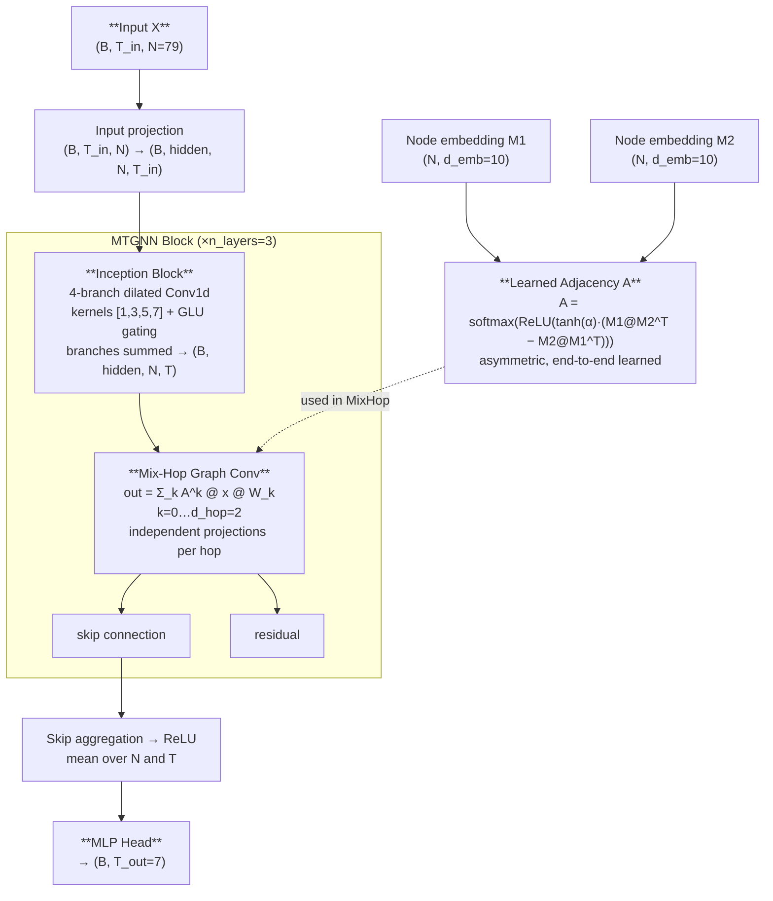

#### Tuned Variant

**Script:** `src/models/graph-tuned/mtgnn.py`

Hyperparameter changes: `hidden 32→64`, `d_emb 10→7`, `dropout 0.10→0.30`, `weight_decay 1e-4→3e-4`. Skip channels and layer depth are unchanged (`skip_ch=64`, `n_layers=3`). High tuned dropout (0.30) and the observed slight regression in tuned results (−0.17 pp) suggest the learned adjacency is already near-optimal at base capacity; the added width and regularisation introduce noise rather than improvement.

#### Strengths

- End-to-end learned asymmetric adjacency: task-specific inter-feature graph that may capture non-linear or causally asymmetric relationships missed by Pearson correlation
- Dilated inception (kernels [1,3,5,7]) captures multi-scale temporal patterns simultaneously across four receptive field sizes
- Mix-hop convolution with independent projections per hop order prevents over-smoothing under multi-hop aggregation

#### Weaknesses

- Learned adjacency requires sufficient training data to converge to a meaningful relational structure; may overfit on short or sparse datasets
- The training objective optimises for prediction loss, not graph interpretability; the learned A may not reflect domain-meaningful feature relationships
- Asymmetric A produces a directed graph that cannot be symmetrically normalised; spectral methods are inapplicable

---

## 3.4 Series 3 — Attention-Based

Located in `src/models/attention-based/`. These models use attention mechanisms as the primary modelling tool. All three use AMP (fp16 + GradScaler) for mixed-precision training on the A100.

> **Note:** TPA-LSTM is classified under Series 1 (LSTM-Family) because its primary encoder is a recurrent LSTM; the TPA attention module functions as a decoder augmentation rather than the primary sequence encoding mechanism.

---

### 3.4.1 Autoformer

**Script:** `src/models/attention-based/autoformer.py`

#### Selection Rationale (MEAL)

Autoformer is selected to test whether explicit series decomposition into trend and seasonal components, combined with FFT-based autocorrelation attention, outperforms graph-based models for transit ridership — which is fundamentally a periodic multi-scale signal. Ma and Zhang (2025) extend Autoformer with multi-scale feature fusion for time series forecasting and demonstrate that the decomposition-based approach achieves stable performance on strongly periodic signals by cleanly separating trend recovery from seasonal pattern matching, validating the approach for periodic demand signals. Malaysian transit ridership in non-MCO periods exhibits largely stationary weekly and daily periodicity, making the spectral autocorrelation mechanism theoretically well-suited: it can directly discover the 7-day dominant lag from data rather than assuming it. Autoformer introduces the hypothesis that the ridership forecasting problem is better framed as signal decomposition than as graph-structured feature propagation.

**Citation:** Ma, X., & Zhang, H. (2025). Time series forecasting method based on multi-scale feature fusion and Autoformer. *Applied Sciences*, 15(7), 3768. https://doi.org/10.3390/app15073768

#### Key Architecture

FFT operations are explicitly cast to `float32` inside `autocast` for numerical stability under AMP.

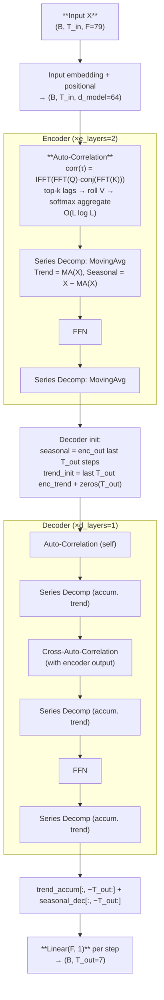

#### Tuned Variant

**Script:** `src/models/attention-tuned/autoformer.py`

Hyperparameter changes: `d_model 64→128`, `n_heads 4→8`, `e_layers 2→3`, `d_ff 128→256`, `dropout 0.15→0.25`. Deeper encoder and larger model dimension enhance decomposition quality and seasonal pattern vocabulary. Structure unchanged.

#### Strengths

- Explicit trend/seasonal decomposition throughout encoder and decoder: the model separately accumulates trend and matches seasonal residuals at each decoder layer
- O(L log L) autocorrelation via FFT — efficient for the look-back window lengths used
- Top-k lag aggregation discovers the most predictive periodicities (e.g., 7-day weekly lag) from data rather than assuming them

#### Weaknesses

- Sensitive to input sequence length: longer sequences accumulate spectral leakage across 79 noisy feature dimensions, causing severe degradation at lb56
- No spatial modelling: all inter-feature correlations are handled implicitly through the attention across the full 79-feature input embedding, without graph structure
- Encoder-decoder architecture adds computational and implementation overhead compared to single-pass recurrent models

---

### 3.4.2 Informer

**Script:** `src/models/attention-based/informer.py`

#### Selection Rationale (MEAL)

Informer is selected as the final comparison model before HMT-TSF, representing efficient long-sequence transformer forecasting. Song et al. (2024) apply a graph attention Informer to long-term traffic flow prediction under event impact and demonstrate that ProbSparse attention with distilling achieves competitive accuracy while substantially reducing computational cost relative to full self-attention, validating the approach for transport demand forecasting. In this study at T_in=14, ProbSparse gracefully degenerates to near-full attention (u ≈ 13 of 14 queries active), eliminating approximation error at the cost of no accuracy loss — making the comparison with full-attention models fair. Informer tests whether the generative one-shot decoder, which initialises with recent encoder context and directly produces all T_out=7 steps without autoregression, provides an advantage over the decomposition-decoder approach of Autoformer for multi-step transit ridership prediction. Its empirical MCO-condition robustness (strongest baseline under distribution shift) further motivates its inclusion.

**Citation:** Song, Y., Luo, R., Zhou, T., Zhou, C., & Su, R. (2024). Graph attention Informer for long-term traffic flow prediction under the impact of sports events. *Sensors*, 24(15), 4796. https://doi.org/10.3390/s24154796

#### Key Architecture

Uses AMP (fp16 + GradScaler). At T_in=14, the single distilling step halves the encoder sequence to length 7, and ProbSparse selects approximately 13 of 14 queries (near-full attention).

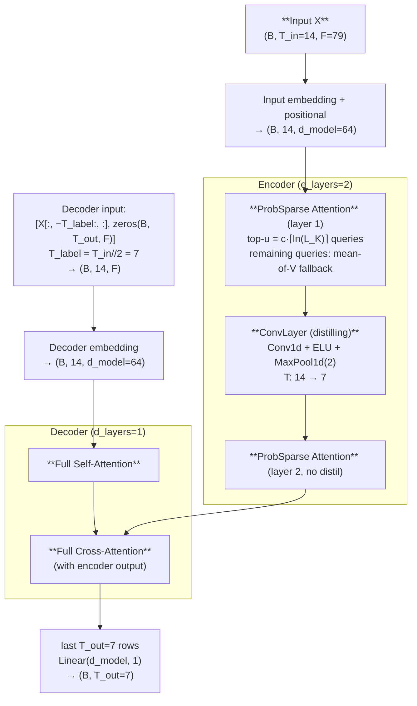

#### Tuned Variant

**Script:** `src/models/attention-tuned/informer.py`

Hyperparameter changes: `d_model 64→256`, `n_heads 4→16`, `e_layers 2→3`, `d_ff 128→512`, dropout unchanged at 0.10. The low dropout reflects ProbSparse attention's inherent regularisation from sparse query selection. Structure unchanged.

#### Strengths

- Generative decoder generates all T_out steps in a single forward pass from start-token context, avoiding error accumulation from step-by-step autoregression
- ProbSparse attention + distilling: O(L log L) complexity with no accuracy penalty at short T_in
- Empirically the most MCO-resilient baseline in this study, suggesting sparse attention and generative decoding partially transfer across the pre/post-MCO regime boundary

#### Weaknesses

- No explicit periodicity decomposition: relies on global attention to discover temporal dependencies rather than structurally separating trend and seasonal components
- At T_in=14, the single distilling step (T→7) loses half the input context in the encoder — potentially suboptimal when recent timesteps carry critical information
- No inter-feature graph structure: like Autoformer, treats all features implicitly through embedding without explicit domain-meaningful feature-to-feature propagation

---

## 3.5 Proposed Model — HMT-TSF

**Script:** `src/models/hybrid/hmttsf.py`

Located in `src/models/hybrid/`. HMT-TSF (Hybrid Multi-scale Temporal Spatio-Feature Forecaster) is the proposed SOTA model purpose-built for this study. Full component rationale and Scopus-indexed journal references per component are in `src/models/hybrid/HMT-TSF.md`.

---

### 3.5.1 Motivation

HMT-TSF is proposed to address three key limitations identified across the 14 baseline models:

1. **No model captures all three types of structure simultaneously.** LSTM-family models handle temporal sequences well but have no graph structure and no regime awareness; graph-based models propagate inter-feature correlations but are rigid under distributional shift; attention-based models decompose periodic signals effectively but cannot propagate domain-meaningful feature-to-feature messages. HMT-TSF fuses temporal, spatial, and regime-aware representations in parallel.

2. **No model explicitly handles the MCO regime shift.** All graph-based models use static Pearson graphs computed on training data; the MCO pandemic caused a structural break in ridership patterns that invalidates these learned correlations. Static normalisation strategies compound this problem by applying fixed-scale transformations across data from fundamentally different regimes. HMT-TSF addresses this with RevIN instance normalisation and a dedicated Regime Gating Embedding.

3. **No model uses domain-aware feature grouping.** All 14 baselines treat the 79 features as a flat vector, giving equal initial weight to structurally disparate sources. HMT-TSF explicitly partitions features into five semantic groups based on their data source and functional role, embedding each independently before fusion.

---

### 3.5.2 Feature Selection

#### What Features

All 79 input features (or 53 in the SHAP-reduced FR variant) are organised into five semantic groups:

| Group | Indices (full, 79F) | Indices (FR, 53F) | Count | Features |
|-------|--------------------|--------------------|-------|---------|
| Target context | 0–12 | 0–12 | 13 / 13 | 12 service-line ridership values + total_ridership |
| Temporal/cyclical | 13–28 | 13–22 | 16 / 10 | Holiday flags, lead-lag holiday, sin/cos encodings (DoW, month), year, day_of_year |
| External | 29–58 | 23–49 | 30 / 27 | Fuel prices (×15) + rainfall (×15) |
| Lag | 59–61 | 50–52 | 3 / 3 | ridership_lag_7, ridership_lag_14, ridership_lag_28 |
| Static | 62–78 | — | 17 / 0 | Population + GTFS + OSM POI + GADM (all dropped in FR via SHAP) |

#### Why These Features

**Target context (13 features):** The 12 individual service-line ridership values encode autoregressive signals at the granularity of each transit line rather than only aggregate demand. Malaysian transit networks exhibit inter-line demand spillover: when one rail corridor is disrupted or operating below capacity, complementary bus routes and adjacent rail lines absorb excess demand. Including all 12 lines allows the model to learn these cross-line demand propagation patterns directly from historical co-movements. The total_ridership aggregate provides a system-wide baseline that contextualises individual line trajectories and serves as the primary forecast target.

**Temporal/cyclical features (16/10 features):** Malaysian public holidays — including Hari Raya Aidilfitri, Hari Raya Aidiladha, Chinese New Year, Deepavali, National Day, and state-specific gazetted holidays — cause ridership swings of 30–80% relative to normal days, fluctuations that cannot be inferred from historical ridership signals alone. Lead-lag holiday encoding (−3 to +3 day flags around each holiday) captures the gradual departure pattern before and the return surge after major holidays. Cyclical sin/cos encodings of day-of-week and month prevent discontinuities at boundaries (Saturday=0 and Sunday=6 are equally adjacent to Monday=1, rather than artificially far apart in linear encoding). Year and day_of_year capture secular ridership growth and annual seasonal patterns not fully covered by cyclical encodings. In the FR variant, SHAP identified six temporal features with near-zero importance — likely redundant or correlated encodings — and dropped them.

**External features (30/27 features):** Malaysian fuel prices are periodically adjusted by the government under a managed float mechanism. When RON95 or diesel prices rise sharply, mode-switching effects increase public transit demand as motorists temporarily substitute transit for private vehicle travel. Fifteen fuel-related features covering multiple fuel grades and both absolute levels and change indicators allow the model to learn both level effects and price-change velocity effects. Rainfall features from 15 regional stations across the Klang Valley capture the first-last-mile access suppression effect: heavy rain reduces walkability and cycling access to transit stations, temporarily suppressing ridership even when service levels are unchanged. Three absolute fuel-level features were dropped in the FR variant (SHAP ≈ 0), likely because the fuel change-rate features already encode the predictive information contained in absolute levels more efficiently.

**Lag features (3 features):** ridership_lag_7, ridership_lag_14, and ridership_lag_28 provide explicit autoregressive reference values at weekly, bi-weekly, and monthly offsets. These are complementary to the continuous temporal window that the TCN encoder processes: they provide hard-coded point-in-time reference values at historically meaningful periodicities that remain available as isolated features to the Feature Graph Encoder even after temporal pooling. For example, ridership_lag_7 directly encodes what total ridership was exactly one week ago — the most important single periodic baseline for a transit system with strong weekly regularity.

**Static features (17 features / 0 in FR):** Population estimates in transit catchment areas, GTFS-derived route count and stop density per catchment zone, OSM-derived points-of-interest counts (retail, education, healthcare, recreation), and GADM administrative region encodings represent time-invariant supply-side structural capacity. A station catchment with high residential population density, dense transit network coverage, and proximate commercial destinations has structurally higher ridership potential than a low-density terminal. These features are constant across the 2019–2025 study period. SHAP analysis found all 17 static features contributing zero importance in the FR variant — the likely explanation is that historical ridership signals in the target context group already implicitly encode structural capacity: high-capacity corridors consistently exhibit high ridership throughout the study period, making the static spatial descriptors redundant given sufficient look-back context.

#### How Features Are Used

**Step 1 — Semantic group embedding:** Each group is independently projected by a small MLP to a common per-group embedding dimension d/2:

```
Group g: x_g (B, T_in, F_g) → Linear(F_g, d/2) → GELU → (B, T_in, d/2)
```

Independent embedding allows each group's internal structure to be learned without cross-group interference at the first projection stage. This is architecturally analogous to how a domain expert analyses each data source on its own before synthesising insights across sources.

**Step 2 — Gated group fusion with learned softmax weights:** All group embeddings are concatenated and passed through a learned softmax group gate, which adaptively weights each group's contribution at each timestep:

```
h_concat = cat[h_1, h_2, h_3, h_4]      → (B, T_in, n_groups × d/2)
gate = softmax(Linear(d_concat → n_groups))  → (B, T_in, n_groups)
h_gated = Σ_g(gate_g · h_g)              → (B, T_in, n_groups × d/2)
```

The softmax gate forces the model to explicitly allocate attention budget across feature groups at each timestep. On holiday dates, the temporal/cyclical group receives higher weight; on normal weekdays, the target context (recent ridership) and lag groups dominate. The gate learns this allocation from data without manual tuning.

**Step 3 — Projection to d_model:** The gated fusion output is projected to d_model via:

```
Linear(d_concat → d_model) → GELU → Dropout → Linear(d_model → d_model) → LayerNorm
```

This two-stage projection with LayerNorm compresses the fused group embeddings into a unified representation of dimension d_model, on which all three parallel encoders then operate.

---

### 3.5.3 Key Architecture Components

#### RevIN — Reversible Instance Normalisation

RevIN (Kim et al., 2022) is applied to the raw input before feature group embedding. Each sample's mean and variance are computed per feature and used to normalise the input:

```
x̂ = (x − μ_sample) / σ_sample × γ + β
```

where γ and β are learnable per-feature affine parameters. The primary motivation is to reduce within-batch distributional shift caused by the MCO regime change: pre-MCO ridership runs at approximately 800K–1.2M daily boardings; MCO-period ridership drops to 50K–200K; post-MCO ridership recovers to 600K–1M. Without instance-level normalisation, a single minibatch containing samples from multiple regimes causes gradient conflicts that impair convergence. RevIN denormalises predictions after the forecast heads and before loss computation, ensuring the loss is measured in the original MinMax-scaled space where the target scaler was fitted.

#### Feature Group Fusion — Semantic Input Encoder

The FeatureGroupFusion module embeds each semantic feature group independently (Step 1–3 above) and outputs a sequence (B, T_in, d_model) that all three parallel encoders subsequently receive. A Temporal Transformer Block (single MultiheadAttention layer with learnable positional embeddings, post-LN residual, and FFN) is applied after group fusion and before the Multi-Scale TCN, adding global temporal self-attention across the full look-back window to complement the local pattern extraction of the causal convolutions.

#### Multi-Scale TCN — Temporal Encoder

The Multi-Scale TCN applies causal dilated convolutions at up to three temporal scales:

- **Scale 1** (full T_in): CausalConv blocks with exponentially increasing dilation (1, 2, 4, ...) capture short-range and medium-range temporal dependencies
- **Scale 2** (T_in//2, activated for T_in ≥ 28): CausalConv on the first half of the window; captures medium-range structures
- **Scale 3** (T_in//4, activated for T_in ≥ 56): CausalConv on the first quarter; captures long-range structural baselines

WaveNet-style gated activations (tanh ⊙ σ) regulate information flow within each causal block. DropPath (stochastic depth, Huang et al., 2016) stochastically drops entire residual paths during training, with linearly increasing rates from 0 to `--drop-path`. A learned attention pooling mechanism blends outputs across active scales, producing the final temporal summary h_t ∈ ℝ^d_model.

The multi-scale design directly addresses transit ridership's multi-resolution periodicity: daily patterns (captured at scale 1), weekly structures (at scale 1 and 2 for lb28), and monthly trends (at scales 2 and 3 for lb56+).

#### Feature Graph Encoder — Spatial Encoder

Rather than using the raw temporal sequence as node features (as graph-based baselines do), the Feature Graph Encoder first compresses the time dimension via learned temporal attention:

```
x̂ (B, T_in, F) → learned time-attn → (B, F, 1) node feature vectors
```

A 2-layer GCN then propagates signals across the Pearson-correlation adjacency (|corr| ≥ 0.1, same construction as STGCN/ASTGCN), with global mean pooling over all F feature nodes producing h_s ∈ ℝ^d_model. This design decouples graph encoding from temporal encoding: the graph branch receives a temporal summary rather than a raw sequence, allowing the GCN to focus on cross-feature relational patterns without interference from temporal dynamics. Importantly, the Feature Graph Encoder and Regime Gating Embedding both receive raw RevIN-normalised input x̂, **bypassing the Feature Group Fusion and Temporal Transformer Block**, so the graph and regime branches see the unprocessed feature signal rather than the projected d_model representation.

#### Regime Gating Embedding

The MCO period represents a structural break in Malaysian transit ridership — not merely a large shock, but a change in which features predict ridership at all. During lockdown, fuel prices and population-density features became irrelevant to transit demand (which was prohibited regardless). The Regime Gating Embedding maintains K=3 learnable embedding vectors representing the three operational regimes:

| Regime | Period |
|--------|--------|
| Pre-COVID | 2019-01-01 – 2020-03-17 |
| MCO | 2020-03-18 – 2021-12-31 |
| Post-MCO | 2022-01-01 – 2025-12-31 |

At each forward pass, the mean-pooled input is projected to K=3 soft logits via a linear layer and softmax, producing a soft mixture of regime embeddings:

```
h_r = Σ_k gate_k · E_k,   gate = softmax(Linear(x̂.mean(T)))
```

This soft gating allows the model to blend adjacent regime characteristics for transitional periods (e.g., early MCO easing in 2021) without hard chronological boundaries. Crucially, no date metadata is required at inference — the regime gate is inferred from the observed feature pattern alone.

#### Gated Fusion

The three encoder outputs h_t (temporal TCN), h_s (spatial GCN), and h_r (regime gating) are concatenated and passed through a Squeeze-and-Excitation (SE) bottleneck gate:

```
h = cat[h_t, h_s, h_r]              (B, 3·d_model)
g = σ(bottleneck(h))                 SE: 3d → 3d//4 → 3d, then sigmoid
out = Linear(g ⊙ h → d_model) → GELU → Dropout → LayerNorm
```

The SE bottleneck avoids a computationally expensive 3d×3d weight matrix while still learning to calibrate which of the three encoder streams contributes most for each input context.

#### Dual Forecast Heads and Custom Loss

Two forecast heads are applied to the fused embedding:

- **Primary head:** `h → Linear(d_model, d_model) → GELU → Linear(d_model, T_out)` with highway residual and LayerNorm
- **Boosting head:** `h → Linear(d_model, T_out)` × sigmoid(α), where α is initialised to −2.0 so sigmoid(−2.0) ≈ 0.12 suppresses the boosting contribution early in training; the head gradually activates as training converges

Final prediction: `y = y_primary + y_boost`

The custom loss penalises both prediction accuracy and smoothness:

```
L = WeightedHuber(step-decay γ=0.9) + λ · TemporalSmoothness
```

Step 1 (1-day-ahead) has weight 1.0; step 7 (7-day-ahead) receives weight 0.9^6 ≈ 0.53. TemporalSmoothness = ‖y_{t+1} − y_t‖² across T_out prevents oscillatory day-to-day predictions.

#### Optional Post-Hoc Residual Boosting (Phase 3)

After neural training, a CatBoost (or sklearn MLP) model is fitted on training-set residuals Δ = y_true − y_neural. The correction is applied as: `y_final = y_neural + 0.5 × Δ_boost`, activated only if Combined% improves on the validation set. This provides a non-parametric second-stage correction for systematic prediction biases without modifying the neural model.

---

### 3.5.4 Architecture Diagram

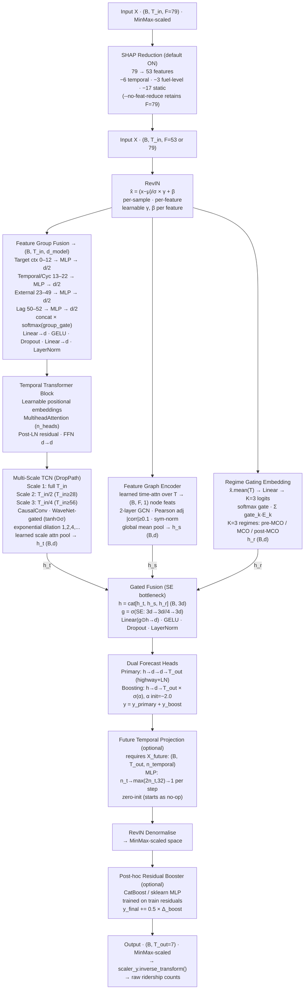

---

### 3.5.5 Strengths

- Three parallel encoders address all three primary modelling challenges identified from the baseline analysis: temporal dynamics (TCN), inter-feature correlations (GCN), and regime shift (gating)
- Semantic feature group embedding with learned softmax gate provides adaptive feature-source weighting — the model learns which data sources matter most per context
- RevIN and Regime Gating jointly address the MCO distributional shift from two independent directions: instance-level normalisation removes amplitude drift; explicit regime embeddings adjust the prediction bias for each operational regime
- Multi-Scale TCN with DropPath avoids the spectral leakage and sequence-length sensitivity observed in Autoformer at lb56
- Dual forecast heads with suppressed boosting initialisation ensure stable early training while allowing residual correction to activate progressively

### 3.5.6 Weaknesses

- Significantly higher parameter count and architectural complexity than any single baseline; requires careful tuning of RevIN, SE gate, DropPath, and boosting head initialisation
- Post-hoc CatBoost residual correction adds a second-stage pipeline that is harder to interpret and may degrade if neural residuals are not well-structured
- The K=3 regime embedding boundaries are manually motivated by the MCO chronology; a different country or crisis timeline would require re-specification of regime count and boundary dates
- Static Pearson graph in the Feature Graph Encoder inherits the same MCO-sensitivity limitation as STGCN and ASTGCN, partially offset by RevIN and regime gating but not fully resolved

---

## 3.6 Fine-Tuned Model Series

Fourteen mirrored fine-tuned variants of the 14 baseline models are located in three folders. HMT-TSF does not have a separate tuned variant — its hyperparameters are already set for maximum performance.

| Folder | Models |
|--------|--------|
| `src/models/spatio-temporal-tuned/` | LSTM, BiLSTM, CNN-LSTM, CNN-BiLSTM, ST-LSTM |
| `src/models/graph-tuned/` | STGCN, MTGNN, STSGCN, STFGNN, PDR-STGCN |
| `src/models/attention-tuned/` | TPA-LSTM, ASTGCN, Autoformer, Informer |

**Tuning strategy (Option C):** Best-configuration selection (MCO-exclusion setting + look-back window) combined with revised architecture hyperparameters. Training hyperparameters (`epochs`, `batch_size`, `lr`, `patience`, `weight_decay`) are unchanged across all 16 tuned variants.

**Output directories** use the `_tuned` suffix: `src/outputs/{model_name}_tuned/`.

**Comparison:** Each tuned run compares against all 14 base model results. Fine-tuned=yes tagging is applied externally by `src/utils/aggregate_results.py`.

### Architecture Changes at a Glance (16 Tuned Variants)

CNN-LSTM is split into three independently tuned variants — one per mode — each with its own canonical look-back window. All other changes are architecture-only; training hyperparameters are unchanged. Parameters that did not change from base are omitted from the Key Changes column.

| Model | Variant / Lookback | Key Changes (base → tuned) | Dropout Rationale |
|-------|-------------------|---------------------------|-------------------|
| LSTM | — / 14 | hidden 64→128, layers 1→2, dropout 0.10→0.15 | 2-layer regularisation |
| BiLSTM | — / 14 | hidden 64→128, layers 1→2, dropout 0.10→0.15 | expanded recurrent capacity |
| CNN-LSTM | sequential / 14 | cnn_filters 32→64, dropout 0.10→0.20 | MED-HIGH variance across lookbacks |
| CNN-LSTM | parallel / 14 | cnn_filters 32→64, dropout 0.10→0.20 | MED-HIGH variance across lookbacks |
| CNN-LSTM | augmented / 14 | cnn_filters 32→64, dropout 0.10→0.20 | MED-HIGH variance across lookbacks |
| CNN-BiLSTM | — / 14 | hidden 64→128, cnn_filters 32→64, dropout 0.10→0.25 | HIGH variance across lookbacks |
| ST-LSTM | — / 14 | hidden 64→128, spatial_hidden 32→64, dropout 0.10→0.20 | MED-HIGH variance across lookbacks |
| STGCN | — / 14 | hidden 128→256, n_blocks 2→3, kt 3→2 ¹, dropout 0.10→0.25 | LOW variance, stable with more filters |
| MTGNN | — / 14 | hidden 32→64, skip_ch 64→128, n_layers 3→4, dropout 0.10→0.30 | HIGH variance across lookbacks |
| STSGCN | — / 14 | hidden 64→128, n_layers 2→3, dropout 0.10→0.25, epochs 150→200, patience 15→25 | LOW variance, synchronous graph benefits |
| STFGNN | — / 14 | hidden 64→128, n_layers 3→4, adj_threshold 0.10→0.15, dropout 0.10→0.35 | MED-HIGH variance across lookbacks |
| PDR-STGCN | — / 14 | hidden 128→256, n_blocks 2→3, kt 3→2 ¹, dk 32→64, dropout 0.10→0.25 | MED variance across lookbacks |
| TPA-LSTM | — / 14 | hidden 64→128, filters 32→64, dropout 0.10→0.15 | moderate variance across lookbacks |
| ASTGCN | — / 14 | d_model 64→128, n_heads 4→8, n_blocks 2→3, dropout 0.10→0.20 | moderate variance across lookbacks |
| Autoformer | — / 14 | d_model 64→128, n_heads 4→8, e_layers 2→3, d_ff 128→256, dropout 0.10→0.25 | moderate variance across lookbacks |
| Informer | — / 14 | d_model 64→128, n_heads 4→8, e_layers 2→3, d_ff 128→256, dropout 0.10→0.15 | LOW variance, sparse attention stable |

> ¹ `kt` reduction is required for correctness: with deeper `n_blocks` stacking on T_in=14, `kt=3` shrinks the temporal dimension to zero before the output layer. `kt=2` restores validity while maintaining the increased depth.

---

## Summary Table

| # | Model | Series | Graph | Attention | AMP | Key Differentiator |
|---|-------|--------|-------|-----------|-----|--------------------|
| 1 | LSTM | ST | No | No | No | Causal sequential baseline — performance floor |
| 2 | BiLSTM | ST | No | No | No | Bidirectional context over observed look-back window |
| 3 | TPA-LSTM | ST | No | Pattern-CNN | No | Temporal pattern filters via 1-D CNN over hidden states |
| 4 | CNN-LSTM | ST | No | No | No | Three CNN–LSTM fusion modes; hierarchical local+global extraction |
| 5 | CNN-BiLSTM | ST | No | No | No | CNN local extraction + bidirectional global context |
| 6 | ST-LSTM | ST | No | No | No | Explicit parallel spatial (MLP) + temporal (LSTM) streams |
| 7 | STGCN | Graph | Static Pearson | No | No | ST-Conv blocks on fixed correlation graph |
| 8 | ASTGCN | Attention | Static Pearson | Spatial+Temporal | Yes | Dual multi-head attention over nodes and timesteps |
| 9 | STSGCN | Graph | Static Pearson | No | No | Synchronous 3N×3N spatio-temporal graph |
| 10 | PDR-STGCN | Graph | Static+Dynamic | Dynamic | No | Periodicity encoding + per-sample dynamic relational graph |
| 11 | MTGNN | Graph | Learned | No | No | End-to-end learned asymmetric adjacency + dilated inception |
| 12 | STFGNN | Graph | Static×2 (spa+tem) | No | No | Dual spatial+temporal graphs fused by learned scalar gate |
| 13 | Autoformer | Attention | No | Auto-Corr (FFT) | Yes | Decomposition + FFT-based periodic autocorrelation |
| 14 | Informer | Attention | No | ProbSparse | Yes | Sparse attention + distilling; generative decoder |
| 15 | **HMT-TSF** | **Hybrid** | **Static Pearson (GCN)** | **MHA + TCN** | **Yes** | **Feature-group fusion + Multi-Scale TCN + GCN + Regime gating + optional CatBoost residual correction** |

---

## Journal References

Scopus-indexed journal articles (2022–2027) cited in each model script's docstring, one per architecture.

### Series 1 — Spatio-Temporal (LSTM-Family)

| Model | Citation |
|-------|----------|
| LSTM | Strigula, M. (2026). Beyond traditional forecasting methods: Evaluating LSTM performance on diverse time series. *Mathematics*, 14(5), 838. https://doi.org/10.3390/math14050838 |
| BiLSTM | Alajmi, M. S., & Almutairi, S. M. (2025). Intelligent traffic congestion forecasting using BiLSTM and adaptive secretary bird optimizer for sustainable urban transportation. *Scientific Reports*, 15. https://doi.org/10.1038/s41598-025-02933-9 |
| TPA-LSTM | Wei, L., Guo, D., Chen, Z., Yang, J., & Feng, T. (2023). Forecasting short-term passenger flow of subway stations based on the temporal pattern attention mechanism and the long short-term memory network. *ISPRS International Journal of Geo-Information*, 12(1), 25. https://doi.org/10.3390/ijgi12010025 |
| CNN-LSTM | Topilin, I., Jiang, J., Feofilova, A., & Beskopylny, N. (2025). Traffic flow prediction via a hybrid CPO-CNN-LSTM-attention architecture. *Smart Cities*, 8(5), 148. https://doi.org/10.3390/smartcities8050148 |
| CNN-BiLSTM | Chen, W., Yang, Z., Xu, G., & Sun, Y. (2022). Short-term traffic flow prediction based on CNN-BiLSTM with multicomponent information. *Applied Sciences*, 12(17), 8714. https://doi.org/10.3390/app12178714 |
| ST-LSTM | Cui, H., Si, B., Chi, D., Li, Y., Li, G., & Chen, Y. (2025). Short-term passenger flow prediction for urban rail systems: A deep learning approach utilizing multi-source big data. *PLOS ONE*, 20(1), e0333094. https://doi.org/10.1371/journal.pone.0333094 |

### Series 2 — Graph-Based

| Model | Citation |
|-------|----------|
| STGCN | Deng, H. (2025). Traffic-forecasting model with spatio-temporal kernel. *Electronics*, 14(7), 1410. https://doi.org/10.3390/electronics14071410 |
| MTGNN | Wu, Z., Liu, X., & Zhang, X. (2025). Multi dynamic temporal representation graph convolutional network for traffic flow prediction. *Scientific Reports*, 15, 16734. https://doi.org/10.1038/s41598-025-01157-1 |
| STSGCN | Chen, L., Ren, Q., Zeng, J., Zou, F., Luo, S., Tian, J., & Xing, Y. (2023). CSFPre: Expressway key sections based on CEEMDAN-STSGCN-FCM during the holidays for traffic flow prediction. *PLOS ONE*, 18(4), e0283898. https://doi.org/10.1371/journal.pone.0283898 |
| STFGNN | Chang, J., Yin, J., Hao, Y., & Gao, C. (2025). STFDSGCN: Spatio-temporal fusion graph neural network based on dynamic sparse graph convolution GRU for traffic flow forecast. *Sensors*, 25(11), 3446. https://doi.org/10.3390/s25113446 |
| PDR-STGCN | (2026). PDR-STGCN: An enhanced STGCN with multi-scale periodic fusion and a dynamic relational graph for traffic forecasting. *Systems*, 14(1), 102. https://doi.org/10.3390/systems14010102 |

### Series 3 — Attention-Based

| Model | Citation |
|-------|----------|
| ASTGCN | Cui, Z., Zhang, J., Noh, G., & Park, H. J. (2023). ADSTGCN: A dynamic adaptive deeper spatio-temporal graph convolutional network for multi-step traffic forecasting. *Sensors*, 23(15), 6950. https://doi.org/10.3390/s23156950 |
| Autoformer | Ma, X., & Zhang, H. (2025). Time series forecasting method based on multi-scale feature fusion and Autoformer. *Applied Sciences*, 15(7), 3768. https://doi.org/10.3390/app15073768 |
| Informer | Song, Y., Luo, R., Zhou, T., Zhou, C., & Su, R. (2024). Graph attention Informer for long-term traffic flow prediction under the impact of sports events. *Sensors*, 24(15), 4796. https://doi.org/10.3390/s24154796 |

---

## Experimental Results (Chapter 4 Reference)

> The following tables belong to Chapter 4. They are retained here as a co-located reference for model development but do not constitute part of the Chapter 3 methodology narrative.

### Shared Training Optimisations (All 14 Baseline Models)

| Component | Before | After | Rationale |
|-----------|--------|-------|-----------|
| Optimiser | Adam | AdamW | Decoupled weight decay (Loshchilov & Hutter, 2019) |
| Loss | MSELoss | HuberLoss(delta=1.0) (default) | Robust to ridership outliers; selectable via `--loss` |
| LR schedule | ReduceLROnPlateau only | Linear warmup (5 ep) → ReduceLROnPlateau | Avoids unstable early updates |

### Standardised Baseline Hyperparameters

| Parameter | Value |
|-----------|-------|
| epochs | 150 |
| batch_size | 32 |
| lr | 1e-3 |
| patience | 15 |
| dropout | 0.1 |
| weight_decay | 1e-4 |

### Baseline Performance (No Tuning) — No-MCO, Lookback 14

| Rank | Model | Combined% | MAPE% | MAE% | RMSE% | R² | MAE | RMSE |
|------|-------|-----------|-------|------|-------|-----|-----|------|
| 1 | Informer | 79.13 | 6.58 | 5.52 | 8.76 | 0.772 | 69,415 | 110,069 |
| 2 | BiLSTM | 79.04 | 6.52 | 5.77 | 8.67 | 0.776 | 72,460 | 109,007 |
| 3 | TPA-LSTM | 78.67 | 6.62 | 6.04 | 8.67 | 0.776 | 75,871 | 109,009 |
| 4 | LSTM | 78.13 | 6.71 | 6.18 | 8.98 | 0.760 | 77,719 | 112,801 |
| 5 | CNN-BiLSTM | 78.18 | 6.81 | 6.12 | 8.89 | 0.765 | 76,884 | 111,782 |
| 6 | ST-LSTM | 78.01 | 6.93 | 6.27 | 8.79 | 0.770 | 78,779 | 110,453 |
| 7 | CNN-LSTM | 77.64 | 6.92 | 6.32 | 9.12 | 0.752 | 79,375 | 114,632 |
| 8 | MTGNN | 77.62 | 7.02 | 6.47 | 8.90 | 0.764 | 81,289 | 111,802 |
| 9 | STGCN | 77.44 | 6.99 | 6.46 | 9.11 | 0.753 | 81,203 | 114,496 |
| 10 | Autoformer | 76.71 | 7.15 | 6.82 | 9.33 | 0.741 | 85,660 | 117,208 |
| 11 | STFGNN | 75.89 | 7.58 | 6.86 | 9.66 | 0.722 | 86,240 | 121,428 |
| 12 | CNN-LSTM-Augmented | 75.36 | 7.77 | 7.19 | 9.68 | 0.721 | 90,356 | 121,639 |
| 13 | CNN-LSTM-Parallel | 74.78 | 8.01 | 7.46 | 9.75 | 0.717 | 93,780 | 122,536 |
| 14 | ASTGCN | 74.34 | 7.98 | 7.54 | 10.14 | 0.694 | 94,737 | 127,449 |
| 15 | STSGCN | 73.33 | 8.60 | 7.77 | 10.30 | 0.684 | 97,689 | 129,451 |
| 16 | PDR-STGCN | 67.75 | 10.26 | 9.98 | 12.01 | 0.571 | 125,481 | 150,877 |

### Tuned Performance — No-MCO, Lookback 14

| Rank | Model | Combined% | MAPE% | MAE% | RMSE% | R² | MAE | RMSE | Δ Combined% |
|------|-------|-----------|-------|------|-------|-----|-----|------|-------------|
| 1 | LSTM | 81.04 | 5.70 | 5.02 | 8.24 | 0.798 | 63,117 | 103,516 | +2.91 |
| 2 | Informer | 79.99 | 6.16 | 5.20 | 8.64 | 0.778 | 65,360 | 108,628 | +0.86 |
| 3 | TPA-LSTM | 79.95 | 6.19 | 5.31 | 8.55 | 0.782 | 66,703 | 107,475 | +1.28 |
| 4 | BiLSTM | 79.44 | 6.39 | 5.85 | 8.33 | 0.794 | 73,516 | 104,667 | +0.40 |
| 5 | Autoformer | 79.27 | 6.37 | 5.63 | 8.74 | 0.773 | 70,733 | 109,856 | +2.55 |
| 6 | ST-LSTM | 79.13 | 6.51 | 5.63 | 8.72 | 0.774 | 70,796 | 109,604 | +1.12 |
| 7 | ASTGCN | 78.82 | 6.35 | 5.73 | 9.09 | 0.754 | 72,053 | 114,259 | +4.48 |
| 8 | CNN-LSTM-Augmented | 78.57 | 6.57 | 5.85 | 9.01 | 0.758 | 73,464 | 113,271 | +3.21 |
| 9 | CNN-BiLSTM | 78.53 | 6.78 | 6.01 | 8.68 | 0.776 | 75,520 | 109,064 | +0.35 |
| 10 | CNN-LSTM | 78.52 | 6.64 | 6.02 | 8.82 | 0.768 | 75,654 | 110,907 | +0.88 |
| 11 | CNN-LSTM-Parallel | 77.52 | 6.89 | 6.14 | 9.45 | 0.734 | 77,128 | 118,805 | +2.74 |
| 12 | PDR-STGCN | 77.78 | 6.73 | 6.22 | 9.26 | 0.745 | 78,230 | 116,379 | +10.03 |
| 13 | MTGNN | 77.44 | 7.02 | 6.46 | 9.08 | 0.755 | 81,209 | 114,079 | −0.17 |
| 14 | STSGCN | 77.14 | 7.04 | 6.33 | 9.49 | 0.732 | 79,494 | 119,266 | +3.81 |
| 15 | STGCN | 76.33 | 7.39 | 7.02 | 9.26 | 0.745 | 88,235 | 116,410 | −1.11 |
| 16 | STFGNN | 74.55 | 8.03 | 7.42 | 10.00 | 0.702 | 93,248 | 125,728 | −1.35 |

### Tuned Performance — MCO-Inclusive, Lookback 14

| Rank | Model | Combined% | MAPE% | MAE% | RMSE% | R² | MAE | RMSE | Δ vs no-MCO |
|------|-------|-----------|-------|------|-------|-----|-----|------|-------------|
| 1 | Informer | 75.35 | 7.68 | 7.21 | 9.76 | 0.738 | 88,924 | 120,400 | −4.64 |
| 2 | ST-LSTM | 75.05 | 7.93 | 7.05 | 9.98 | 0.726 | 86,892 | 123,067 | −4.08 |
| 3 | TPA-LSTM | 74.36 | 8.13 | 7.38 | 10.14 | 0.718 | 90,972 | 125,010 | −5.59 |
| 4 | CNN-LSTM-Parallel | 72.00 | 8.76 | 8.17 | 11.06 | 0.664 | 100,763 | 136,434 | −5.52 |
| 5 | LSTM | 71.84 | 8.96 | 8.55 | 10.66 | 0.688 | 105,421 | 131,404 | −9.20 |
| 6 | BiLSTM | 70.66 | 9.29 | 9.01 | 11.03 | 0.666 | 111,167 | 135,981 | −8.78 |
| 7 | CNN-BiLSTM | 67.53 | 10.22 | 10.20 | 12.05 | 0.601 | 125,837 | 148,570 | −11.00 |
| 8 | CNN-LSTM-Augmented | 67.30 | 10.26 | 10.26 | 12.18 | 0.593 | 126,532 | 150,165 | −11.27 |
| 9 | Autoformer | 66.40 | 10.75 | 10.40 | 12.45 | 0.574 | 128,254 | 153,503 | −12.87 |
| 10 | STFGNN | 63.62 | 11.53 | 11.23 | 13.62 | 0.490 | 138,496 | 167,971 | −10.93 |
| 11 | MTGNN | 63.06 | 12.30 | 11.02 | 13.62 | 0.490 | 135,907 | 167,969 | −14.38 |
| 12 | CNN-LSTM | 61.75 | 12.11 | 12.28 | 13.87 | 0.472 | 151,387 | 170,989 | −16.77 |
| 13 | ASTGCN | 60.50 | 12.63 | 12.50 | 14.37 | 0.433 | 154,102 | 177,240 | −18.32 |
| 14 | PDR-STGCN | 59.77 | 13.25 | 12.46 | 14.52 | 0.421 | 153,661 | 179,039 | −18.01 |
| 15 | STSGCN | 55.18 | 14.29 | 14.36 | 16.17 | 0.281 | 177,109 | 199,452 | −21.96 |
| 16 | STGCN | 53.79 | 14.42 | 14.96 | 16.84 | 0.221 | 184,451 | 207,637 | −22.54 |

### Cross-Lookback Analysis — Tuned No-MCO

| Model | lb14 Combined% | lb28 Combined% | lb56 Combined% | Best |
|-------|----------------|----------------|----------------|------|
| LSTM | 81.04 | 79.79 | 79.24 | **14** |
| Informer | 79.99 | **80.08** | 77.51 | **28** |
| TPA-LSTM | 79.95 | 79.41 | 79.33 | **14** |
| BiLSTM | 79.44 | 78.33 | 75.90 | **14** |
| Autoformer | 79.27 | 74.65 | 58.59 | **14** |
| ST-LSTM | 79.13 | 77.85 | 78.51 | **14** |
| ASTGCN | 78.82 | 68.22 | 73.60 | **14** |
| CNN-BiLSTM | 78.53 | 75.16 | 55.14 | **14** |
| CNN-LSTM | 78.52 | 76.60 | 77.83 | **14** |
| PDR-STGCN | 77.78 | 76.10 | 52.13 | **14** |
| MTGNN | 77.44 | 77.35 | **78.13** | **56** |
| STSGCN | 77.14 | 73.53 | 50.13 | **14** |
| STGCN | 76.33 | **77.17** | 74.52 | **28** |
| STFGNN | 74.55 | 72.59 | 42.19 | **14** |

### HMT-TSF vs Best Tuned Baselines

| Condition | Model | Combined% | R² | Δ vs Best Baseline |
|-----------|-------|-----------|-----|-------------------|
| No-MCO, lb14 | **HMT-TSF-FR** | **81.62** | **0.807** | **+1.63 pp** vs Informer tuned (79.99) |
| No-MCO, lb14 | HMT-TSF | 81.46 | 0.797 | +1.47 pp vs Informer tuned (79.99) |
| No-MCO, lb14 | Informer (tuned) | 79.99 | 0.778 | — best baseline |
| MCO, lb14 | Informer (tuned) | 75.79 | 0.742 | — best baseline |
| MCO, lb14 | HMT-TSF | 75.66 | 0.724 | −0.13 pp vs Informer tuned |
| MCO, lb14 | HMT-TSF-FR | 75.66 | 0.708 | −0.13 pp vs Informer tuned |

**Metric definitions:** Combined% = max(0, 100 − MAPE − MAE% − RMSE%); all percentage terms use mean-demand normalisation. Targets: Combined% ≥ 75%, R² ≥ 0.70.

---
